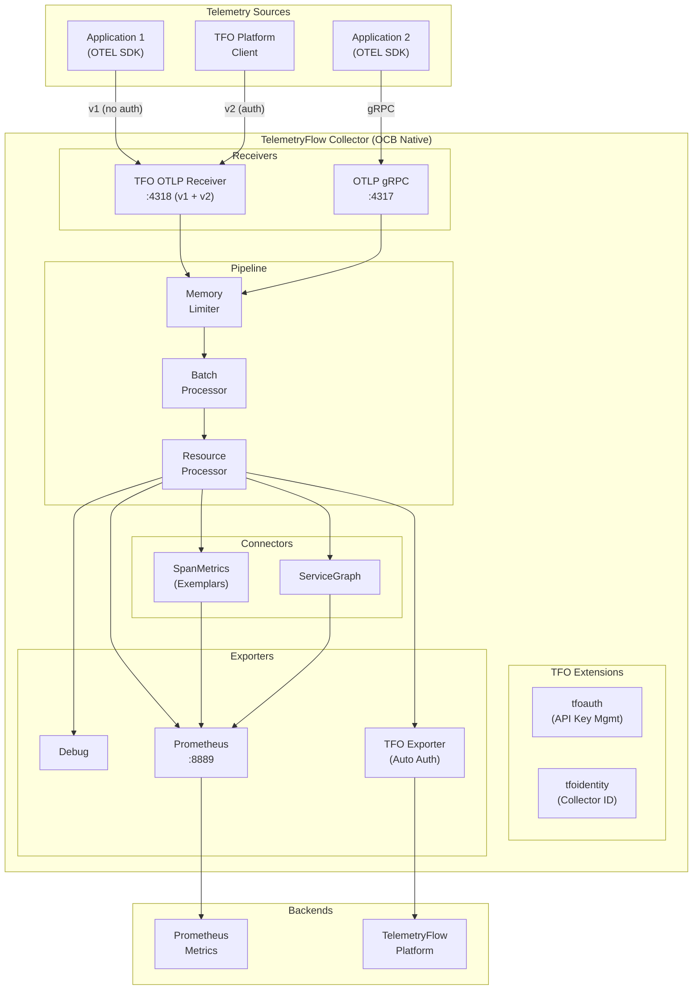

<div align="center">
  <picture>
    <source media="(prefers-color-scheme: dark)" srcset="https://github.com/telemetryflow/.github/raw/main/docs/assets/tfo-logo-collector-dark.svg">
    <source media="(prefers-color-scheme: light)" srcset="https://github.com/telemetryflow/.github/raw/main/docs/assets/tfo-logo-collector-light.svg">
    
  </picture>

  <h3>TelemetryFlow Collector (OCB Native)</h3>

[](CHANGELOG.md)
[](https://opensource.org/licenses/Apache-2.0)
[](https://golang.org/)
[](https://opentelemetry.io/)
[](https://opentelemetry.io/)

</div>

---

Enterprise-grade OpenTelemetry Collector distribution for the **TelemetryFlow Platform**. Built 100% natively with OpenTelemetry Collector Builder (OCB), featuring custom TFO components for platform-specific authentication and v1/v2 endpoint support.

## Features

- **100% OCB Native**: Built with OpenTelemetry Collector Builder v0.142.0
- **TFO Custom Components**: tfootlp receiver, tfo exporter, tfoauth/tfoidentity extensions
- **Dual Endpoint Support**: v1 (open) and v2 (authenticated) on same port
- **Multi-Signal Support**: Metrics, logs, and traces
- **Rich Receivers**: OTLP, Prometheus, Host Metrics, File Logs, Kafka, Kubernetes
- **Powerful Processors**: Batch, Filter, Transform, Resource Detection, K8s Attributes
- **Flexible Exporters**: OTLP, Prometheus, TFO Platform, Loki, Elasticsearch
- **Enterprise Ready**: Health checks, metrics, profiling endpoints

## Architecture



## OTLP HTTP Endpoints

TelemetryFlow Collector supports **dual v1/v2 endpoints on the same port (4318)**:

| Version | Endpoint | Auth Required | Description |
|---------|----------|---------------|-------------|
| **v1** | `/v1/traces`, `/v1/metrics`, `/v1/logs` | No | Community/Open - OTEL standard |
| **v2** | `/v2/traces`, `/v2/metrics`, `/v2/logs` | Yes | TFO Platform - requires `tfk_` key |

### v1 Endpoints (Community/Open)
```bash
# No authentication required
curl -X POST http://localhost:4318/v1/traces \
  -H "Content-Type: application/json" \
  -d '{"resourceSpans": [...]}'
```

### v2 Endpoints (TFO Platform)
```bash
# Requires TFO authentication headers
curl -X POST http://localhost:4318/v2/traces \
  -H "Content-Type: application/json" \
  -H "X-TelemetryFlow-Key-ID: tfk_your_key_id" \
  -H "X-TelemetryFlow-Key-Secret: tfs_your_secret" \
  -d '{"resourceSpans": [...]}'
```

## Quick Start

### Prerequisites

- Go 1.24 or later
- OpenTelemetry Collector Builder (OCB) v0.142.0

### Build & Run

```bash
# Clone the repository
git clone https://github.com/telemetryflow/telemetryflow-collector.git
cd telemetryflow-collector

# Build with OCB
make build

# Run with TFO config (v1 + v2 endpoints)
./build/tfo-collector --config configs/tfo-collector.yaml
# Or use short flag
./build/tfo-collector -c configs/tfo-collector.yaml

# Or run with standard OTEL config (v1 only)
./build/tfo-collector --config configs/otel-collector.yaml
```

### Docker

```bash
# Copy environment template
cp .env.example .env

# Edit with your TFO API credentials (for v2 endpoints)
vim .env

# Build and run
docker-compose up -d --build

# View logs
docker-compose logs -f tfo-collector
```

## Configuration Files

| File | Purpose | v2 Auth | TFO Exporter |
|------|---------|---------|--------------|
| `configs/otel-collector.yaml` | **Default community config** - standard OTEL | No | No |
| `configs/otel-collector-minimal.yaml` | Minimal config for quick start | No | No |
| `configs/tfo-collector.yaml` | TFO config with v1/v2 endpoints | v2 only | No |
| `configs/tfo-collector-unified.yaml` | Full TFO Platform config | v2 only | Yes |

### Standard OTEL Config (No Auth)

```yaml
# configs/otel-collector.yaml
receivers:
  otlp:
    protocols:
      grpc:
        endpoint: "0.0.0.0:4317"
      http:
        endpoint: "0.0.0.0:4318"

processors:
  batch:
    timeout: 200ms

exporters:
  debug:
    verbosity: detailed

service:
  pipelines:
    traces:
      receivers: [otlp]
      processors: [batch]
      exporters: [debug]
```

### TFO Config (v1/v2 Endpoints)

```yaml
# configs/tfo-collector.yaml
extensions:
  tfoauth:
    api_key_id: "${env:TELEMETRYFLOW_API_KEY_ID}"
    api_key_secret: "${env:TELEMETRYFLOW_API_KEY_SECRET}"
  tfoidentity:
    id: "${env:TELEMETRYFLOW_COLLECTOR_ID}"
    name: "TelemetryFlow Collector"

receivers:
  tfootlp:
    protocols:
      grpc:
        endpoint: "0.0.0.0:4317"
      http:
        endpoint: "0.0.0.0:4318"
    enable_v2_endpoints: true
    v2_auth:
      required: true

service:
  extensions: [tfoauth, tfoidentity]
  pipelines:
    traces:
      receivers: [tfootlp]
      processors: [batch]
      exporters: [debug]
```

## TFO Custom Components

| Component | Type | Purpose |
|-----------|------|---------|
| `tfootlp` | Receiver | OTLP receiver with v1/v2 endpoint support |
| `tfo` | Exporter | Auto-injects TFO auth headers |
| `tfoauth` | Extension | TFO API key management |
| `tfoidentity` | Extension | Collector identity and resource enrichment |

## Environment Variables

| Variable | Description | Example |
|----------|-------------|---------|
| `TELEMETRYFLOW_API_KEY_ID` | TFO API Key ID | `tfk_prod_key_001` |
| `TELEMETRYFLOW_API_KEY_SECRET` | TFO API Key Secret | `tfs_xxxxx` |
| `TELEMETRYFLOW_COLLECTOR_ID` | Unique collector ID | `collector-prod-01` |
| `TELEMETRYFLOW_COLLECTOR_NAME` | Human-readable name | `Production Collector` |
| `TELEMETRYFLOW_ENVIRONMENT` | Deployment environment | `production` |
| `TELEMETRYFLOW_ENDPOINT` | TFO Platform endpoint | `https://api.telemetryflow.id` |

## Exposed Ports

| Port | Protocol | Description |
|------|----------|-------------|
| 4317 | gRPC | OTLP gRPC receiver |
| 4318 | HTTP | OTLP HTTP receiver (v1 + v2) |
| 8888 | HTTP | Prometheus metrics (self) |
| 8889 | HTTP | Prometheus exporter |
| 13133 | HTTP | Health check |
| 55679 | HTTP | zPages |
| 1777 | HTTP | pprof |

## CLI Usage

### Command Line Flags

| Flag | Short | Description |
|------|-------|-------------|
| `--config` | `-c` | Configuration file path |
| `--set` | `-s` | Set component config property |
| `--feature-gates` | `-f` | Feature gate identifiers |
| `--help` | `-h` | Show help information |
| `--version` | `-v` | Show version information |

### Usage Examples

```bash
# Show help (displays TFO banner)
tfo-collector
tfo-collector --help
tfo-collector -h

# Start with config file
tfo-collector --config configs/tfo-collector.yaml
tfo-collector -c configs/tfo-collector.yaml

# Set config properties
tfo-collector -c config.yaml --set processors.batch.timeout=2s
tfo-collector -c config.yaml -s processors.batch.timeout=2s

# Enable feature gates
tfo-collector -c config.yaml --feature-gates gate1,gate2
tfo-collector -c config.yaml -f gate1,gate2

# Show version
tfo-collector --version
tfo-collector -v
```

## Project Structure

```text
tfo-collector/
├── cmd/tfo-collector/               # OCB-generated main.go
├── components/                      # TFO Custom Components
│   ├── tfootlpreceiver/             # TFO OTLP Receiver (v1/v2)
│   ├── tfoexporter/                 # TFO Platform Exporter
│   └── extension/
│       ├── tfoauthextension/        # TFO Auth Extension
│       └── tfoidentityextension/    # TFO Identity Extension
├── configs/
│   ├── otel-collector.yaml          # Standard OTEL config
│   ├── otel-collector-minimal.yaml  # Minimal config
│   ├── tfo-collector.yaml           # TFO config (v1/v2)
│   └── tfo-collector-unified.yaml   # Full TFO Platform
├── tests/
│   ├── unit/                        # Unit tests
│   └── integration/                 # Integration tests
├── build/                           # Build output
├── manifest.yaml                    # OCB manifest
├── Makefile
├── Dockerfile
├── docker-compose.yml
└── .env.example
```

## Development

### Build Commands

```bash
make help              # Show all commands
make build             # Build with OCB
make test              # Run all tests
make test-unit         # Run unit tests
make test-integration  # Run integration tests
make lint              # Run linters
make clean             # Clean build artifacts
make docker            # Build Docker image
```

### Running Tests

```bash
# Run all tests
make test

# Run unit tests only
make test-unit

# Run integration tests
make test-integration

# Run with coverage
go test -cover ./tests/...
```

## Documentation

| Document | Description |
|----------|-------------|
| [README](docs/README.md) | Documentation overview |
| [INSTALLATION](docs/INSTALLATION.md) | Installation guide |
| [CONFIGURATION](docs/CONFIGURATION.md) | Configuration options |
| [COMPONENTS](docs/COMPONENTS.md) | Available components |
| [EXEMPLARS](docs/EXEMPLARS.md) | Exemplars and metrics-to-traces |
| [CHANGELOG](CHANGELOG.md) | Version history |

## License

Apache License 2.0 - See [LICENSE](../LICENSE)

## Links

- **Website**: [https://telemetryflow.id](https://telemetryflow.id)
- **Documentation**: [https://docs.telemetryflow.id](https://docs.telemetryflow.id)
- **OpenTelemetry**: [https://opentelemetry.io](https://opentelemetry.io)
- **Developer**: [DevOpsCorner Indonesia](https://devopscorner.id)

---

**Copyright (c) 2024-2026 DevOpsCorner Indonesia. All rights reserved.**
