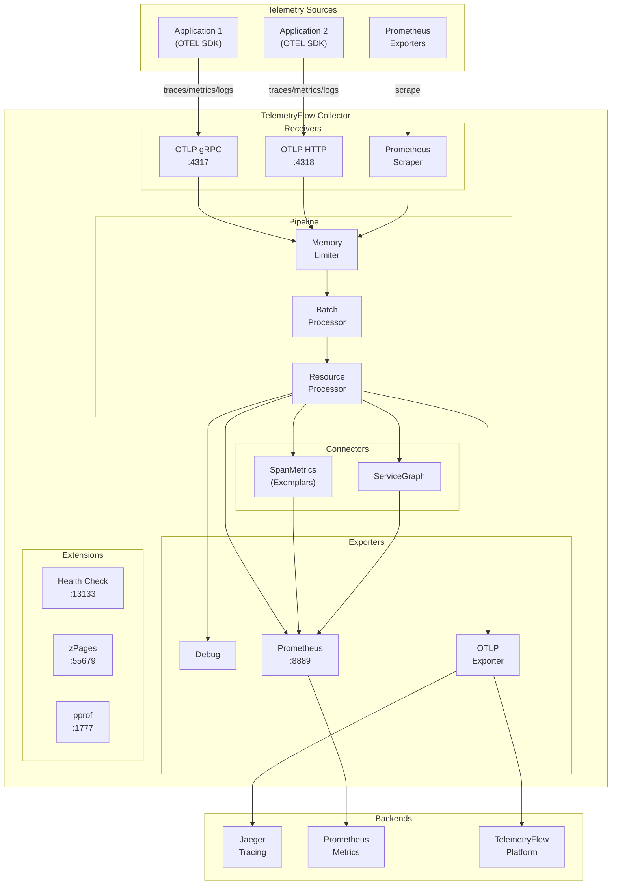
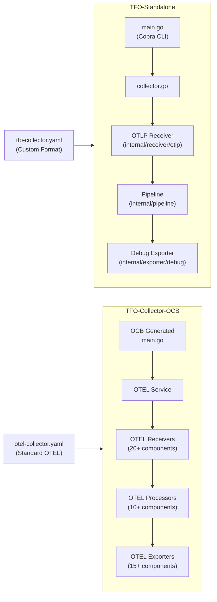
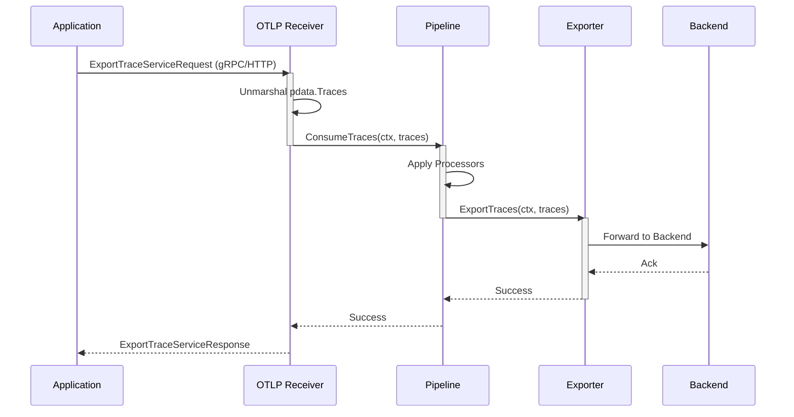

<div align="center">
  <picture>
    <source media="(prefers-color-scheme: dark)" srcset="https://github.com/telemetryflow/.github/raw/main/docs/assets/tfo-logo-collector-dark.svg">
    <source media="(prefers-color-scheme: light)" srcset="https://github.com/telemetryflow/.github/raw/main/docs/assets/tfo-logo-collector-light.svg">
    
  </picture>

  <h3>TelemetryFlow Collector (OTEL Collector)</h3>

[](CHANGELOG.md)
[](https://opensource.org/licenses/Apache-2.0)
[](https://golang.org/)
[](https://opentelemetry.io/)
[](https://opentelemetry.io/)

</div>

---

Enterprise-grade OpenTelemetry Collector distribution for the **TelemetryFlow Platform**. Built on the OpenTelemetry Collector Community, it provides comprehensive telemetry collection, processing, and export capabilities.

## Features

- **OpenTelemetry Native**: Built on OTEL Collector v0.142.0
- **Multi-Signal Support**: Metrics, logs, and traces
- **Rich Receivers**: OTLP, Prometheus, Host Metrics, File Logs, Kafka, Kubernetes
- **Powerful Processors**: Batch, Filter, Transform, Resource Detection, K8s Attributes
- **Flexible Exporters**: OTLP, Prometheus, Loki, Elasticsearch, Kafka
- **Enterprise Ready**: Health checks, metrics, profiling endpoints
- **Dual Build System**: Standalone CLI and OCB (OpenTelemetry Collector Builder)

## Architecture



### Standalone vs OCB Architecture



### Data Flow



## Build Options

TelemetryFlow Collector supports two build modes:

| Build Type | Description | Binary Location | Config File |
|------------|-------------|-----------------|-------------|
| **Standalone** | Custom CLI with Cobra commands, internal packages | `./build/tfo-collector` | `configs/tfo-collector.yaml` |
| **OCB** | Standard OpenTelemetry Collector with full ecosystem | `./build/tfo-collector-ocb` | `configs/otel-collector.yaml` |

## Quick Start

### Prerequisites

- Go 1.24 or later
- OpenTelemetry Collector Builder (for OCB build only)

### Standalone Build (Recommended)

```bash
# Clone the repository
git clone https://github.com/telemetryflow/telemetryflow-collector.git
cd telemetryflow-collector

# Build standalone collector (default)
make

# Run with standalone config
./build/tfo-collector start --config configs/tfo-collector.yaml

# Or use make target
make run-standalone
```

### OCB Build (OpenTelemetry Collector Builder)

```bash
# Install OCB
make install-ocb

# Build with OCB
make build

# Run with OTel-compatible config
./build/tfo-collector-ocb --config configs/otel-collector.yaml

# Or use make target
make run
```

### Docker

TelemetryFlow Collector provides separate Dockerfiles and Docker Compose files for each build type:

| File | Build Type | Description |
|------|------------|-------------|
| `Dockerfile` | Standalone | Custom Cobra CLI build |
| `Dockerfile.ocb` | OCB | Standard OTEL CLI build |
| `docker-compose.yml` | Standalone | Docker Compose for standalone |
| `docker-compose.ocb.yml` | OCB | Docker Compose for OCB |
| `.env.example` | Both | Environment variables template |

#### Using Docker Compose (Recommended)

```bash
# Copy environment template
cp .env.example .env

# Edit .env with your configuration
vim .env

# Standalone build
docker-compose up -d --build

# OR OCB build
docker-compose -f docker-compose.ocb.yml up -d --build

# View logs
docker-compose logs -f tfo-collector

# Stop
docker-compose down
```

#### Using Docker Directly

**Build Standalone Image:**

```bash
docker build \
  --build-arg VERSION=1.1.1 \
  --build-arg GIT_COMMIT=$(git rev-parse --short HEAD) \
  --build-arg GIT_BRANCH=$(git rev-parse --abbrev-ref HEAD) \
  --build-arg BUILD_TIME=$(date -u '+%Y-%m-%dT%H:%M:%SZ') \
  -t telemetryflow/telemetryflow-collector:1.1.1 .

docker run -d --name tfo-collector \
  -p 4317:4317 \
  -p 4318:4318 \
  -p 8888:8888 \
  -p 13133:13133 \
  -v /path/to/config.yaml:/etc/tfo-collector/tfo-collector.yaml:ro \
  telemetryflow/telemetryflow-collector:1.1.1
```

**Build OCB Image:**

```bash
docker build \
  -f Dockerfile.ocb \
  --build-arg VERSION=1.1.1 \
  --build-arg OTEL_VERSION=0.142.0 \
  -t telemetryflow/telemetryflow-collector-ocb:1.1.1 .

docker run -d --name tfo-collector-ocb \
  -p 4317:4317 \
  -p 4318:4318 \
  -p 8888:8888 \
  -p 13133:13133 \
  -v /path/to/config.yaml:/etc/tfo-collector/collector.yaml:ro \
  telemetryflow/telemetryflow-collector-ocb:1.1.1
```

## Configuration

### Configuration Files

| File | Purpose | Build Type |
|------|---------|------------|
| `configs/tfo-collector.yaml` | Custom format with `enabled` flags | Standalone |
| `configs/otel-collector.yaml` | Standard OTel format | OCB |
| `configs/ocb-collector-minimal.yaml` | Minimal OTel config for testing | OCB |

### Standalone Configuration Example

```yaml
# configs/tfo-collector.yaml (custom format)
collector:
  id: "my-collector"
  description: "TelemetryFlow Collector"

receivers:
  otlp:
    enabled: true
    protocols:
      grpc:
        enabled: true
        endpoint: "0.0.0.0:4317"
      http:
        enabled: true
        endpoint: "0.0.0.0:4318"

processors:
  batch:
    enabled: true
    send_batch_size: 8192
    timeout: 200ms

exporters:
  logging:
    enabled: true
    loglevel: "info"
```

### OCB Configuration Example

```yaml
# configs/otel-collector.yaml (standard OTel format)
receivers:
  otlp:
    protocols:
      grpc:
        endpoint: "0.0.0.0:4317"
      http:
        endpoint: "0.0.0.0:4318"

processors:
  batch:
    send_batch_size: 8192
    timeout: 200ms

exporters:
  debug:
    verbosity: detailed

service:
  pipelines:
    traces:
      receivers: [otlp]
      processors: [batch]
      exporters: [debug]
    metrics:
      receivers: [otlp]
      processors: [batch]
      exporters: [debug]
    logs:
      receivers: [otlp]
      processors: [batch]
      exporters: [debug]
```

## Included Components

### Receivers

| Component | Description |
|-----------|-------------|
| `otlp` | OTLP gRPC and HTTP receiver |
| `hostmetrics` | System metrics (CPU, memory, disk, network) |
| `filelog` | File-based log collection |
| `prometheus` | Prometheus metrics scraping |
| `kafka` | Kafka message receiver |
| `k8s_cluster` | Kubernetes cluster metrics |
| `k8s_events` | Kubernetes events |
| `syslog` | Syslog receiver |

### Processors

| Component | Description |
|-----------|-------------|
| `batch` | Batches data for efficient export |
| `memory_limiter` | Prevents OOM conditions |
| `attributes` | Modify/add/delete attributes |
| `resource` | Modify resource attributes |
| `resourcedetection` | Auto-detect resource info |
| `filter` | Filter telemetry data |
| `transform` | Transform telemetry using OTTL |
| `k8sattributes` | Add Kubernetes metadata |
| `tail_sampling` | Tail-based trace sampling |

### Exporters

| Component | Description |
|-----------|-------------|
| `otlp` | OTLP gRPC exporter |
| `otlphttp` | OTLP HTTP exporter |
| `debug` | Debug output (development) |
| `prometheus` | Prometheus metrics endpoint |
| `prometheusremotewrite` | Prometheus remote write |
| `kafka` | Kafka exporter |
| `loki` | Loki log exporter |
| `elasticsearch` | Elasticsearch exporter |
| `file` | File exporter |

### Extensions

| Component | Description |
|-----------|-------------|
| `health_check` | Health check endpoint |
| `pprof` | Performance profiling |
| `zpages` | Debug pages |
| `basicauth` | Basic authentication |
| `bearertokenauth` | Bearer token auth |
| `file_storage` | Persistent storage |

## Project Structure

```text
tfo-collector/
├── cmd/tfo-collector/        # Standalone CLI entry point
│   └── main.go               # Cobra CLI with banner
├── internal/
│   ├── collector/            # Core collector implementation
│   ├── config/               # Configuration management
│   └── version/              # Version and banner info
├── pkg/                      # LEGO Building Blocks
│   ├── banner/               # Startup banner
│   ├── config/               # Config loader utilities
│   └── plugin/               # Component registry
├── configs/
│   ├── tfo-collector.yaml         # Standalone config (custom format)
│   ├── otel-collector.yaml        # OCB config (standard OTel format)
│   └── ocb-collector-minimal.yaml
├── tests/
│   ├── unit/                 # Unit tests
│   ├── integration/          # Integration tests
│   ├── e2e/                  # End-to-end tests
│   ├── mocks/                # Mock implementations
│   └── fixtures/             # Test fixtures
├── build/                    # Build output directory
│   ├── tfo-collector         # Standalone binary
│   ├── tfo-collector-ocb     # OCB binary
│   └── ocb/                  # OCB generated code
├── manifest.yaml             # OCB manifest
├── Makefile
├── Dockerfile                # Standalone build
├── Dockerfile.ocb            # OCB build
├── docker-compose.yml        # Docker Compose (standalone)
├── docker-compose.ocb.yml    # Docker Compose (OCB)
├── .env.example              # Environment template
└── README.md
```

## Exposed Ports

| Port | Protocol | Description |
|------|----------|-------------|
| 4317 | gRPC | OTLP gRPC receiver |
| 4318 | HTTP | OTLP HTTP receiver |
| 8888 | HTTP | Prometheus metrics (self) |
| 8889 | HTTP | Prometheus exporter |
| 13133 | HTTP | Health check |
| 55679 | HTTP | zPages |
| 1777 | HTTP | pprof |

## OTLP HTTP Endpoints

TelemetryFlow Collector supports dual OTLP HTTP endpoint versions based on build type:

### TFO Standalone (v1 + v2)

The Standalone build supports **both v1 and v2** endpoints:

| Version | Endpoint | Description |
|---------|----------|-------------|
| **v2** (Recommended) | `/v2/traces`, `/v2/metrics`, `/v2/logs` | TelemetryFlow Platform |
| **v1** (Compatible) | `/v1/traces`, `/v1/metrics`, `/v1/logs` | OTEL Community standard |

```bash
# TelemetryFlow Platform v2 (recommended)
curl -X POST http://localhost:4318/v2/traces \
  -H "Content-Type: application/json" \
  -d '{"resourceSpans": [...]}'

# OTEL Community v1 (backwards compatible)
curl -X POST http://localhost:4318/v1/traces \
  -H "Content-Type: application/json" \
  -d '{"resourceSpans": [...]}'
```

### OCB Build (v1 Only)

The OCB build uses the **standard OpenTelemetry OTLP receiver** which supports **v1 endpoints only**:

| Signal | Endpoint | Content-Type |
|--------|----------|--------------|
| Traces | `/v1/traces` | `application/x-protobuf`, `application/json` |
| Metrics | `/v1/metrics` | `application/x-protobuf`, `application/json` |
| Logs | `/v1/logs` | `application/x-protobuf`, `application/json` |

```bash
# OTEL Community v1 (standard)
curl -X POST http://localhost:4318/v1/metrics \
  -H "Content-Type: application/json" \
  -d '{"resourceMetrics": [...]}'
```

> **Note:** Use TFO Standalone for v2 endpoint support. Use v2 endpoints for TelemetryFlow Platform features.

## Development

### Build Commands

```bash
# Show all commands
make help

# Standalone Build (Default)
make                    # Build standalone collector
make build-standalone   # Build standalone collector
make run-standalone     # Run standalone collector
make test-standalone    # Run standalone tests
make tidy               # Tidy go modules

# OCB Build
make build              # Build with OCB
make build-all          # Build for all platforms with OCB
make install-ocb        # Install OpenTelemetry Collector Builder
make generate           # Generate collector code using OCB
make run                # Run OCB collector
make run-debug          # Run OCB with debug logging
make validate-config    # Validate OCB configuration

# Common
make test               # Run tests
make lint               # Run linters
make clean              # Clean build artifacts
make docker             # Build Docker image
make version            # Show version information
```

### Running Tests

```bash
# Run all standalone tests
make test-standalone

# Run specific test packages
go test -v ./tests/unit/...
go test -v ./tests/integration/...

# Run with coverage
go test -cover ./...
```

### Adding Components (OCB Build)

Edit `manifest.yaml` to add/remove OTEL components:

```yaml
receivers:
  - gomod: github.com/open-telemetry/opentelemetry-collector-contrib/receiver/myreceiver v0.142.0
```

Then rebuild:

```bash
make clean && make build
```

## Kubernetes Deployment

```yaml
apiVersion: apps/v1
kind: Deployment
metadata:
  name: tfo-collector
spec:
  replicas: 1
  selector:
    matchLabels:
      app: tfo-collector
  template:
    metadata:
      labels:
        app: tfo-collector
    spec:
      containers:
      - name: collector
        image: telemetryflow/telemetryflow-collector:latest
        ports:
        - containerPort: 4317
        - containerPort: 4318
        - containerPort: 8888
        volumeMounts:
        - name: config
          mountPath: /etc/tfo-collector
      volumes:
      - name: config
        configMap:
          name: tfo-collector-config
```

## Systemd Service

```ini
# /etc/systemd/system/tfo-collector.service
[Unit]
Description=TelemetryFlow Collector - CEOP
After=network.target

[Service]
Type=simple
User=telemetryflow
ExecStart=/usr/local/bin/tfo-collector start --config /etc/tfo-collector/tfo-collector.yaml
Restart=always
RestartSec=5
LimitNOFILE=65536

[Install]
WantedBy=multi-user.target
```

## Documentation

| Document | Description |
|----------|-------------|
| [README](docs/README.md) | Documentation overview |
| [INSTALLATION](docs/INSTALLATION.md) | Installation guide for all platforms |
| [CONFIGURATION](docs/CONFIGURATION.md) | Configuration options and examples |
| [COMPONENTS](docs/COMPONENTS.md) | Available receivers, processors, exporters |
| [BUILD-SYSTEM](docs/BUILD-SYSTEM.md) | Standalone vs OCB build comparison |
| [OCB_BUILD](docs/OCB_BUILD.md) | OpenTelemetry Collector Builder guide |
| [EXEMPLARS](docs/EXEMPLARS.md) | Exemplars and metrics-to-traces correlation |
| [GITHUB-WORKFLOWS](docs/GITHUB-WORKFLOWS.md) | CI/CD workflows documentation |
| [CHANGELOG](CHANGELOG.md) | Version history and changes |

## License

Apache License 2.0 - See [LICENSE](../LICENSE)

## Links

- **Website**: [https://telemetryflow.id](https://telemetryflow.id)
- **Documentation**: [https://docs.telemetryflow.id](https://docs.telemetryflow.id)
- **OpenTelemetry**: [https://opentelemetry.io](https://opentelemetry.io)
- **Developer**: [DevOpsCorner Indonesia](https://devopscorner.id)

---

**Copyright (c) 2024-2026 DevOpsCorner Indonesia. All rights reserved.**
