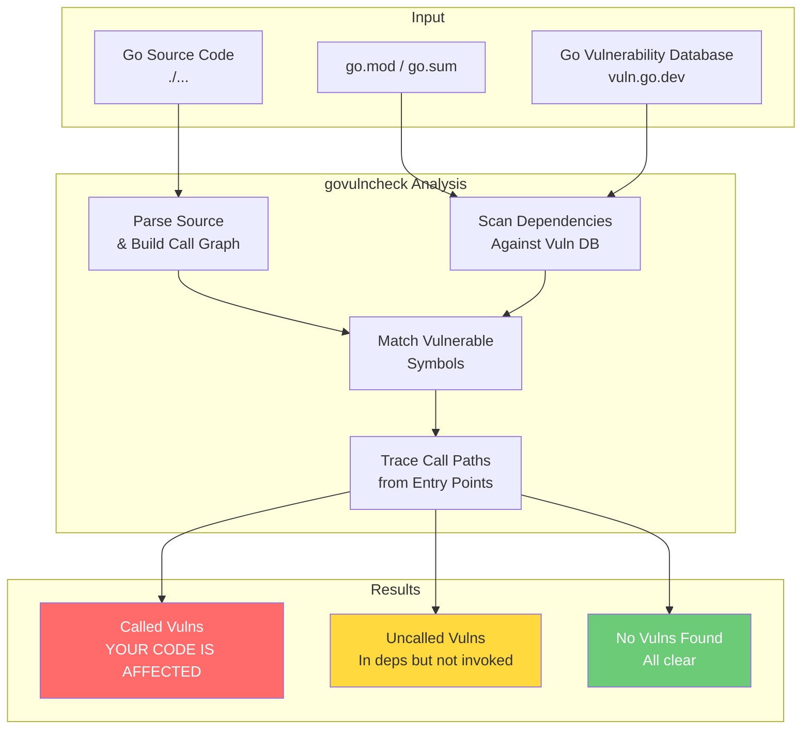
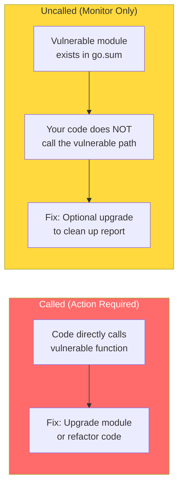
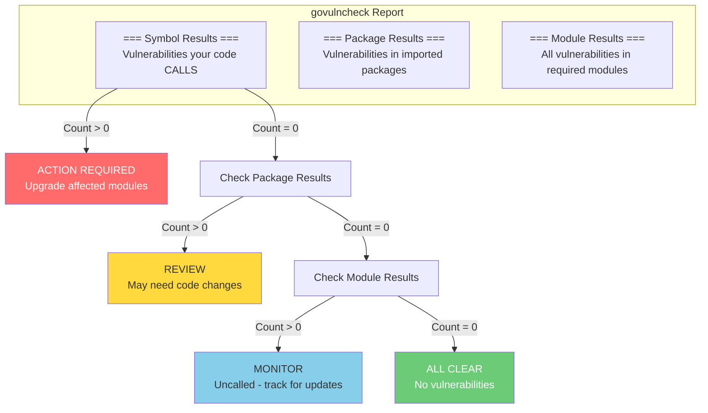
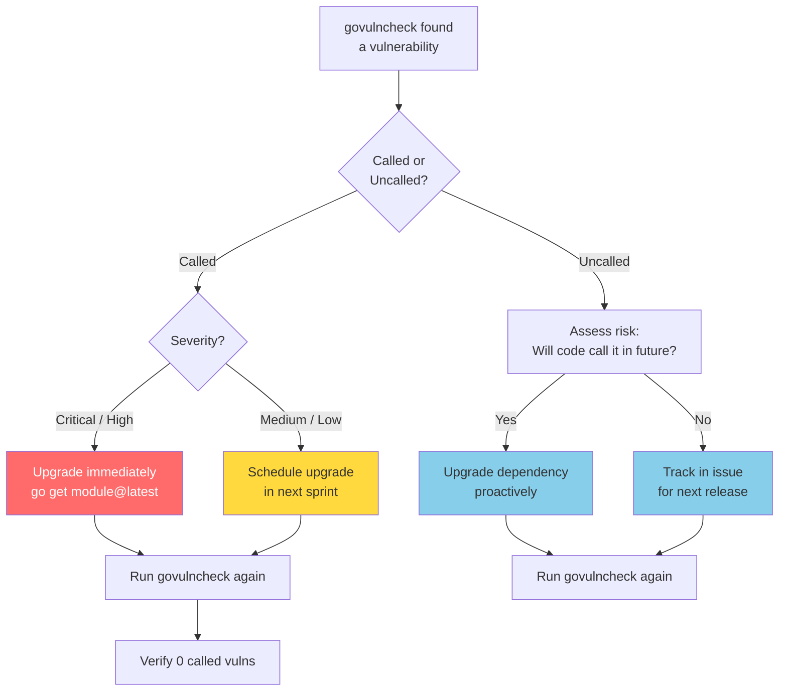
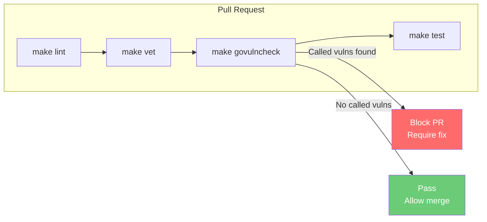

<div align="center">
  <picture>
    <source media="(prefers-color-scheme: dark)" srcset="https://github.com/telemetryflow/.github/raw/main/docs/assets/tfo-logo-collector-dark.svg">
    <source media="(prefers-color-scheme: light)" srcset="https://github.com/telemetryflow/.github/raw/main/docs/assets/tfo-logo-collector-light.svg">
    
  </picture>

  <h3>TelemetryFlow Collector (OTEL Collector)</h3>

[](CHANGELOG.md)
[](https://opensource.org/licenses/Apache-2.0)
[](https://golang.org/)
[](https://opentelemetry.io/)
[](https://opentelemetry.io/)

</div>

---

# Security Policy

## Supported Versions

We release patches for security vulnerabilities in the following versions:

| Version | Supported          |
| ------- | ------------------ |
| 1.1.x   | :white_check_mark: |
| 1.0.x   | :x:                |
| < 1.0   | :x:                |

## Reporting a Vulnerability

We take the security of TelemetryFlow Core seriously. If you believe you have found a security vulnerability, please report it to us as described below.

### Where to Report

**Please DO NOT report security vulnerabilities through public GitHub issues.**

Instead, please report them via email to:
- **Security Team**: security@telemetryflow.id
- **Project Lead**: support@telemetryflow.id

### What to Include

Please include the following information in your report:

- **Type of vulnerability** (e.g., SQL injection, XSS, authentication bypass)
- **Full paths of source file(s)** related to the vulnerability
- **Location of the affected source code** (tag/branch/commit or direct URL)
- **Step-by-step instructions** to reproduce the issue
- **Proof-of-concept or exploit code** (if possible)
- **Impact of the vulnerability** and how an attacker might exploit it

### Response Timeline

- **Initial Response**: Within 48 hours
- **Status Update**: Within 7 days
- **Fix Timeline**: Depends on severity
  - Critical: 1-7 days
  - High: 7-14 days
  - Medium: 14-30 days
  - Low: 30-90 days

### Disclosure Policy

- Security issues will be disclosed after a fix is available
- We will credit researchers who report vulnerabilities (unless they prefer to remain anonymous)
- We follow responsible disclosure practices

## Vulnerability Scanning

### govulncheck

TelemetryFlow Collector uses [`govulncheck`](https://pkg.go.dev/golang.org/x/vuln/cmd/govulncheck) — the official Go vulnerability scanner powered by the [Go Vulnerability Database](https://vuln.go.dev). It performs **call-graph analysis** to determine whether your code actually invokes vulnerable code paths, not just whether vulnerable modules exist in `go.sum`.

#### How It Works



#### Vulnerability Classification



#### Quick Start

```bash
# Install govulncheck
go install golang.org/x/vuln/cmd/govulncheck@latest

# Run vulnerability scan (default - called vulns only)
make govulncheck

# Or run directly
govulncheck ./...

# Show verbose output (includes uncalled vulns)
govulncheck -show verbose ./...

# Scan specific package
govulncheck ./cmd/tfo-collector/...

# Scan build module
govulncheck -C build/ ./...
```

#### Makefile Target

The `make govulncheck` target automatically installs `govulncheck` if not present:

```makefile
## CI: Run govulncheck
govulncheck:
    @govulncheck ./...
```

#### Reading the Output



**Example output:**

```
=== Symbol Results ===

No vulnerabilities found.

Your code is affected by 0 vulnerabilities.
This scan also found 0 vulnerabilities in packages you import and 15
vulnerabilities in modules you require, but your code doesn't appear to call
these vulnerabilities.
```

#### Resolving Vulnerabilities



#### Common Fixes

| Vulnerability Module | Typical Fix | Command |
| --- | --- | --- |
| `golang.org/x/crypto` | Upgrade to latest patch | `go get golang.org/x/crypto@latest` |
| `golang.org/x/net` | Upgrade to latest patch | `go get golang.org/x/net@latest` |
| `github.com/docker/docker` | Migrate to `moby/moby` modules | Update upstream dependency |
| `google.golang.org/grpc` | Upgrade gRPC | `go get google.golang.org/grpc@latest` |
| Transitive dependency | Upgrade root dependency | `go get -u <root-module>@latest` |

#### CI Integration



Add to your CI pipeline:

```yaml
- name: Vulnerability Check
  run: |
    go install golang.org/x/vuln/cmd/govulncheck@latest
    govulncheck ./...
```

#### Current Vulnerability Status

| Module | Vulns | Status | Notes |
| --- | --- | --- | --- |
| `golang.org/x/crypto` v0.50.0 | 13 | Uncalled | Your code does not invoke affected functions |
| `github.com/aws/aws-sdk-go` v1.55.8 | 2 | Uncalled | Legacy SDK (transitive), not directly used |
| `github.com/docker/docker` | 0 | Fixed | Migrated to `moby/moby` modules in v0.152.0 |

Last scanned: **May 2026** | Run `make govulncheck` for latest results.

### gosec

Static Application Security Testing (SAST) using [gosec](https://github.com/securego/gosec):

```bash
# Run security scan (SARIF output)
make security

# Or run directly
gosec -no-fail -fmt sarif -out gosec-results.sarif ./...
```

## Security Tools

| Tool | Purpose | Command |
| --- | --- | --- |
| `govulncheck` | Dependency vulnerability scanning | `make govulncheck` |
| `gosec` | Static security analysis (SAST) | `make security` |
| `go vet` | Code correctness check | `make vet` |
| `golangci-lint` | Comprehensive linting | `make lint` |
| [Trivy](https://trivy.dev) | Container image scanning | `trivy image telemetryflow/telemetryflow-collector:latest` |
| [Snyk](https://snyk.io) | Dependency monitoring | Integrates with GitHub |
| [SonarQube](https://sonarqube.org) | Code quality & security | CI/CD integration |

### Security Tools Workflow

```mermaid
flowchart TB
    subgraph Local["Local Development"]
        FMT["make fmt<br/>Format code"]
        LINT["make lint<br/>Lint code"]
        VET["make vet<br/>Code correctness"]
        VULN["make govulncheck<br/>Vuln scanning"]
        SEC["make security<br/>SAST (gosec)"]
        TEST["make test<br/>Run tests"]
    end

    subgraph CI["CI Pipeline"]
        CI_LINT["CI Lint"]
        CI_VULN["CI Vuln Check"]
        CI_SEC["CI Security Scan"]
        CI_TEST["CI Tests"]
        CI_IMG["Container Scan<br/>(Trivy)"]
    end

    FMT --> LINT --> VET --> VULN --> SEC --> TEST
    CI_LINT --> CI_VULN --> CI_SEC --> CI_TEST --> CI_IMG

    style VULN fill:#e74c3c,color:#fff
    style CI_VULN fill:#e74c3c,color:#fff
```



## Security Best Practices

### For Users

#### 1. Environment Variables
```bash
# Never commit .env files
echo ".env" >> .gitignore

# Use strong secrets
pnpm run generate:secrets
```

#### 2. Database Security
```bash
# Use strong passwords
POSTGRES_PASSWORD=<strong-random-password>
CLICKHOUSE_PASSWORD=<strong-random-password>

# Restrict database access
# Only allow connections from trusted IPs
```

#### 3. JWT Configuration
```bash
# Use minimum 32 characters for secrets
JWT_SECRET=<min-32-chars-random-string>
SESSION_SECRET=<min-32-chars-random-string>

# Set appropriate expiration
JWT_EXPIRES_IN=24h  # Adjust based on your needs
```

#### 4. Production Deployment
```bash
# Always use NODE_ENV=production
NODE_ENV=production

# Disable debug logs
LOG_LEVEL=warn

# Enable HTTPS only
# Use reverse proxy (nginx/traefik) with SSL/TLS
```

### For Contributors

#### 1. Code Security

**Never commit:**
- Passwords or API keys
- Private keys or certificates
- Database credentials
- JWT secrets
- Personal information

**Always:**
- Use environment variables for sensitive data
- Validate all user inputs
- Sanitize database queries
- Use parameterized queries (TypeORM handles this)
- Implement proper authentication and authorization

#### 2. Dependencies

```bash
# Check for vulnerabilities
pnpm audit

# Fix vulnerabilities
pnpm audit fix

# Update dependencies regularly
pnpm update
```

#### 3. Code Review

All code changes must:
- Pass security review
- Include tests for security-critical features
- Follow OWASP security guidelines
- Be reviewed by at least one maintainer

## Security Features

### Authentication & Authorization

- **JWT-based authentication** with secure token generation
- **5-tier RBAC system** (Super Admin, Admin, Developer, Viewer, Demo)
- **Permission-based access control** with 22+ granular permissions
- **Password hashing** using Argon2 (industry standard)
- **Session management** with secure session secrets

### Data Protection

- **PostgreSQL** for transactional data with row-level security
- **ClickHouse** for audit logs and observability data
- **Encrypted connections** between services
- **Input validation** using class-validator
- **SQL injection prevention** via TypeORM parameterized queries

### Observability & Monitoring

- **Audit logging** for all critical operations
- **OpenTelemetry tracing** for request tracking
- **Winston logging** with structured logs
- **Health checks** for service monitoring

### Network Security

- **Docker network isolation** (172.151.151.0/24)
- **Service-to-service communication** on private network
- **Exposed ports** only for necessary services
- **CORS configuration** for API access control

## Vulnerability Disclosure

### Past Vulnerabilities

No security vulnerabilities have been reported yet.

### Security Advisories

Security advisories will be published at:
- GitHub Security Advisories
- Project documentation
- Release notes

## Compliance

### Standards

TelemetryFlow Core follows:
- **OWASP Top 10** security guidelines
- **CWE/SANS Top 25** vulnerability prevention
- **NIST Cybersecurity Framework** principles

### Certifications

Currently pursuing:
- SOC 2 Type II compliance
- ISO 27001 certification

## Security Contacts

### Primary Contact
- **Email**: security@telemetryflow.id
- **Response Time**: 48 hours

### Alternative Contact
- **Email**: support@telemetryflow.id
- **GitHub**: [@telemetryflow](https://github.com/telemetryflow)

## Bug Bounty Program

We currently do not have a formal bug bounty program, but we:
- Acknowledge security researchers in release notes
- Provide public recognition for valid reports
- Consider monetary rewards for critical vulnerabilities (case-by-case basis)

## Security Updates

### Notification Channels

Stay informed about security updates:
- **GitHub Releases**: Watch repository for releases
- **Security Advisories**: Enable GitHub security alerts
- **Changelog**: Check [CHANGELOG.md](./CHANGELOG.md)
- **Release Notes**: Review [docs/RELEASE_NOTES_*.md](./docs/)

### Update Process

```bash
# Check current version
cat package.json | grep version

# Update to latest version
git pull origin main
pnpm install

# Run migrations if needed
pnpm db:migrate

# Restart services
docker-compose restart
```

## Contribution Security Guidelines

### Before Contributing

1. **Read** [CONTRIBUTING.md](./CONTRIBUTING.md)
2. **Review** this security policy
3. **Sign** commits with GPG key (recommended)
4. **Test** security implications of your changes

### Code Submission

```bash
# Sign commits
git commit -S -m "Your commit message"

# Run security checks
pnpm audit
pnpm lint
pnpm test

# Create pull request with security checklist
```

### Security Checklist for PRs

- [ ] No hardcoded secrets or credentials
- [ ] Input validation implemented
- [ ] SQL injection prevention verified
- [ ] XSS prevention implemented
- [ ] Authentication/authorization tested
- [ ] Error messages don't leak sensitive info
- [ ] Dependencies updated and audited
- [ ] Tests include security scenarios

## Additional Resources

### Documentation
- [README.md](./README.md) - Project overview
- [CONTRIBUTING.md](./CONTRIBUTING.md) - Contribution guidelines
- [CODE_OF_CONDUCT.md](./CODE_OF_CONDUCT.md) - Community standards

### Security Tools
- [OWASP Top 10](https://owasp.org/www-project-top-ten/)
- [npm audit](https://docs.npmjs.com/cli/v8/commands/npm-audit)
- [Snyk](https://snyk.io/) - Vulnerability scanning
- [SonarQube](https://www.sonarqube.org/) - Code quality & security

### Security Training
- [OWASP WebGoat](https://owasp.org/www-project-webgoat/)
- [PortSwigger Web Security Academy](https://portswigger.net/web-security)
- [HackerOne Resources](https://www.hackerone.com/resources)

## Acknowledgments

We would like to thank the following security researchers for their contributions:

*No security researchers have been acknowledged yet.*

---

- **Last Updated**: May 25, 2026
- **Version**: 1.2.1
- **Project**: TelemetryFlow Collector

**Built with ❤️ by Telemetri Data Indonesia**
