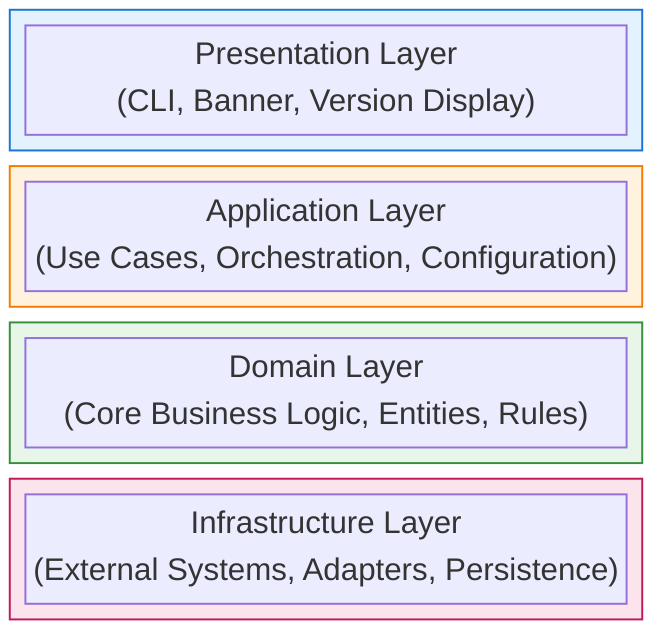
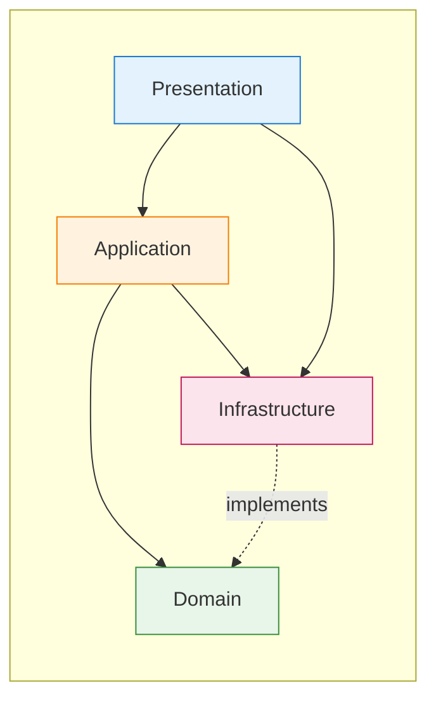
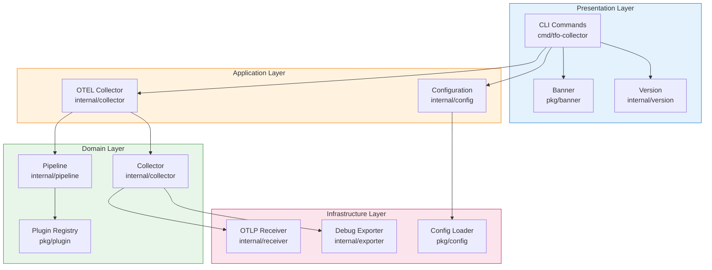
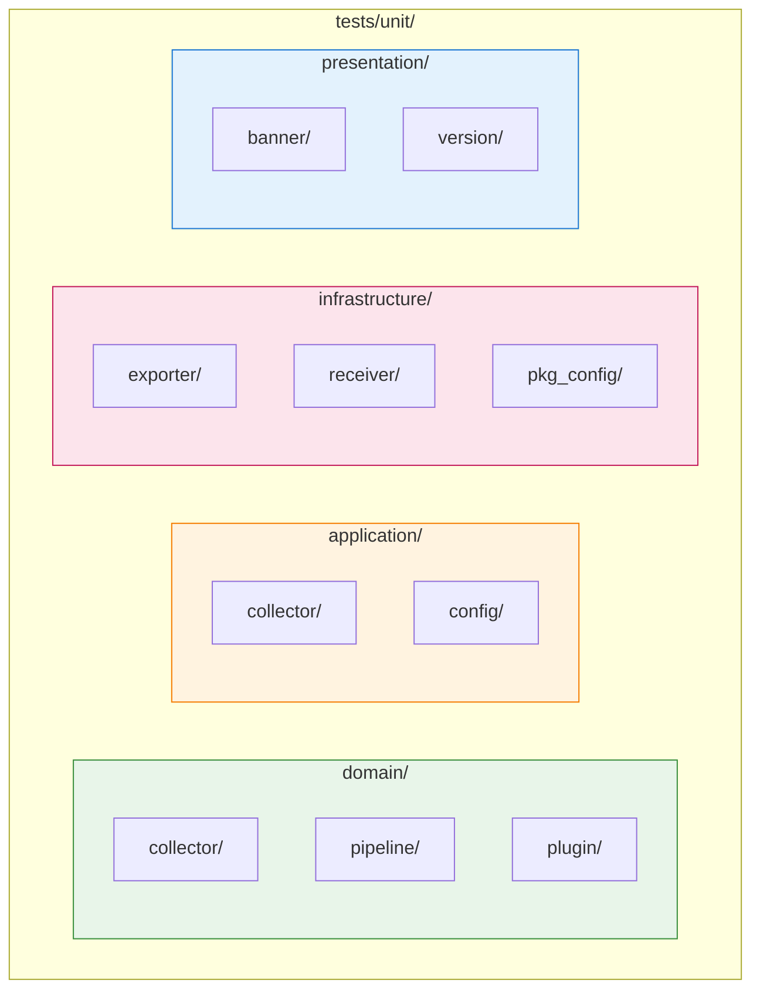
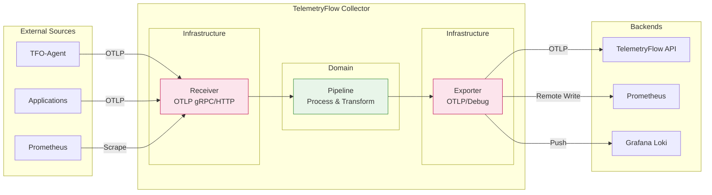
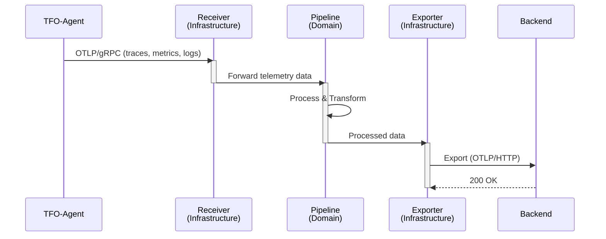

# Architecture Guide

Domain-Driven Design (DDD) architecture guide for the TelemetryFlow Collector.

- **Version:** 1.1.2
- **OTEL Version:** 0.142.0
- **Last Updated:** January 2026

---

## Overview

TelemetryFlow Collector follows Domain-Driven Design (DDD) principles to maintain clean architecture, separation of concerns, and testability. This document explains the architectural patterns used throughout the codebase.

---

## DDD Layers

The codebase is organized into four main layers:



### Layer Dependencies



**Rules:**

- Domain layer has NO external dependencies
- Infrastructure implements domain interfaces
- Application orchestrates domain and infrastructure
- Presentation depends on application layer

---

## Project Structure

```text
tfo-collector/
├── cmd/                        # Entry points (Presentation)
│   └── tfo-collector/
│       └── main.go             # CLI commands, flags
│
├── internal/                   # Private packages
│   ├── collector/              # Domain: Core collector logic
│   │   ├── collector.go        # Collector entity
│   │   └── otel_collector.go   # OTEL wrapper
│   │
│   ├── config/                 # Application: Configuration
│   │   ├── config.go           # Config structures
│   │   └── loader.go           # Config loading
│   │
│   ├── pipeline/               # Domain: Data pipelines
│   │   └── pipeline.go         # Pipeline processing
│   │
│   ├── receiver/               # Infrastructure: Data receivers
│   │   └── otlp/
│   │       └── receiver.go     # OTLP receiver
│   │
│   ├── exporter/               # Infrastructure: Data exporters
│   │   └── debug/
│   │       └── exporter.go     # Debug exporter
│   │
│   └── version/                # Presentation: Version info
│       └── version.go          # Version display
│
├── pkg/                        # Public packages
│   ├── banner/                 # Presentation: ASCII banner
│   │   └── banner.go
│   │
│   ├── config/                 # Infrastructure: Config utilities
│   │   └── loader.go           # Public config loader
│   │
│   └── plugin/                 # Domain: Plugin system
│       └── registry.go         # Component registry
│
└── tests/                      # Test organization (DDD)
    └── unit/
        ├── domain/
        ├── application/
        ├── infrastructure/
        └── presentation/
```

---

## Component Architecture



---

## Layer Details

### Domain Layer

**Purpose:** Core business logic independent of external systems.

**Location:** `internal/collector/`, `internal/pipeline/`, `pkg/plugin/`

**Characteristics:**

- Pure business logic
- No external dependencies (database, HTTP, etc.)
- Defines interfaces for infrastructure
- Contains entities and value objects

**Example - Pipeline Entity:**

```go
// internal/pipeline/pipeline.go
package pipeline

// Pipeline represents the core data processing pipeline
type Pipeline struct {
    traceExporters   []TraceExporter
    metricsExporters []MetricsExporter
    logsExporters    []LogsExporter
}

// Config defines pipeline configuration
type Config struct {
    TracesEnabled  bool
    MetricsEnabled bool
    LogsEnabled    bool
}

// New creates a new pipeline with the given configuration
func New(cfg Config) (*Pipeline, error) {
    if !cfg.TracesEnabled && !cfg.MetricsEnabled && !cfg.LogsEnabled {
        return nil, errors.New("at least one signal must be enabled")
    }
    return &Pipeline{}, nil
}

// ProcessTraces processes trace data through the pipeline
func (p *Pipeline) ProcessTraces(ctx context.Context, traces ptrace.Traces) error {
    for _, exporter := range p.traceExporters {
        if err := exporter.Export(ctx, traces); err != nil {
            return err
        }
    }
    return nil
}
```

**Example - Plugin Registry:**

```go
// pkg/plugin/registry.go
package plugin

// ComponentType defines the type of component
type ComponentType string

const (
    TypeReceiver  ComponentType = "receiver"
    TypeProcessor ComponentType = "processor"
    TypeExporter  ComponentType = "exporter"
)

// Component interface for all plugin components
type Component interface {
    Info() ComponentInfo
    Validate(config map[string]interface{}) error
}

// Registry manages component registration
type Registry struct {
    mu         sync.RWMutex
    components map[string]ComponentFactory
}

// Register adds a component to the registry
func (r *Registry) Register(name string, factory ComponentFactory) error {
    r.mu.Lock()
    defer r.mu.Unlock()

    if _, exists := r.components[name]; exists {
        return fmt.Errorf("component %s already registered", name)
    }
    r.components[name] = factory
    return nil
}
```

---

### Application Layer

**Purpose:** Orchestration, use cases, and configuration management.

**Location:** `internal/config/`, `internal/collector/otel_collector.go`

**Characteristics:**

- Coordinates domain and infrastructure
- Handles use case orchestration
- Configuration loading and validation
- No business logic (delegates to domain)

**Example - Configuration:**

```go
// internal/config/config.go
package config

// Config represents the complete collector configuration
type Config struct {
    TelemetryFlow TelemetryFlowConfig `yaml:"telemetryflow"`
    Collector     CollectorConfig     `yaml:"collector"`
    Receivers     ReceiversConfig     `yaml:"receivers"`
    Processors    ProcessorsConfig    `yaml:"processors"`
    Exporters     ExportersConfig     `yaml:"exporters"`
    Service       ServiceConfig       `yaml:"service"`
}

// Validate validates the configuration
func (c *Config) Validate() error {
    if err := c.Receivers.Validate(); err != nil {
        return fmt.Errorf("receivers: %w", err)
    }
    if err := c.Service.Validate(); err != nil {
        return fmt.Errorf("service: %w", err)
    }
    return nil
}

// DefaultConfig returns the default configuration
func DefaultConfig() *Config {
    return &Config{
        Receivers: defaultReceivers(),
        Processors: defaultProcessors(),
        Exporters: defaultExporters(),
    }
}
```

**Example - OTEL Collector Wrapper:**

```go
// internal/collector/otel_collector.go
package collector

// OTELCollector wraps the OpenTelemetry Collector
type OTELCollector struct {
    configPath string
    logger     *zap.Logger
    version    component.BuildInfo
    service    *otelcol.Collector
}

// NewOTELCollector creates a new OTEL collector
func NewOTELCollector(opts ...OTELOption) *OTELCollector {
    c := &OTELCollector{
        version: component.BuildInfo{
            Command: "tfo-collector",
            Version: version.Version,
        },
    }
    for _, opt := range opts {
        opt(c)
    }
    return c
}

// Run starts the collector
func (c *OTELCollector) Run(ctx context.Context) error {
    factories, err := c.components()
    if err != nil {
        return err
    }

    settings := otelcol.CollectorSettings{
        BuildInfo: c.version,
        Factories: factories,
    }

    c.service, err = otelcol.NewCollector(settings)
    if err != nil {
        return err
    }

    return c.service.Run(ctx)
}
```

---

### Infrastructure Layer

**Purpose:** External system adapters, persistence, and external dependencies.

**Location:** `internal/receiver/`, `internal/exporter/`, `pkg/config/`

**Characteristics:**

- Implements domain interfaces
- Handles external communication
- Database, HTTP, gRPC clients
- File system operations

**Example - OTLP Receiver:**

```go
// internal/receiver/otlp/receiver.go
package otlp

// Receiver implements OTLP data receiver
type Receiver struct {
    config     Config
    grpcServer *grpc.Server
    httpServer *http.Server
    logger     *zap.Logger
}

// Config defines receiver configuration
type Config struct {
    GRPC GRPCConfig
    HTTP HTTPConfig
}

// NewReceiver creates a new OTLP receiver
func NewReceiver(cfg Config, logger *zap.Logger) (*Receiver, error) {
    if err := cfg.Validate(); err != nil {
        return nil, err
    }
    return &Receiver{
        config: cfg,
        logger: logger,
    }, nil
}

// Start starts the receiver
func (r *Receiver) Start(ctx context.Context) error {
    if r.config.GRPC.Enabled {
        if err := r.startGRPC(ctx); err != nil {
            return err
        }
    }
    if r.config.HTTP.Enabled {
        if err := r.startHTTP(ctx); err != nil {
            return err
        }
    }
    return nil
}
```

**Example - Debug Exporter:**

```go
// internal/exporter/debug/exporter.go
package debug

// Exporter exports telemetry data for debugging
type Exporter struct {
    config Config
    logger *zap.Logger
}

// Export exports trace data
func (e *Exporter) Export(ctx context.Context, traces ptrace.Traces) error {
    e.logger.Debug("exporting traces",
        zap.Int("span_count", traces.SpanCount()),
    )
    return nil
}
```

---

### Presentation Layer

**Purpose:** User interface, CLI commands, and display formatting.

**Location:** `cmd/tfo-collector/`, `internal/version/`, `pkg/banner/`

**Characteristics:**

- CLI commands and flags
- User input/output
- Display formatting
- No business logic

**Example - CLI Commands:**

```go
// cmd/tfo-collector/main.go
package main

func startCmd() *cobra.Command {
    return &cobra.Command{
        Use:   "start",
        Short: "Start the TelemetryFlow Collector",
        Long:  `Start the TelemetryFlow Collector with the specified configuration.`,
        RunE:  runStart,
    }
}

func versionCmd() *cobra.Command {
    return &cobra.Command{
        Use:   "version",
        Short: "Show version information",
        Run: func(cmd *cobra.Command, args []string) {
            if jsonOutput {
                printVersionJSON()
            } else {
                fmt.Println(version.Full())
            }
        },
    }
}
```

**Example - Banner Display:**

```go
// pkg/banner/banner.go
package banner

// Print displays the startup banner
func Print() {
    fmt.Println(asciiArt)
    fmt.Printf("  %s v%s\n", version.ProductName, version.Short())
    fmt.Println()
}
```

---

## Design Patterns

### Repository Pattern

Used for data access abstraction:

```go
// Domain interface
type ComponentRepository interface {
    Get(name string) (Component, error)
    List() []Component
    Register(name string, factory ComponentFactory) error
}

// Infrastructure implementation
type InMemoryComponentRepository struct {
    components map[string]ComponentFactory
}
```

### Factory Pattern

Used for component creation:

```go
// ComponentFactory creates new component instances
type ComponentFactory func() Component

// Create creates a new component from the factory
func (r *Registry) Create(name string) (Component, error) {
    factory, err := r.Get(name)
    if err != nil {
        return nil, err
    }
    return factory(), nil
}
```

### Options Pattern

Used for configurable constructors:

```go
type OTELOption func(*OTELCollector)

func WithConfigPath(path string) OTELOption {
    return func(c *OTELCollector) {
        c.configPath = path
    }
}

func WithLogger(logger *zap.Logger) OTELOption {
    return func(c *OTELCollector) {
        c.logger = logger
    }
}

// Usage
collector := NewOTELCollector(
    WithConfigPath("/etc/config.yaml"),
    WithLogger(logger),
)
```

---

## Testing Architecture

Tests mirror the DDD structure:



---

## Data Flow



### Sequence Diagram



---

## Best Practices

### 1. Layer Separation

- Keep domain logic free of infrastructure concerns
- Use interfaces for cross-layer communication
- Don't import infrastructure in domain layer

### 2. Dependency Injection

- Inject dependencies through constructors
- Use interfaces for flexibility
- Configure at the application layer

### 3. Testing

- Unit test domain layer without mocks
- Mock infrastructure for application tests
- Integration test actual infrastructure

### 4. Error Handling

- Domain errors should be meaningful
- Wrap infrastructure errors with context
- Don't expose internal errors to presentation

---

## References

- [Domain-Driven Design by Eric Evans](https://www.domainlanguage.com/ddd/)
- [Clean Architecture by Robert C. Martin](https://blog.cleancoder.com/uncle-bob/2012/08/13/the-clean-architecture.html)
- [OpenTelemetry Collector Architecture](https://opentelemetry.io/docs/collector/architecture/)
- [Testing Documentation](TESTING.md)

---

**Copyright (c) 2024-2026 DevOpsCorner Indonesia. All rights reserved.**
