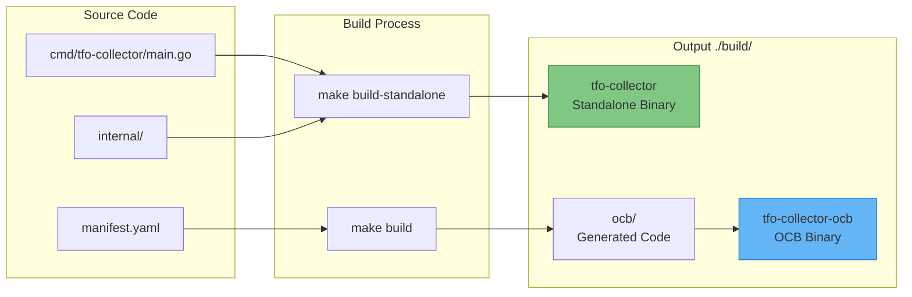
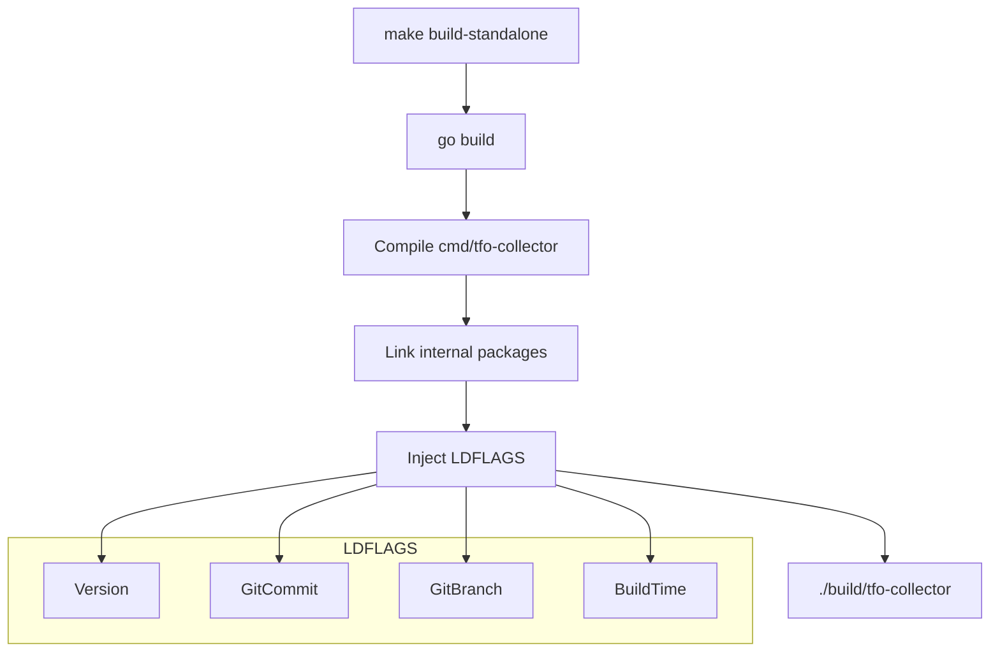
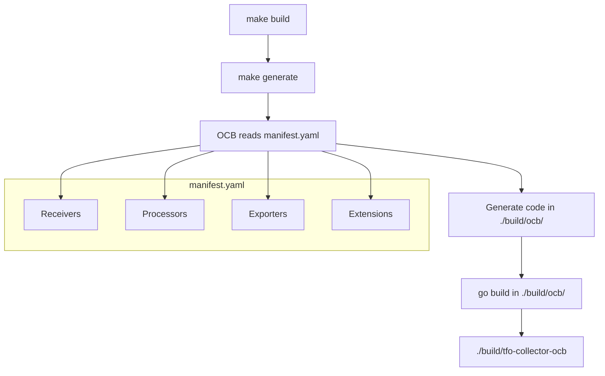
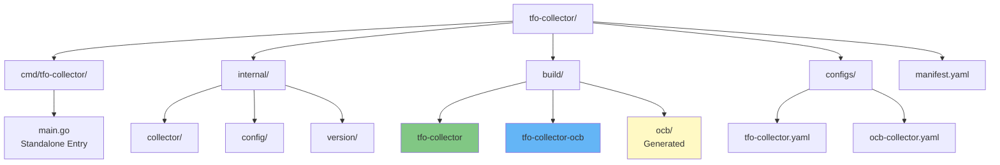

# TelemetryFlow Collector Build System

- **Version:** 1.0.0
- **Last Updated:** December 2025

---

## Overview

TelemetryFlow Collector uses a **dual build system** that produces two different binaries from the same codebase:

1. **Standalone Build** (`tfo-collector`) - Custom Cobra CLI
2. **OCB Build** (`tfo-collector-ocb`) - Standard OpenTelemetry Collector



---

## Build Comparison

| Aspect | Standalone (`tfo-collector`) | OCB (`tfo-collector-ocb`) |
|--------|------------------------------|---------------------------|
| **Source** | `cmd/tfo-collector/main.go` | `manifest.yaml` → generated |
| **CLI** | Cobra (`start`, `version`, `config`) | Standard OTEL (`--config`) |
| **Config Format** | Custom with `enabled` flags | Standard OTEL YAML |
| **Banner** | Custom ASCII art | None |
| **Build Command** | `make build-standalone` | `make build` |
| **Default Target** | Yes (`make` or `make all`) | No |
| **Binary Location** | `./build/tfo-collector` | `./build/tfo-collector-ocb` |

---

## Standalone Build

### Build Process



### Build Command

```bash
# Default build (standalone)
make

# Explicit standalone build
make build-standalone

# Output
./build/tfo-collector
```

### LDFLAGS

Version information is injected at build time:

```makefile
LDFLAGS_STANDALONE := -s -w \
    -X 'github.com/telemetryflow/telemetryflow-collector/internal/version.Version=$(VERSION)' \
    -X 'github.com/telemetryflow/telemetryflow-collector/internal/version.GitCommit=$(GIT_COMMIT)' \
    -X 'github.com/telemetryflow/telemetryflow-collector/internal/version.GitBranch=$(GIT_BRANCH)' \
    -X 'github.com/telemetryflow/telemetryflow-collector/internal/version.BuildTime=$(BUILD_TIME)'
```

### Configuration Format

Standalone uses a custom format with `enabled` flags:

```yaml
# configs/tfo-collector.yaml
receivers:
  otlp:
    enabled: true  # <-- Custom flag
    protocols:
      grpc:
        enabled: true
        endpoint: "0.0.0.0:4317"
```

### CLI Commands

```bash
# Show help
./build/tfo-collector --help

# Start collector
./build/tfo-collector start --config configs/tfo-collector.yaml

# Show version
./build/tfo-collector version

# Show parsed config
./build/tfo-collector config --config configs/tfo-collector.yaml
```

---

## OCB Build

### What is OCB?

OCB (OpenTelemetry Collector Builder) is the official tool for building custom OpenTelemetry Collector distributions. It:

1. Reads a `manifest.yaml` specifying components
2. Generates Go source code
3. Compiles a standard OTEL Collector binary

### Build Process



### Install OCB

```bash
# Install OpenTelemetry Collector Builder
make install-ocb

# This runs:
go install go.opentelemetry.io/collector/cmd/builder@v0.114.0
```

### Build Command

```bash
# Generate and build OCB collector
make build

# Just generate code (no compile)
make generate

# Output
./build/tfo-collector-ocb
```

### Manifest Configuration

The `manifest.yaml` defines which components to include:

```yaml
# manifest.yaml
dist:
  name: tfo-collector-ocb
  output_path: ./build/ocb
  module: github.com/telemetryflow/telemetryflow-collector-ocb
  skip_compilation: true

receivers:
  - gomod: go.opentelemetry.io/collector/receiver/otlpreceiver v0.114.0
  - gomod: github.com/open-telemetry/opentelemetry-collector-contrib/receiver/prometheusreceiver v0.114.0
  # ... more receivers

processors:
  - gomod: go.opentelemetry.io/collector/processor/batchprocessor v0.114.0
  # ... more processors

exporters:
  - gomod: go.opentelemetry.io/collector/exporter/otlpexporter v0.114.0
  # ... more exporters

extensions:
  - gomod: go.opentelemetry.io/collector/extension/zpagesextension v0.114.0
  # ... more extensions
```

### Configuration Format

OCB uses standard OTEL configuration (no `enabled` flags):

```yaml
# configs/ocb-collector.yaml
receivers:
  otlp:
    protocols:
      grpc:
        endpoint: "0.0.0.0:4317"  # No enabled flag

service:
  pipelines:
    metrics:
      receivers: [otlp]
      processors: [batch]
      exporters: [debug]
```

### CLI Commands

```bash
# Show help
./build/tfo-collector-ocb --help

# Run with config
./build/tfo-collector-ocb --config configs/ocb-collector.yaml

# Validate config
./build/tfo-collector-ocb validate --config configs/ocb-collector.yaml
```

---

## Directory Structure



```text
tfo-collector/
├── cmd/tfo-collector/
│   └── main.go                 # Standalone CLI entry point
├── internal/
│   ├── collector/              # Standalone collector logic
│   ├── config/                 # Custom config parser
│   └── version/                # Version info & banner
├── build/
│   ├── tfo-collector           # Standalone binary
│   ├── tfo-collector-ocb       # OCB binary
│   └── ocb/                    # OCB generated code
│       ├── main.go             # Generated main
│       ├── components.go       # Generated components
│       └── go.mod              # Generated module
├── configs/
│   ├── tfo-collector.yaml      # Standalone config (custom format)
│   └── ocb-collector.yaml      # OCB config (standard OTEL)
├── manifest.yaml               # OCB build manifest
└── Makefile
```

---

## Makefile Reference

### Variables

```makefile
PRODUCT_NAME := TelemetryFlow Collector
BINARY_NAME := tfo-collector
BINARY_NAME_OCB := tfo-collector-ocb
VERSION ?= 1.0.0
OTEL_VERSION := 0.114.0

BUILD_DIR := ./build
BUILD_DIR_OCB := ./build/ocb
CONFIG_DIR := ./configs
```

### Standalone Targets

```makefile
# Default target (builds standalone)
all: build-standalone

# Build standalone binary
build-standalone:
    go build -ldflags "$(LDFLAGS_STANDALONE)" -o $(BUILD_DIR)/$(BINARY_NAME) ./cmd/tfo-collector

# Run standalone
run-standalone: build-standalone
    $(BUILD_DIR)/$(BINARY_NAME) start --config $(CONFIG_DIR)/tfo-collector.yaml

# Test standalone
test-standalone:
    go test -v ./...
```

### OCB Targets

```makefile
# Install OCB
install-ocb:
    go install go.opentelemetry.io/collector/cmd/builder@v$(OCB_VERSION)

# Generate code with OCB
generate: check-ocb
    $(OCB) --config manifest.yaml

# Build OCB binary
build: generate
    cd $(BUILD_DIR_OCB) && go build -ldflags "$(LDFLAGS)" -o ../$(BINARY_NAME_OCB) .

# Run OCB
run: build
    $(BUILD_DIR)/$(BINARY_NAME_OCB) --config $(CONFIG_DIR)/ocb-collector.yaml

# Validate OCB config
validate-config: build
    $(BUILD_DIR)/$(BINARY_NAME_OCB) validate --config $(CONFIG_DIR)/ocb-collector.yaml
```

### Common Targets

```makefile
# Clean all build artifacts
clean:
    rm -rf $(BUILD_DIR)/*
    rm -rf $(DIST_DIR)

# Show version info
version:
    @echo "Version: $(VERSION)"
    @echo "OTEL Version: $(OTEL_VERSION)"
    @echo "Git Commit: $(GIT_COMMIT)"

# Tidy go modules
tidy:
    go mod tidy
```

---

## When to Use Which Build

### Use Standalone (`tfo-collector`) When:

- You want TelemetryFlow-specific branding and CLI
- You prefer the custom config format with `enabled` flags
- You're deploying in a TelemetryFlow ecosystem
- You need the `start`, `version`, `config` commands
- You want the ASCII art banner on startup

### Use OCB (`tfo-collector-ocb`) When:

- You need full OTEL Collector compatibility
- You're integrating with existing OTEL tooling
- You need components not in the standalone build
- You want to use standard OTEL documentation
- You're validating against OTEL config schemas

---

## Troubleshooting

### OCB Build Fails: "builder not found"

```bash
# Install OCB
make install-ocb

# Or manually
go install go.opentelemetry.io/collector/cmd/builder@v0.114.0
```

### OCB Config Error: "has invalid keys: enabled"

The OCB build doesn't support the custom `enabled` flags. Use the standard OTEL config format:

```yaml
# Wrong (standalone format)
receivers:
  otlp:
    enabled: true  # <-- Invalid for OCB

# Correct (OCB format)
receivers:
  otlp:
    protocols:
      grpc:
        endpoint: "0.0.0.0:4317"
```

### Both Binaries Show Same Output

Make sure you're running the correct binary:

```bash
# Standalone - has custom banner and commands
./build/tfo-collector version

# OCB - standard OTEL help
./build/tfo-collector-ocb --help
```

### Generated Code Not Updating

Clean and regenerate:

```bash
make clean
make generate
make build
```

---

**Copyright (c) 2024-2026 DevOpsCorner Indonesia. All rights reserved.**
