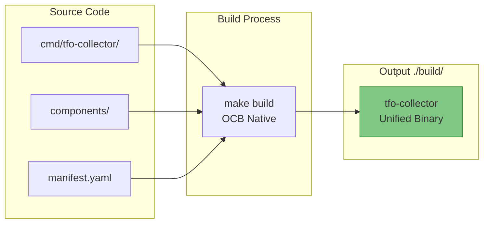
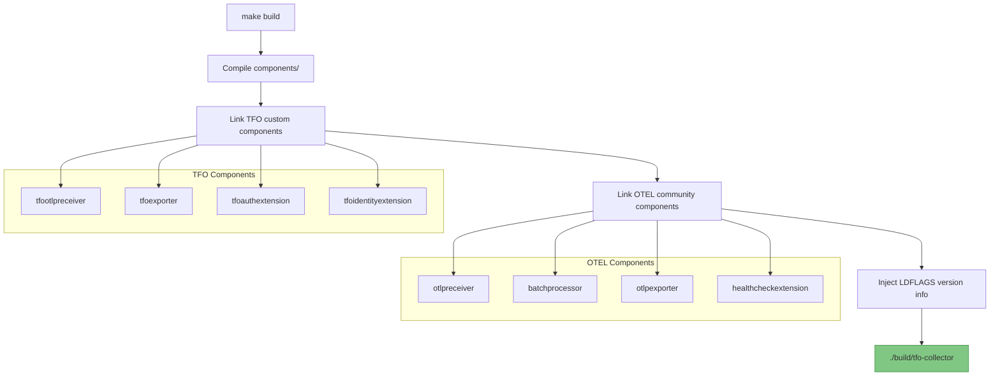
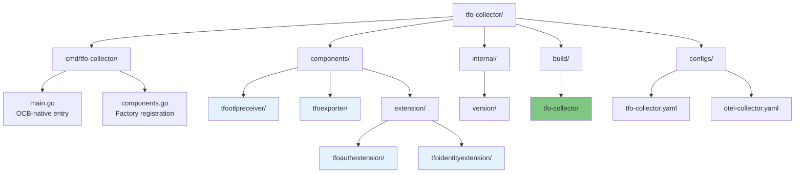

# TelemetryFlow Collector Build System

- **Version:** 1.1.2
- **OTEL Version:** 0.142.0
- **Last Updated:** January 2026

---

## Overview

TelemetryFlow Collector uses **OCB (OpenTelemetry Collector Builder)** as the native build system, producing a single unified binary that includes:

- **85+ OTEL Community Components** - Full ecosystem compatibility
- **TFO Custom Components** - Platform-specific features for TelemetryFlow



---

## OCB-Native Architecture

| Aspect | Description |
|--------|-------------|
| **Binary** | `tfo-collector` (single unified binary) |
| **Build System** | OpenTelemetry Collector Builder (OCB) |
| **CLI** | Standard OTEL CLI with TFO branding |
| **Config Format** | Standard OTEL YAML |
| **Components** | 85+ OTEL community + TFO custom |
| **Build Command** | `make build` |
| **Binary Location** | `./build/tfo-collector` |

---

## TFO Custom Components

TFO custom components are integrated natively into the OCB build:

| Component | Type | Description |
|-----------|------|-------------|
| `tfootlp` | Receiver | OTLP receiver with v1 + v2 endpoint support |
| `tfo` | Exporter | Auto-injects TFO authentication headers |
| `tfoauth` | Extension | Centralized API key management |
| `tfoidentity` | Extension | Collector identity and resource enrichment |

---

## Build Process

### How It Works



### Build Commands

```bash
# Build unified binary
make build

# Build for all platforms
make build-all

# Build for CI (specific platform)
GOOS=linux GOARCH=amd64 make ci-build

# Output
./build/tfo-collector
```

### LDFLAGS

Version information is injected at build time:

```makefile
LDFLAGS_VERSION := -s -w \
    -X 'github.com/telemetryflow/telemetryflow-collector/internal/version.Version=$(VERSION)' \
    -X 'github.com/telemetryflow/telemetryflow-collector/internal/version.GitCommit=$(GIT_COMMIT)' \
    -X 'github.com/telemetryflow/telemetryflow-collector/internal/version.GitBranch=$(GIT_BRANCH)' \
    -X 'github.com/telemetryflow/telemetryflow-collector/internal/version.BuildTime=$(BUILD_TIME)'
```

---

## Directory Structure



```text
tfo-collector/
├── cmd/tfo-collector/
│   ├── main.go                 # OCB-native entry with TFO branding
│   └── components.go           # Component factory registration
├── components/                 # TFO custom components
│   ├── tfootlpreceiver/        # TFO OTLP receiver (v1+v2)
│   │   ├── factory.go
│   │   ├── config.go
│   │   └── receiver.go
│   ├── tfoexporter/            # TFO exporter (auto-auth)
│   │   ├── factory.go
│   │   ├── config.go
│   │   └── exporter.go
│   └── extension/
│       ├── tfoauthextension/   # TFO auth extension
│       └── tfoidentityextension/ # TFO identity extension
├── internal/
│   └── version/                # Version info & banner
├── build/
│   └── tfo-collector           # Built binary
├── configs/
│   ├── tfo-collector.yaml      # TFO config with custom components
│   └── otel-collector.yaml     # Standard OTEL config
└── Makefile
```

---

## Makefile Reference

### Variables

```makefile
PRODUCT_NAME := TelemetryFlow Collector
BINARY_NAME := tfo-collector
VERSION ?= 1.1.2
OTEL_VERSION := 0.142.0

BUILD_DIR := ./build
CONFIG_DIR := ./configs
```

### Build Targets

```makefile
# Default target - builds collector
all: build

# Build unified binary
build: tidy-components
    go build -ldflags "$(LDFLAGS_VERSION)" -o $(BUILD_DIR)/$(BINARY_NAME) ./cmd/tfo-collector

# Build for all platforms
build-all:
    # linux/amd64, linux/arm64, darwin/amd64, darwin/arm64, windows/amd64

# CI build for specific platform
ci-build:
    CGO_ENABLED=0 GOOS=$(GOOS) GOARCH=$(GOARCH) go build ...

# Tidy component modules
tidy-components:
    for dir in components/*/; do cd $$dir && go mod tidy && cd -; done
```

### Run Targets

```makefile
# Run collector
run: build
    $(BUILD_DIR)/$(BINARY_NAME) --config $(CONFIG_DIR)/tfo-collector.yaml

# Run with debug logging
run-debug: build
    $(BUILD_DIR)/$(BINARY_NAME) --config $(CONFIG_DIR)/tfo-collector.yaml \
        --set=service.telemetry.logs.level=debug

# Validate configuration
validate-config: build
    $(BUILD_DIR)/$(BINARY_NAME) validate --config $(CONFIG_DIR)/tfo-collector.yaml
```

### Common Targets

```makefile
# Clean all build artifacts
clean:
    rm -rf $(BUILD_DIR)/*

# Show version info
version:
    @echo "Version: $(VERSION)"
    @echo "OTEL Version: $(OTEL_VERSION)"
    @echo "Git Commit: $(GIT_COMMIT)"

# Tidy all go modules
tidy:
    go mod tidy
    $(MAKE) tidy-components

# Run tests
test:
    go test -v ./...

# Run linter
lint:
    golangci-lint run ./...
```

---

## Configuration Format

TelemetryFlow Collector uses **standard OpenTelemetry Collector YAML format** with TFO custom components:

```yaml
# configs/tfo-collector.yaml

receivers:
  # TFO custom receiver with v1+v2 endpoints
  tfootlp:
    protocols:
      grpc:
        endpoint: "0.0.0.0:4317"
      http:
        endpoint: "0.0.0.0:4318"
    enable_v2_endpoints: true

  # Standard OTEL receiver
  otlp:
    protocols:
      grpc:
        endpoint: "0.0.0.0:4317"

processors:
  batch:
    send_batch_size: 8192
    timeout: 200ms

exporters:
  # TFO custom exporter with auto-auth
  tfo:
    endpoint: "https://api.telemetryflow.id"
    use_v2_api: true
    auth:
      extension: tfoauth

  # Standard OTEL exporter
  debug:
    verbosity: detailed

extensions:
  # TFO custom extensions
  tfoauth:
    api_key_id: "${env:TELEMETRYFLOW_API_KEY_ID}"
    api_key_secret: "${env:TELEMETRYFLOW_API_KEY_SECRET}"
  tfoidentity:
    id: "${env:TELEMETRYFLOW_COLLECTOR_ID}"
    name: "Production Collector"

  # Standard OTEL extensions
  health_check:
    endpoint: "0.0.0.0:13133"

service:
  extensions: [health_check, tfoauth, tfoidentity]
  pipelines:
    traces:
      receivers: [tfootlp]
      processors: [batch]
      exporters: [tfo]
```

---

## CLI Commands

```bash
# Show help
./build/tfo-collector --help

# Run with config
./build/tfo-collector --config configs/tfo-collector.yaml

# Validate config
./build/tfo-collector validate --config configs/tfo-collector.yaml

# Show components
./build/tfo-collector components

# Show version
./build/tfo-collector --version
```

---

## Troubleshooting

### Build Fails: "undefined: component.Type"

This indicates OTEL API version mismatch. Ensure go.mod has matching versions:

```bash
# Check versions
grep "go.opentelemetry.io/collector" go.mod

# Update to correct version
go get go.opentelemetry.io/collector@v0.142.0
go mod tidy
```

### Build Fails: "MakeFactoryMap undefined"

OTEL 0.142.0 removed `MakeFactoryMap` functions. Use manual map creation:

```go
// Old API (deprecated)
factories.Extensions, err = extension.MakeFactoryMap(...)

// New API (0.142.0+)
factories.Extensions = make(map[component.Type]extension.Factory)
for _, f := range extensionFactories {
    factories.Extensions[f.Type()] = f
}
```

### Config Error: "unknown component: tfootlp"

Ensure TFO custom components are registered in `cmd/tfo-collector/components.go`:

```go
factories.Receivers[tfootlpreceiver.NewFactory().Type()] = tfootlpreceiver.NewFactory()
```

### Go Version Mismatch

Clear build cache if switching Go versions:

```bash
go clean -cache
rm -rf $(go env GOCACHE)/*
make clean
make build
```

---

**Copyright (c) 2024-2026 DevOpsCorner Indonesia. All rights reserved.**
