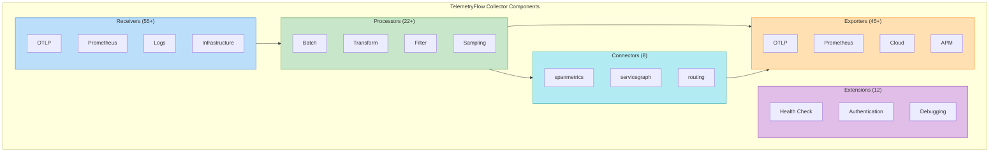
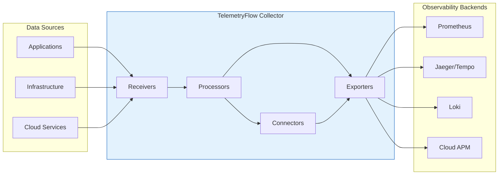

# TelemetryFlow Collector - Component Reference

- **Version:** 1.1.2
- **OTEL Version:** 0.142.0
- **Last Updated:** January 2026

This document provides a comprehensive reference of all OpenTelemetry Collector components included in the TelemetryFlow Collector distribution.

## Component Overview



### Component Data Flow



| Category | Count | Purpose |
|----------|-------|---------|
| Extensions | 12 | Authentication, health checks, debugging |
| Receivers | 55+ | Ingest telemetry data |
| Processors | 22+ | Transform and enrich data |
| Exporters | 45+ | Send data to backends |
| Connectors | 8 | Bridge pipelines, derive metrics |

---

## Extensions

Extensions provide auxiliary capabilities like health checks, authentication, and debugging.

### Core Extensions

| Extension | Description | Documentation |
|-----------|-------------|---------------|
| `zpages` | zPages debugging interface | [Link](https://github.com/open-telemetry/opentelemetry-collector/tree/main/extension/zpagesextension) |
| `health_check` | HTTP health check endpoint | [Link](https://github.com/open-telemetry/opentelemetry-collector-contrib/tree/main/extension/healthcheckextension) |
| `pprof` | Go pprof profiling endpoint | [Link](https://github.com/open-telemetry/opentelemetry-collector-contrib/tree/main/extension/pprofextension) |
| `file_storage` | Persistent storage for queuing | [Link](https://github.com/open-telemetry/opentelemetry-collector-contrib/tree/main/extension/storage/filestorage) |

### Authentication Extensions

| Extension | Description | Documentation |
|-----------|-------------|---------------|
| `basicauth` | HTTP Basic authentication | [Link](https://github.com/open-telemetry/opentelemetry-collector-contrib/tree/main/extension/basicauthextension) |
| `bearertoken` | Bearer token authentication | [Link](https://github.com/open-telemetry/opentelemetry-collector-contrib/tree/main/extension/bearertokenauthextension) |
| `headers_setter` | Add custom headers | [Link](https://github.com/open-telemetry/opentelemetry-collector-contrib/tree/main/extension/headerssetterextension) |
| `oauth2client` | OAuth 2.0 client credentials | [Link](https://github.com/open-telemetry/opentelemetry-collector-contrib/tree/main/extension/oauth2clientauthextension) |
| `oidc` | OpenID Connect authentication | [Link](https://github.com/open-telemetry/opentelemetry-collector-contrib/tree/main/extension/oidcauthextension) |
| `sigv4auth` | AWS Signature Version 4 | [Link](https://github.com/open-telemetry/opentelemetry-collector-contrib/tree/main/extension/sigv4authextension) |

---

## Receivers

Receivers collect telemetry data from various sources.

### OTLP Receiver (Core)

The primary receiver for OpenTelemetry Protocol data. Supports all three signal types (traces, metrics, logs) over both gRPC and HTTP protocols.

**Capabilities:**

| Feature | gRPC (4317) | HTTP (4318) |
|---------|-------------|-------------|
| Protocol Buffers | Yes | Yes |
| JSON Encoding | No | Yes |
| Streaming | Bidirectional | Request/Response |
| TLS/mTLS | Yes | Yes |
| Compression | gzip | gzip |

**Basic Configuration:**

```yaml
receivers:
  otlp:
    protocols:
      grpc:
        endpoint: "0.0.0.0:4317"
      http:
        endpoint: "0.0.0.0:4318"
```

**Advanced Configuration with TLS:**

```yaml
receivers:
  otlp:
    protocols:
      grpc:
        endpoint: "0.0.0.0:4317"
        max_recv_msg_size_mib: 4
        max_concurrent_streams: 100
        read_buffer_size: 524288
        write_buffer_size: 524288
        tls:
          cert_file: /etc/tfo-collector/certs/server.crt
          key_file: /etc/tfo-collector/certs/server.key
          client_ca_file: /etc/tfo-collector/certs/ca.crt
        keepalive:
          server_parameters:
            max_connection_idle: 15s
            max_connection_age: 30s
            max_connection_age_grace: 5s
            time: 10s
            timeout: 5s
      http:
        endpoint: "0.0.0.0:4318"
        max_request_body_size: 10485760
        cors:
          allowed_origins: ["*"]
          allowed_headers: ["*"]
          max_age: 7200
        tls:
          cert_file: /etc/tfo-collector/certs/server.crt
          key_file: /etc/tfo-collector/certs/server.key
```

**HTTP API Endpoints:**

TFO-Collector supports both standard OTLP v1 and TelemetryFlow Platform v2 endpoints:

| Version | Endpoint | Signal | Content-Type |
|---------|----------|--------|--------------|
| v1 (Standard OTLP) | `/v1/traces` | Traces | `application/x-protobuf`, `application/json` |
| v1 (Standard OTLP) | `/v1/metrics` | Metrics | `application/x-protobuf`, `application/json` |
| v1 (Standard OTLP) | `/v1/logs` | Logs | `application/x-protobuf`, `application/json` |
| v2 (TelemetryFlow) | `/v2/traces` | Traces | `application/x-protobuf`, `application/json` |
| v2 (TelemetryFlow) | `/v2/metrics` | Metrics | `application/x-protobuf`, `application/json` |
| v2 (TelemetryFlow) | `/v2/logs` | Logs | `application/x-protobuf`, `application/json` |

> **Note:** The v1 endpoints follow the standard OpenTelemetry specification. The v2 endpoints are TelemetryFlow Platform-specific for enhanced features. Both versions use the same handlers and are functionally equivalent.

### Trace Receivers (Legacy Formats)

| Receiver | Protocol | Port | Documentation |
|----------|----------|------|---------------|
| `jaeger` | Thrift/gRPC | 14250, 14268, 6831, 6832 | [Link](https://github.com/open-telemetry/opentelemetry-collector-contrib/tree/main/receiver/jaegerreceiver) |
| `zipkin` | HTTP | 9411 | [Link](https://github.com/open-telemetry/opentelemetry-collector-contrib/tree/main/receiver/zipkinreceiver) |
| `opencensus` | gRPC | 55678 | [Link](https://github.com/open-telemetry/opentelemetry-collector-contrib/tree/main/receiver/opencensusreceiver) |
| `skywalking` | gRPC/HTTP | 11800, 12800 | [Link](https://github.com/open-telemetry/opentelemetry-collector-contrib/tree/main/receiver/skywalkingreceiver) |

### Metrics Receivers

| Receiver | Description | Documentation |
|----------|-------------|---------------|
| `hostmetrics` | CPU, memory, disk, network metrics | [Link](https://github.com/open-telemetry/opentelemetry-collector-contrib/tree/main/receiver/hostmetricsreceiver) |
| `prometheus` | Scrape Prometheus endpoints | [Link](https://github.com/open-telemetry/opentelemetry-collector-contrib/tree/main/receiver/prometheusreceiver) |
| `statsd` | StatsD metrics | [Link](https://github.com/open-telemetry/opentelemetry-collector-contrib/tree/main/receiver/statsdreceiver) |
| `carbon` | Graphite Carbon metrics | [Link](https://github.com/open-telemetry/opentelemetry-collector-contrib/tree/main/receiver/carbonreceiver) |
| `collectd` | collectd metrics | [Link](https://github.com/open-telemetry/opentelemetry-collector-contrib/tree/main/receiver/collectdreceiver) |
| `influxdb` | InfluxDB line protocol | [Link](https://github.com/open-telemetry/opentelemetry-collector-contrib/tree/main/receiver/influxdbreceiver) |

### Log Receivers

| Receiver | Description | Documentation |
|----------|-------------|---------------|
| `filelog` | Tail log files | [Link](https://github.com/open-telemetry/opentelemetry-collector-contrib/tree/main/receiver/filelogreceiver) |
| `journald` | Linux systemd journal | [Link](https://github.com/open-telemetry/opentelemetry-collector-contrib/tree/main/receiver/journaldreceiver) |
| `syslog` | RFC 3164/5424 syslog | [Link](https://github.com/open-telemetry/opentelemetry-collector-contrib/tree/main/receiver/syslogreceiver) |
| `tcplog` | TCP log ingestion | [Link](https://github.com/open-telemetry/opentelemetry-collector-contrib/tree/main/receiver/tcplogreceiver) |
| `udplog` | UDP log ingestion | [Link](https://github.com/open-telemetry/opentelemetry-collector-contrib/tree/main/receiver/udplogreceiver) |
| `windowseventlog` | Windows Event Log | [Link](https://github.com/open-telemetry/opentelemetry-collector-contrib/tree/main/receiver/windowseventlogreceiver) |
| `fluentforward` | Fluentd/Fluent Bit forward | [Link](https://github.com/open-telemetry/opentelemetry-collector-contrib/tree/main/receiver/fluentforwardreceiver) |

### Infrastructure Receivers

| Receiver | Description | Documentation |
|----------|-------------|---------------|
| `docker_stats` | Docker container metrics | [Link](https://github.com/open-telemetry/opentelemetry-collector-contrib/tree/main/receiver/dockerstatsreceiver) |
| `podman` | Podman container metrics | [Link](https://github.com/open-telemetry/opentelemetry-collector-contrib/tree/main/receiver/podmanreceiver) |
| `k8s_cluster` | Kubernetes cluster metrics | [Link](https://github.com/open-telemetry/opentelemetry-collector-contrib/tree/main/receiver/k8sclusterreceiver) |
| `k8s_events` | Kubernetes events | [Link](https://github.com/open-telemetry/opentelemetry-collector-contrib/tree/main/receiver/k8seventsreceiver) |
| `k8sobjects` | Kubernetes objects | [Link](https://github.com/open-telemetry/opentelemetry-collector-contrib/tree/main/receiver/k8sobjectsreceiver) |
| `kubeletstats` | Kubelet stats | [Link](https://github.com/open-telemetry/opentelemetry-collector-contrib/tree/main/receiver/kubeletstatsreceiver) |

### Database Receivers

| Receiver | Description | Documentation |
|----------|-------------|---------------|
| `mysql` | MySQL metrics | [Link](https://github.com/open-telemetry/opentelemetry-collector-contrib/tree/main/receiver/mysqlreceiver) |
| `postgresql` | PostgreSQL metrics | [Link](https://github.com/open-telemetry/opentelemetry-collector-contrib/tree/main/receiver/postgresqlreceiver) |
| `mongodb` | MongoDB metrics | [Link](https://github.com/open-telemetry/opentelemetry-collector-contrib/tree/main/receiver/mongodbreceiver) |
| `redis` | Redis metrics | [Link](https://github.com/open-telemetry/opentelemetry-collector-contrib/tree/main/receiver/redisreceiver) |
| `elasticsearch` | Elasticsearch metrics | [Link](https://github.com/open-telemetry/opentelemetry-collector-contrib/tree/main/receiver/elasticsearchreceiver) |
| `sqlquery` | Custom SQL queries | [Link](https://github.com/open-telemetry/opentelemetry-collector-contrib/tree/main/receiver/sqlqueryreceiver) |
| `oracledb` | Oracle Database metrics | [Link](https://github.com/open-telemetry/opentelemetry-collector-contrib/tree/main/receiver/oracledbreceiver) |

### Message Queue Receivers

| Receiver | Description | Documentation |
|----------|-------------|---------------|
| `kafka` | Kafka consumer | [Link](https://github.com/open-telemetry/opentelemetry-collector-contrib/tree/main/receiver/kafkareceiver) |
| `kafkametrics` | Kafka broker metrics | [Link](https://github.com/open-telemetry/opentelemetry-collector-contrib/tree/main/receiver/kafkametricsreceiver) |
| `rabbitmq` | RabbitMQ metrics | [Link](https://github.com/open-telemetry/opentelemetry-collector-contrib/tree/main/receiver/rabbitmqreceiver) |
| `pulsar` | Apache Pulsar | [Link](https://github.com/open-telemetry/opentelemetry-collector-contrib/tree/main/receiver/pulsarreceiver) |

### Web Server Receivers

| Receiver | Description | Documentation |
|----------|-------------|---------------|
| `nginx` | Nginx stub status | [Link](https://github.com/open-telemetry/opentelemetry-collector-contrib/tree/main/receiver/nginxreceiver) |
| `apache` | Apache mod_status | [Link](https://github.com/open-telemetry/opentelemetry-collector-contrib/tree/main/receiver/apachereceiver) |
| `haproxy` | HAProxy stats | [Link](https://github.com/open-telemetry/opentelemetry-collector-contrib/tree/main/receiver/haproxyreceiver) |
| `iis` | IIS metrics (Windows) | [Link](https://github.com/open-telemetry/opentelemetry-collector-contrib/tree/main/receiver/iisreceiver) |

### Cloud Receivers

| Receiver | Description | Documentation |
|----------|-------------|---------------|
| `awscloudwatch` | AWS CloudWatch metrics | [Link](https://github.com/open-telemetry/opentelemetry-collector-contrib/tree/main/receiver/awscloudwatchreceiver) |
| `awscontainerinsight` | AWS Container Insights | [Link](https://github.com/open-telemetry/opentelemetry-collector-contrib/tree/main/receiver/awscontainerinsightreceiver) |
| `awsecscontainermetrics` | AWS ECS metrics | [Link](https://github.com/open-telemetry/opentelemetry-collector-contrib/tree/main/receiver/awsecscontainermetricsreceiver) |
| `awsxray` | AWS X-Ray traces | [Link](https://github.com/open-telemetry/opentelemetry-collector-contrib/tree/main/receiver/awsxrayreceiver) |
| `azureeventhub` | Azure Event Hub | [Link](https://github.com/open-telemetry/opentelemetry-collector-contrib/tree/main/receiver/azureeventhubreceiver) |
| `azuremonitor` | Azure Monitor metrics | [Link](https://github.com/open-telemetry/opentelemetry-collector-contrib/tree/main/receiver/azuremonitorreceiver) |
| `googlecloudpubsub` | Google Cloud Pub/Sub | [Link](https://github.com/open-telemetry/opentelemetry-collector-contrib/tree/main/receiver/googlecloudpubsubreceiver) |

---

## Processors

Processors transform, filter, and enrich telemetry data.

### Core Processors

| Processor | Description | Documentation |
|-----------|-------------|---------------|
| `batch` | Batch data for efficient export | [Link](https://github.com/open-telemetry/opentelemetry-collector/tree/main/processor/batchprocessor) |
| `memory_limiter` | Prevent OOM conditions | [Link](https://github.com/open-telemetry/opentelemetry-collector/tree/main/processor/memorylimiterprocessor) |

### Attribute Processors

| Processor | Description | Documentation |
|-----------|-------------|---------------|
| `attributes` | Modify span/metric/log attributes | [Link](https://github.com/open-telemetry/opentelemetry-collector-contrib/tree/main/processor/attributesprocessor) |
| `resource` | Modify resource attributes | [Link](https://github.com/open-telemetry/opentelemetry-collector-contrib/tree/main/processor/resourceprocessor) |
| `resourcedetection` | Auto-detect cloud/host resources | [Link](https://github.com/open-telemetry/opentelemetry-collector-contrib/tree/main/processor/resourcedetectionprocessor) |
| `k8sattributes` | Add Kubernetes metadata | [Link](https://github.com/open-telemetry/opentelemetry-collector-contrib/tree/main/processor/k8sattributesprocessor) |

### Transform Processors

| Processor | Description | Documentation |
|-----------|-------------|---------------|
| `transform` | OTTL-based transformation | [Link](https://github.com/open-telemetry/opentelemetry-collector-contrib/tree/main/processor/transformprocessor) |
| `metricstransform` | Rename, aggregate metrics | [Link](https://github.com/open-telemetry/opentelemetry-collector-contrib/tree/main/processor/metricstransformprocessor) |
| `span` | Rename spans, extract attributes | [Link](https://github.com/open-telemetry/opentelemetry-collector-contrib/tree/main/processor/spanprocessor) |
| `logstransform` | Transform logs | [Link](https://github.com/open-telemetry/opentelemetry-collector-contrib/tree/main/processor/logstransformprocessor) |

### Filtering Processors

| Processor | Description | Documentation |
|-----------|-------------|---------------|
| `filter` | Filter telemetry by conditions | [Link](https://github.com/open-telemetry/opentelemetry-collector-contrib/tree/main/processor/filterprocessor) |
| `routing` | Route to different exporters | [Link](https://github.com/open-telemetry/opentelemetry-collector-contrib/tree/main/processor/routingprocessor) |
| `groupbyattrs` | Group by attributes | [Link](https://github.com/open-telemetry/opentelemetry-collector-contrib/tree/main/processor/groupbyattrsprocessor) |
| `groupbytrace` | Wait for complete traces | [Link](https://github.com/open-telemetry/opentelemetry-collector-contrib/tree/main/processor/groupbytraceprocessor) |

### Sampling Processors

| Processor | Description | Documentation |
|-----------|-------------|---------------|
| `tail_sampling` | Intelligent trace sampling | [Link](https://github.com/open-telemetry/opentelemetry-collector-contrib/tree/main/processor/tailsamplingprocessor) |
| `probabilistic_sampler` | Probabilistic sampling | [Link](https://github.com/open-telemetry/opentelemetry-collector-contrib/tree/main/processor/probabilisticsamplerprocessor) |

### Metrics Processors

| Processor | Description | Documentation |
|-----------|-------------|---------------|
| `cumulativetodelta` | Convert cumulative to delta | [Link](https://github.com/open-telemetry/opentelemetry-collector-contrib/tree/main/processor/cumulativetodeltaprocessor) |
| `deltatocumulative` | Convert delta to cumulative | [Link](https://github.com/open-telemetry/opentelemetry-collector-contrib/tree/main/processor/deltatocumulativeprocessor) |
| `metricsgeneration` | Derive new metrics | [Link](https://github.com/open-telemetry/opentelemetry-collector-contrib/tree/main/processor/metricsgenerationprocessor) |
| `interval` | Aggregate over time intervals | [Link](https://github.com/open-telemetry/opentelemetry-collector-contrib/tree/main/processor/intervalprocessor) |

### Security Processors

| Processor | Description | Documentation |
|-----------|-------------|---------------|
| `redaction` | Remove sensitive data (PII) | [Link](https://github.com/open-telemetry/opentelemetry-collector-contrib/tree/main/processor/redactionprocessor) |

---

## Exporters

Exporters send telemetry data to various backends.

### Core OTLP Exporters

| Exporter | Description | Documentation |
|----------|-------------|---------------|
| `otlp` | OTLP gRPC exporter | [Link](https://github.com/open-telemetry/opentelemetry-collector/tree/main/exporter/otlpexporter) |
| `otlphttp` | OTLP HTTP exporter | [Link](https://github.com/open-telemetry/opentelemetry-collector/tree/main/exporter/otlphttpexporter) |
| `debug` | Debug output (console) | [Link](https://github.com/open-telemetry/opentelemetry-collector/tree/main/exporter/debugexporter) |

**OTLP gRPC Exporter Configuration:**

```yaml
exporters:
  otlp:
    endpoint: "otel-backend:4317"
    tls:
      insecure: false
      cert_file: /etc/tfo-collector/certs/client.crt
      key_file: /etc/tfo-collector/certs/client.key
      ca_file: /etc/tfo-collector/certs/ca.crt
    headers:
      Authorization: "Bearer ${API_TOKEN}"
    compression: gzip
    timeout: 30s
    retry_on_failure:
      enabled: true
      initial_interval: 5s
      max_interval: 30s
      max_elapsed_time: 300s
    sending_queue:
      enabled: true
      num_consumers: 10
      queue_size: 5000
```

**OTLP HTTP Exporter Configuration:**

```yaml
exporters:
  otlphttp:
    endpoint: "https://otel-backend:4318"
    tls:
      insecure: false
      cert_file: /etc/tfo-collector/certs/client.crt
      key_file: /etc/tfo-collector/certs/client.key
    headers:
      Authorization: "Bearer ${API_TOKEN}"
    compression: gzip
    timeout: 30s
    encoding: proto  # or "json"
```

**OTLP Exporter Features:**

| Feature | gRPC | HTTP |
|---------|------|------|
| Protocol Buffers | Yes | Yes |
| JSON Encoding | No | Yes |
| TLS/mTLS | Yes | Yes |
| Compression | gzip | gzip |
| Retry on Failure | Yes | Yes |
| Sending Queue | Yes | Yes |
| Custom Headers | Yes | Yes |

### Metrics Exporters

| Exporter | Description | Documentation |
|----------|-------------|---------------|
| `prometheus` | Prometheus scrape endpoint | [Link](https://github.com/open-telemetry/opentelemetry-collector-contrib/tree/main/exporter/prometheusexporter) |
| `prometheusremotewrite` | Prometheus remote write | [Link](https://github.com/open-telemetry/opentelemetry-collector-contrib/tree/main/exporter/prometheusremotewriteexporter) |
| `carbon` | Graphite Carbon | [Link](https://github.com/open-telemetry/opentelemetry-collector-contrib/tree/main/exporter/carbonexporter) |
| `influxdb` | InfluxDB | [Link](https://github.com/open-telemetry/opentelemetry-collector-contrib/tree/main/exporter/influxdbexporter) |

### Logs Exporters

| Exporter | Description | Documentation |
|----------|-------------|---------------|
| `loki` | Grafana Loki | [Link](https://github.com/open-telemetry/opentelemetry-collector-contrib/tree/main/exporter/lokiexporter) |
| `file` | Local file output | [Link](https://github.com/open-telemetry/opentelemetry-collector-contrib/tree/main/exporter/fileexporter) |

### Database Exporters

| Exporter | Description | Documentation |
|----------|-------------|---------------|
| `elasticsearch` | Elasticsearch | [Link](https://github.com/open-telemetry/opentelemetry-collector-contrib/tree/main/exporter/elasticsearchexporter) |
| `clickhouse` | ClickHouse analytics | [Link](https://github.com/open-telemetry/opentelemetry-collector-contrib/tree/main/exporter/clickhouseexporter) |
| `cassandra` | Apache Cassandra | [Link](https://github.com/open-telemetry/opentelemetry-collector-contrib/tree/main/exporter/cassandraexporter) |

### Message Queue Exporters

| Exporter | Description | Documentation |
|----------|-------------|---------------|
| `kafka` | Apache Kafka | [Link](https://github.com/open-telemetry/opentelemetry-collector-contrib/tree/main/exporter/kafkaexporter) |
| `pulsar` | Apache Pulsar | [Link](https://github.com/open-telemetry/opentelemetry-collector-contrib/tree/main/exporter/pulsarexporter) |

### Cloud Exporters

| Exporter | Description | Documentation |
|----------|-------------|---------------|
| `awsemf` | AWS CloudWatch EMF | [Link](https://github.com/open-telemetry/opentelemetry-collector-contrib/tree/main/exporter/awsemfexporter) |
| `awsxray` | AWS X-Ray | [Link](https://github.com/open-telemetry/opentelemetry-collector-contrib/tree/main/exporter/awsxrayexporter) |
| `awscloudwatchlogs` | AWS CloudWatch Logs | [Link](https://github.com/open-telemetry/opentelemetry-collector-contrib/tree/main/exporter/awscloudwatchlogsexporter) |
| `awskinesis` | AWS Kinesis | [Link](https://github.com/open-telemetry/opentelemetry-collector-contrib/tree/main/exporter/awskinesisexporter) |
| `awss3` | AWS S3 | [Link](https://github.com/open-telemetry/opentelemetry-collector-contrib/tree/main/exporter/awss3exporter) |
| `googlecloud` | Google Cloud Monitoring | [Link](https://github.com/open-telemetry/opentelemetry-collector-contrib/tree/main/exporter/googlecloudexporter) |
| `googlecloudpubsub` | Google Cloud Pub/Sub | [Link](https://github.com/open-telemetry/opentelemetry-collector-contrib/tree/main/exporter/googlecloudpubsubexporter) |
| `azuremonitor` | Azure Monitor | [Link](https://github.com/open-telemetry/opentelemetry-collector-contrib/tree/main/exporter/azuremonitorexporter) |
| `azuredataexplorer` | Azure Data Explorer | [Link](https://github.com/open-telemetry/opentelemetry-collector-contrib/tree/main/exporter/azuredataexplorerexporter) |

### APM Platform Exporters

| Exporter | Description | Documentation |
|----------|-------------|---------------|
| `datadog` | Datadog APM | [Link](https://github.com/open-telemetry/opentelemetry-collector-contrib/tree/main/exporter/datadogexporter) |
| `splunkhec` | Splunk HEC | [Link](https://github.com/open-telemetry/opentelemetry-collector-contrib/tree/main/exporter/splunkhecexporter) |
| `signalfx` | Splunk SignalFx | [Link](https://github.com/open-telemetry/opentelemetry-collector-contrib/tree/main/exporter/signalfxexporter) |
| `dynatrace` | Dynatrace | [Link](https://github.com/open-telemetry/opentelemetry-collector-contrib/tree/main/exporter/dynatraceexporter) |
| `coralogix` | Coralogix | [Link](https://github.com/open-telemetry/opentelemetry-collector-contrib/tree/main/exporter/coralogixexporter) |
| `logzio` | Logz.io | [Link](https://github.com/open-telemetry/opentelemetry-collector-contrib/tree/main/exporter/logzioexporter) |
| `sumologic` | Sumo Logic | [Link](https://github.com/open-telemetry/opentelemetry-collector-contrib/tree/main/exporter/sumologicexporter) |
| `sentry` | Sentry | [Link](https://github.com/open-telemetry/opentelemetry-collector-contrib/tree/main/exporter/sentryexporter) |

### Legacy Trace Exporters

| Exporter | Description | Documentation |
|----------|-------------|---------------|
| `zipkin` | Zipkin backend | [Link](https://github.com/open-telemetry/opentelemetry-collector-contrib/tree/main/exporter/zipkinexporter) |
| `opencensus` | OpenCensus backend | [Link](https://github.com/open-telemetry/opentelemetry-collector-contrib/tree/main/exporter/opencensusexporter) |
| `skywalking` | SkyWalking backend | [Link](https://github.com/open-telemetry/opentelemetry-collector-contrib/tree/main/exporter/skywalkingexporter) |

> **Note**: Jaeger exporter is deprecated. Use OTLP exporter to send traces to Jaeger instead.

---

## Connectors

Connectors bridge pipelines and derive new telemetry.

### Core Connectors

| Connector | Description | Documentation |
|-----------|-------------|---------------|
| `forward` | Forward data between pipelines | [Link](https://github.com/open-telemetry/opentelemetry-collector/tree/main/connector/forwardconnector) |
| `count` | Count signals | [Link](https://github.com/open-telemetry/opentelemetry-collector-contrib/tree/main/connector/countconnector) |

### Exemplars & Service Graph Connectors

| Connector | Description | Documentation |
|-----------|-------------|---------------|
| `spanmetrics` | Derive metrics from traces with **exemplars** | [Link](https://github.com/open-telemetry/opentelemetry-collector-contrib/tree/main/connector/spanmetricsconnector) |
| `servicegraph` | Build service dependency graphs | [Link](https://github.com/open-telemetry/opentelemetry-collector-contrib/tree/main/connector/servicegraphconnector) |
| `exceptions` | Extract exceptions from traces | [Link](https://github.com/open-telemetry/opentelemetry-collector-contrib/tree/main/connector/exceptionsconnector) |

### Routing Connectors

| Connector | Description | Documentation |
|-----------|-------------|---------------|
| `routing` | Route data to different pipelines | [Link](https://github.com/open-telemetry/opentelemetry-collector-contrib/tree/main/connector/routingconnector) |
| `failover` | Failover between pipelines | [Link](https://github.com/open-telemetry/opentelemetry-collector-contrib/tree/main/connector/failoverconnector) |

---

## Adding New Components

To add a component not listed here:

1. Check if it exists in [OTEL Collector Contrib](https://github.com/open-telemetry/opentelemetry-collector-contrib)
2. Add it to `manifest.yaml`:
   ```yaml
   receivers:
     - gomod: github.com/open-telemetry/opentelemetry-collector-contrib/receiver/newreceiver v0.114.0
   ```
3. Rebuild with OCB: `builder --config manifest.yaml`
4. Configure in your YAML config file

## Related Documentation

- [OCB Build Guide](./OCB_BUILD.md)
- [Configuration Guide](./CONFIGURATION.md)
- [Exemplars Guide](./EXEMPLARS.md)
