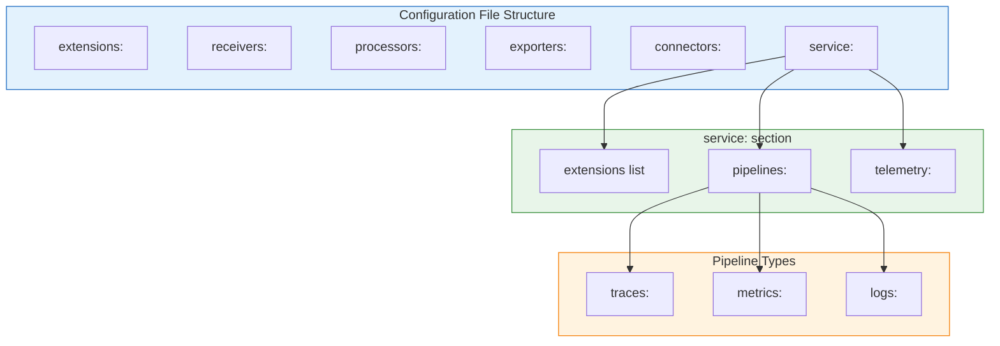
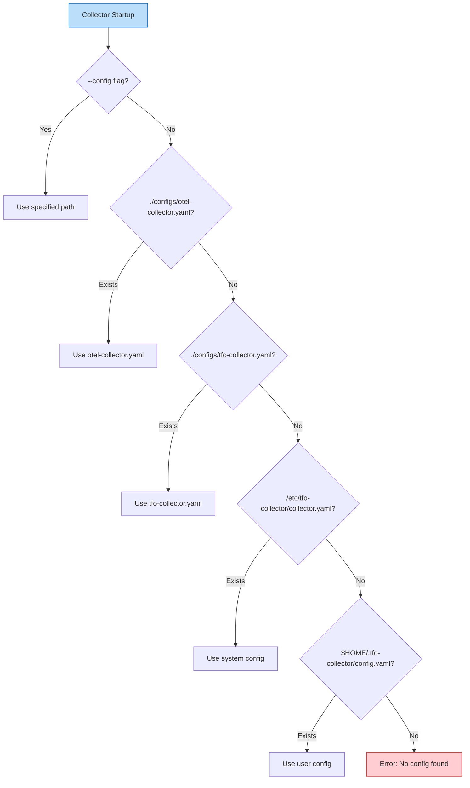
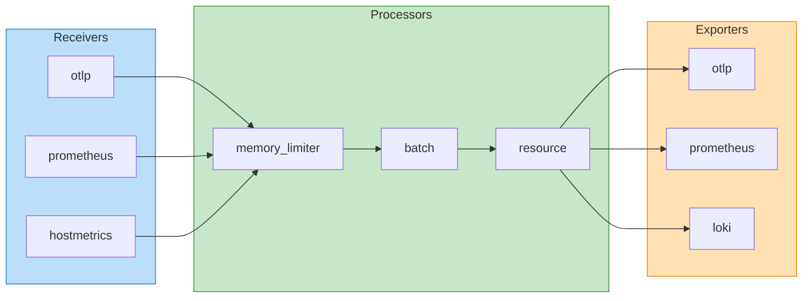

# TelemetryFlow Collector - Configuration Guide

- **Version:** 1.1.2
- **OTEL Version:** 0.142.0
- **Last Updated:** January 2026

This guide provides configuration examples and best practices for the TelemetryFlow Collector.

## Configuration Overview



## Configuration File Location



The collector looks for configuration files in the following order:

1. Path specified via `--config` flag
2. `./configs/otel-collector.yaml` (for OCB build)
3. `./configs/tfo-collector.yaml` (for standalone build)
4. `/etc/tfo-collector/collector.yaml`
5. `$HOME/.tfo-collector/config.yaml`

## Basic Structure

```yaml
# Extensions - Auxiliary capabilities
extensions:
  health_check:
    endpoint: "0.0.0.0:13133"

# Receivers - How data enters the collector
receivers:
  otlp:
    protocols:
      grpc:
        endpoint: "0.0.0.0:4317"
      http:
        endpoint: "0.0.0.0:4318"

# Processors - How data is transformed
processors:
  batch:
    timeout: 200ms
    send_batch_size: 8192

# Exporters - Where data is sent
exporters:
  otlp:
    endpoint: "backend:4317"

# Connectors - Bridge pipelines
connectors:
  spanmetrics:
    histogram:
      explicit:
        buckets: [1ms, 5ms, 10ms, 25ms, 50ms, 100ms, 250ms, 500ms, 1s]

# Service - Defines active pipelines
service:
  extensions: [health_check]
  pipelines:
    traces:
      receivers: [otlp]
      processors: [batch]
      exporters: [otlp]
```

---

## OTLP Configuration

### OTLP Receiver Configuration

The OTLP receiver is the primary entry point for telemetry data. It supports both gRPC and HTTP protocols.

**Complete OTLP Receiver Configuration:**

```yaml
receivers:
  otlp:
    protocols:
      # gRPC Protocol (Port 4317)
      grpc:
        endpoint: "0.0.0.0:4317"
        max_recv_msg_size_mib: 4           # Max message size in MiB
        max_concurrent_streams: 100         # Max concurrent gRPC streams
        read_buffer_size: 524288            # Read buffer size (512 KiB)
        write_buffer_size: 524288           # Write buffer size (512 KiB)

        # TLS Configuration
        tls:
          cert_file: /etc/tfo-collector/certs/server.crt
          key_file: /etc/tfo-collector/certs/server.key
          client_ca_file: /etc/tfo-collector/certs/ca.crt  # For mTLS
          min_version: "1.2"

        # Keepalive Configuration
        keepalive:
          server_parameters:
            max_connection_idle: 15s
            max_connection_age: 30s
            max_connection_age_grace: 5s
            time: 10s
            timeout: 5s

      # HTTP Protocol (Port 4318)
      http:
        endpoint: "0.0.0.0:4318"
        max_request_body_size: 10485760     # 10 MiB

        # CORS Configuration
        cors:
          allowed_origins: ["*"]
          allowed_headers: ["*"]
          max_age: 7200

        # TLS Configuration
        tls:
          cert_file: /etc/tfo-collector/certs/server.crt
          key_file: /etc/tfo-collector/certs/server.key
```

### OTLP Exporter Configuration

**OTLP gRPC Exporter (Recommended for high throughput):**

```yaml
exporters:
  otlp:
    endpoint: "otel-backend:4317"

    # TLS Configuration
    tls:
      insecure: false
      cert_file: /etc/tfo-collector/certs/client.crt
      key_file: /etc/tfo-collector/certs/client.key
      ca_file: /etc/tfo-collector/certs/ca.crt

    # Custom Headers (for authentication)
    headers:
      Authorization: "Bearer ${OTEL_API_TOKEN}"
      X-Tenant-ID: "${TENANT_ID}"

    # Compression
    compression: gzip

    # Timeout
    timeout: 30s

    # Retry Configuration
    retry_on_failure:
      enabled: true
      initial_interval: 5s
      max_interval: 30s
      max_elapsed_time: 300s

    # Sending Queue (for resilience)
    sending_queue:
      enabled: true
      num_consumers: 10
      queue_size: 5000
      storage: file_storage  # For persistent queue
```

**OTLP HTTP Exporter (For HTTP-only backends):**

```yaml
exporters:
  otlphttp:
    endpoint: "https://otel-backend:4318"

    # TLS Configuration
    tls:
      insecure: false
      cert_file: /etc/tfo-collector/certs/client.crt
      key_file: /etc/tfo-collector/certs/client.key

    # Custom Headers
    headers:
      Authorization: "Bearer ${OTEL_API_TOKEN}"

    # Encoding: proto (default) or json
    encoding: proto

    # Compression
    compression: gzip

    # Timeout
    timeout: 30s

    # Retry Configuration
    retry_on_failure:
      enabled: true
      initial_interval: 5s
      max_interval: 30s
```

### OTLP with Exemplars (Metrics-to-Traces Correlation)

```yaml
connectors:
  spanmetrics:
    histogram:
      explicit:
        buckets: [1ms, 5ms, 10ms, 25ms, 50ms, 100ms, 250ms, 500ms, 1s, 2.5s, 5s, 10s]
    dimensions:
      - name: http.method
      - name: http.status_code
      - name: http.route
    exemplars:
      enabled: true  # Enable exemplars for metrics-to-traces correlation
    namespace: traces
    metrics_flush_interval: 15s

exporters:
  prometheus:
    endpoint: "0.0.0.0:8889"
    enable_open_metrics: true  # Required for exemplars

service:
  pipelines:
    traces:
      receivers: [otlp]
      processors: [batch]
      exporters: [otlp/traces, spanmetrics]
    metrics/spanmetrics:
      receivers: [spanmetrics]
      processors: [batch]
      exporters: [prometheus]
```

See [EXEMPLARS.md](EXEMPLARS.md) for complete exemplars setup.

---

## Common Configuration Patterns

### Pipeline Architecture



### 1. Production-Ready Basic Setup

```yaml
receivers:
  otlp:
    protocols:
      grpc:
        endpoint: "0.0.0.0:4317"
      http:
        endpoint: "0.0.0.0:4318"

processors:
  memory_limiter:
    check_interval: 1s
    limit_percentage: 80
    spike_limit_percentage: 25

  batch:
    timeout: 200ms
    send_batch_size: 8192

  resource:
    attributes:
      - key: service.namespace
        value: production
        action: upsert

exporters:
  otlp:
    endpoint: "otel-backend:4317"
    tls:
      insecure: false
      cert_file: /etc/tfo-collector/certs/client.crt
      key_file: /etc/tfo-collector/certs/client.key
    retry_on_failure:
      enabled: true
      initial_interval: 5s
      max_interval: 30s
    sending_queue:
      enabled: true
      num_consumers: 10
      queue_size: 5000

extensions:
  health_check:
    endpoint: "0.0.0.0:13133"
  pprof:
    endpoint: "0.0.0.0:1777"
  zpages:
    endpoint: "0.0.0.0:55679"

service:
  extensions: [health_check, pprof, zpages]
  pipelines:
    traces:
      receivers: [otlp]
      processors: [memory_limiter, batch, resource]
      exporters: [otlp]
    metrics:
      receivers: [otlp]
      processors: [memory_limiter, batch, resource]
      exporters: [otlp]
    logs:
      receivers: [otlp]
      processors: [memory_limiter, batch, resource]
      exporters: [otlp]
```

### 2. Multi-Backend Export

Send data to multiple backends simultaneously:

```yaml
exporters:
  # Send traces to Jaeger via OTLP
  otlp/jaeger:
    endpoint: "jaeger:4317"
    tls:
      insecure: true

  # Send metrics to Prometheus
  prometheus:
    endpoint: "0.0.0.0:8889"
    namespace: myapp
    send_timestamps: true
    enable_open_metrics: true

  # Send logs to Loki
  loki:
    endpoint: "http://loki:3100/loki/api/v1/push"
    labels:
      attributes:
        service.name: "service_name"
      resource:
        deployment.environment: "environment"

service:
  pipelines:
    traces:
      receivers: [otlp]
      processors: [batch]
      exporters: [otlp/jaeger]
    metrics:
      receivers: [otlp]
      processors: [batch]
      exporters: [prometheus]
    logs:
      receivers: [otlp]
      processors: [batch]
      exporters: [loki]
```

### 3. Kubernetes Environment

```yaml
receivers:
  otlp:
    protocols:
      grpc:
        endpoint: "0.0.0.0:4317"
      http:
        endpoint: "0.0.0.0:4318"

processors:
  memory_limiter:
    check_interval: 1s
    limit_mib: 1500
    spike_limit_mib: 512

  batch:
    timeout: 200ms
    send_batch_size: 8192

  # Auto-detect Kubernetes resources
  resourcedetection:
    detectors: [env, system, k8snode]
    timeout: 5s
    override: false

  # Add Kubernetes metadata
  k8sattributes:
    auth_type: serviceAccount
    passthrough: false
    filter:
      node_from_env_var: KUBE_NODE_NAME
    extract:
      metadata:
        - k8s.pod.name
        - k8s.pod.uid
        - k8s.deployment.name
        - k8s.namespace.name
        - k8s.node.name
        - k8s.container.name
      labels:
        - tag_name: app
          key: app.kubernetes.io/name
          from: pod
        - tag_name: version
          key: app.kubernetes.io/version
          from: pod
    pod_association:
      - sources:
          - from: resource_attribute
            name: k8s.pod.ip
      - sources:
          - from: resource_attribute
            name: k8s.pod.uid

exporters:
  otlp:
    endpoint: "otel-gateway.observability:4317"
    tls:
      insecure: true

service:
  pipelines:
    traces:
      receivers: [otlp]
      processors: [memory_limiter, k8sattributes, resourcedetection, batch]
      exporters: [otlp]
```

### 4. Tail Sampling (Error & Latency Based)

```yaml
processors:
  tail_sampling:
    decision_wait: 10s
    num_traces: 100000
    expected_new_traces_per_sec: 1000
    policies:
      # Always sample errors
      - name: errors-policy
        type: status_code
        status_code:
          status_codes: [ERROR]

      # Sample slow traces (>1s)
      - name: slow-traces-policy
        type: latency
        latency:
          threshold_ms: 1000

      # Sample traces with specific attributes
      - name: important-traces-policy
        type: string_attribute
        string_attribute:
          key: http.route
          values: ["/api/v1/checkout", "/api/v1/payment"]

      # Probabilistic fallback (5% of remaining)
      - name: probabilistic-policy
        type: probabilistic
        probabilistic:
          sampling_percentage: 5

service:
  pipelines:
    traces:
      receivers: [otlp]
      processors: [memory_limiter, tail_sampling, batch]
      exporters: [otlp]
```

### 5. Host Metrics Collection

```yaml
receivers:
  hostmetrics:
    collection_interval: 30s
    scrapers:
      cpu:
        metrics:
          system.cpu.utilization:
            enabled: true
      memory:
        metrics:
          system.memory.utilization:
            enabled: true
      disk:
      filesystem:
        exclude_mount_points:
          mount_points: ["/dev/*", "/proc/*", "/sys/*"]
          match_type: regexp
      load:
      network:
      paging:
      processes:

processors:
  resourcedetection:
    detectors: [env, system]
    system:
      hostname_sources: [os]

exporters:
  prometheus:
    endpoint: "0.0.0.0:8889"
    namespace: host

service:
  pipelines:
    metrics:
      receivers: [hostmetrics]
      processors: [resourcedetection, batch]
      exporters: [prometheus]
```

### 6. Log File Collection

```yaml
receivers:
  filelog:
    include: [/var/log/*.log, /var/log/**/*.log]
    exclude: [/var/log/*.gz]
    start_at: beginning
    include_file_path: true
    include_file_name: true
    operators:
      # Parse JSON logs
      - type: json_parser
        if: body matches "^{"
        parse_from: body
        timestamp:
          parse_from: attributes.timestamp
          layout: '%Y-%m-%dT%H:%M:%S.%LZ'
      # Parse standard logs
      - type: regex_parser
        if: body matches "^\\d{4}-\\d{2}-\\d{2}"
        regex: '^(?P<timestamp>\d{4}-\d{2}-\d{2}T\d{2}:\d{2}:\d{2}.\d+Z)\s+(?P<level>\w+)\s+(?P<message>.*)$'
      # Add severity
      - type: severity_parser
        parse_from: attributes.level
        preset: default

processors:
  batch:
    timeout: 1s
    send_batch_size: 1000

exporters:
  loki:
    endpoint: "http://loki:3100/loki/api/v1/push"
    labels:
      attributes:
        level: "severity"
      resource:
        service.name: "service"

service:
  pipelines:
    logs:
      receivers: [filelog]
      processors: [batch]
      exporters: [loki]
```

### 7. Prometheus Scraping

```yaml
receivers:
  prometheus:
    config:
      scrape_configs:
        - job_name: "node-exporter"
          scrape_interval: 15s
          static_configs:
            - targets: ["node-exporter:9100"]

        - job_name: "kubernetes-pods"
          scrape_interval: 30s
          kubernetes_sd_configs:
            - role: pod
          relabel_configs:
            - source_labels: [__meta_kubernetes_pod_annotation_prometheus_io_scrape]
              action: keep
              regex: true
            - source_labels: [__meta_kubernetes_pod_annotation_prometheus_io_path]
              action: replace
              target_label: __metrics_path__
              regex: (.+)

exporters:
  prometheusremotewrite:
    endpoint: "http://prometheus:9090/api/v1/write"
    send_metadata: true
    resource_to_telemetry_conversion:
      enabled: true

service:
  pipelines:
    metrics:
      receivers: [prometheus]
      processors: [batch]
      exporters: [prometheusremotewrite]
```

---

## Environment Variables

Use environment variables in configuration:

```yaml
exporters:
  otlp:
    endpoint: "${OTEL_EXPORTER_ENDPOINT}"
    headers:
      Authorization: "Bearer ${API_TOKEN}"
    tls:
      insecure: ${OTEL_INSECURE:-false}
```

Common environment variables:

| Variable | Description |
|----------|-------------|
| `OTEL_EXPORTER_ENDPOINT` | Backend endpoint |
| `OTEL_SERVICE_NAME` | Service name |
| `OTEL_RESOURCE_ATTRIBUTES` | Additional resource attributes |
| `TELEMETRYFLOW_TENANT_ID` | Tenant identifier |
| `TELEMETRYFLOW_API_KEY` | API authentication key |

---

## Configuration Validation

Validate your configuration before running:

```bash
# Validate configuration
./tfo-collector validate --config config.yaml
```

---

## Telemetry Configuration

Configure the collector's internal telemetry:

```yaml
service:
  telemetry:
    logs:
      level: info  # debug, info, warn, error
      encoding: json  # json, console

    metrics:
      level: detailed  # none, basic, normal, detailed
      readers:
        - pull:
            exporter:
              prometheus:
                host: "0.0.0.0"
                port: 8888
```

---

## Related Documentation

- [OCB Build Guide](./OCB_BUILD.md)
- [Component Reference](./COMPONENTS.md)
- [Exemplars Guide](./EXEMPLARS.md)
