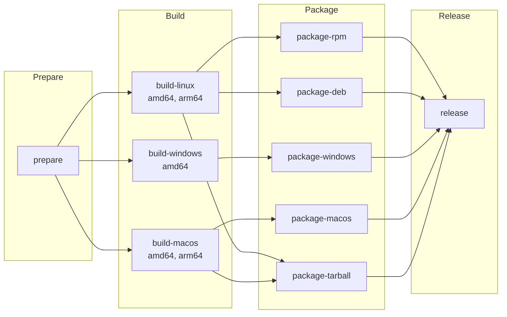
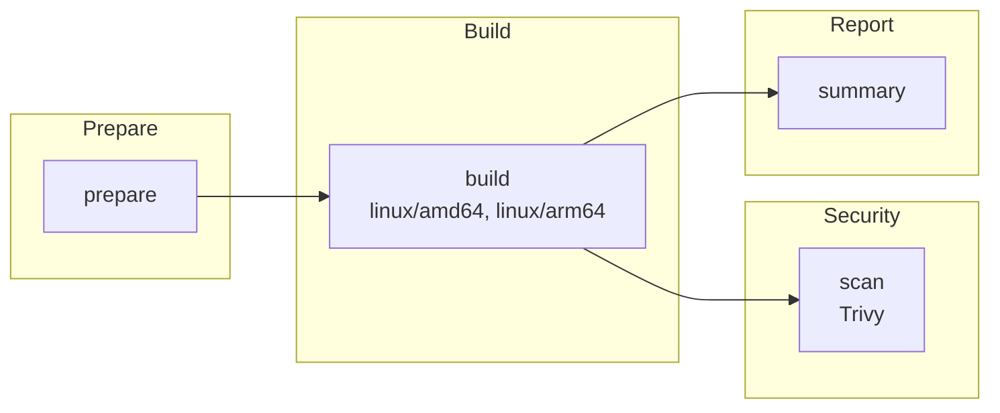
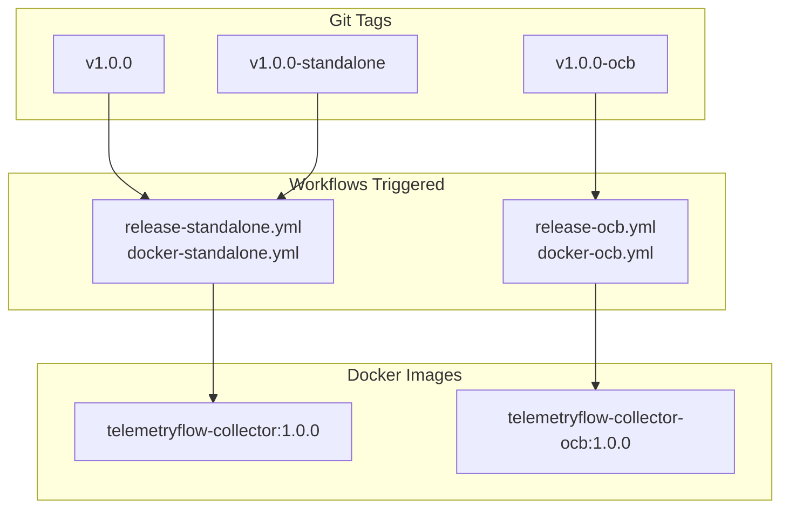
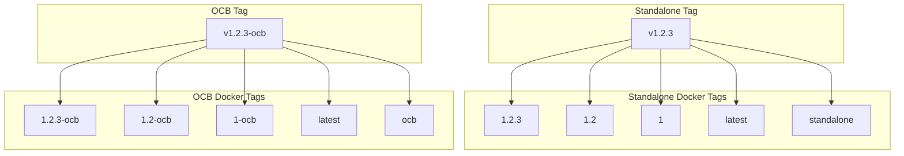

# TelemetryFlow Collector - GitHub Workflows

This document describes the GitHub Actions workflows available for TelemetryFlow Collector.

## Overview

TelemetryFlow Collector supports two build types, each with dedicated workflows:

| Build Type | Description | CLI Command |
|------------|-------------|-------------|
| **Standalone** | Custom Cobra CLI with TelemetryFlow branding | `tfo-collector start --config config.yaml` |
| **OCB** | Standard OpenTelemetry Collector Builder | `tfo-collector --config config.yaml` |

### Workflow Summary

| Workflow | File | Build Type | Purpose |
|----------|------|------------|---------|
| Release Standalone | `release-standalone.yml` | Standalone | Release binaries |
| Release OCB | `release-ocb.yml` | OCB | Release binaries |
| Docker Standalone | `docker-standalone.yml` | Standalone | Build Docker images |
| Docker OCB | `docker-ocb.yml` | OCB | Build Docker images |

---

## Release Workflows

### Release Standalone

**File:** `.github/workflows/release-standalone.yml`

Builds and releases TelemetryFlow Collector (Standalone) for multiple platforms.

#### Triggers

| Trigger | Description |
|---------|-------------|
| Push tag `v*.*.*` | Standard version tag |
| Push tag `v*.*.*-standalone` | Explicit standalone tag |
| Manual dispatch | Run with custom version |

#### Manual Trigger

```yaml
workflow_dispatch:
  inputs:
    version:
      description: 'Version to release (e.g., 1.0.0)'
      required: true
      default: '1.0.0'
    prerelease:
      description: 'Mark as pre-release'
      type: boolean
      default: false
```

---

### Release OCB

**File:** `.github/workflows/release-ocb.yml`

Builds and releases TelemetryFlow Collector (OCB) using OpenTelemetry Collector Builder.

#### Triggers

| Trigger | Description |
|---------|-------------|
| Push tag `v*.*.*-ocb` | OCB-specific version tag |
| Manual dispatch | Run with custom version and OTEL version |

#### Manual Trigger

```yaml
workflow_dispatch:
  inputs:
    version:
      description: 'Version to release (e.g., 1.0.0)'
      required: true
      default: '1.0.0'
    otel_version:
      description: 'OpenTelemetry version (e.g., 0.114.0)'
      required: true
      default: '0.114.0'
    prerelease:
      description: 'Mark as pre-release'
      type: boolean
      default: false
```

---

### Supported Platforms (Both Release Workflows)

| Platform | Architecture | Package Format |
|----------|--------------|----------------|
| Linux | amd64, arm64 | RPM, DEB, tar.gz |
| Windows | amd64 | ZIP (with installer) |
| macOS | amd64 (Intel), arm64 (Apple Silicon) | DMG, tar.gz |

### Release Usage

#### Automatic Release

```bash
# Standalone release
git tag v1.0.0
git push origin v1.0.0

# Or with explicit suffix
git tag v1.0.0-standalone
git push origin v1.0.0-standalone

# OCB release
git tag v1.0.0-ocb
git push origin v1.0.0-ocb
```

#### Manual Release

1. Go to **Actions** > **Release Standalone** or **Release OCB**
2. Click **Run workflow**
3. Enter version (e.g., `1.0.0`)
4. For OCB: Enter OTEL version (e.g., `0.114.0`)
5. Click **Run workflow**

### Release Artifacts

#### Standalone

- `tfo-collector_{version}_{arch}.deb`
- `tfo-collector-{version}-1.{rpm_arch}.rpm`
- `tfo-collector-{version}-standalone-{os}-{arch}.tar.gz`
- `tfo-collector-{version}-standalone-darwin-{arch}.dmg`
- `tfo-collector-{version}-standalone-windows-amd64.zip`

#### OCB

- `tfo-collector-ocb_{version}_{arch}.deb`
- `tfo-collector-ocb-{version}-1.{rpm_arch}.rpm`
- `tfo-collector-ocb-{version}-{os}-{arch}.tar.gz`
- `tfo-collector-ocb-{version}-darwin-{arch}.dmg`
- `tfo-collector-ocb-{version}-windows-amd64.zip`

---

## Docker Build Workflows

### Docker Standalone

**File:** `.github/workflows/docker-standalone.yml`

Builds and publishes Docker images for TelemetryFlow Collector (Standalone).

#### Triggers

| Trigger | Description |
|---------|-------------|
| Push to `main`/`master` | Build `latest` and `standalone` tags |
| Push tag `v*.*.*` | Build version tags |
| Push tag `v*.*.*-standalone` | Build version tags |
| Pull request | Build only (no push) |
| Manual dispatch | Run with custom options |

#### Path Filters

- `Dockerfile`
- `cmd/**`, `internal/**`, `pkg/**`
- `go.mod`, `go.sum`
- `configs/tfo-collector.yaml`
- `.github/workflows/docker-standalone.yml`

---

### Docker OCB

**File:** `.github/workflows/docker-ocb.yml`

Builds and publishes Docker images for TelemetryFlow Collector (OCB).

#### Triggers

| Trigger | Description |
|---------|-------------|
| Push tag `v*.*.*-ocb` | Build version tags |
| Manual dispatch | Run with custom options |

#### Path Filters

- `Dockerfile.ocb`
- `manifest.yaml`
- `configs/ocb-collector.yaml`
- `.github/workflows/docker-ocb.yml`

---

### Docker Registries

| Registry | Standalone Image | OCB Image |
|----------|------------------|-----------|
| GitHub Container Registry | `ghcr.io/{owner}/telemetryflow-collector` | `ghcr.io/{owner}/telemetryflow-collector-ocb` |
| Docker Hub | `telemetryflow/telemetryflow-collector` | `telemetryflow/telemetryflow-collector-ocb` |

### Docker Image Tags

#### Standalone Tags

| Tag Pattern | Description | Example |
|-------------|-------------|---------|
| `{version}` | Full semantic version | `1.0.0` |
| `{major}.{minor}` | Major.minor version | `1.0` |
| `{major}` | Major version only | `1` |
| `latest` | Latest from main branch | `latest` |
| `standalone` | Standalone build marker | `standalone` |
| `sha-{commit}-standalone` | Git commit SHA | `sha-abc1234-standalone` |

#### OCB Tags

| Tag Pattern | Description | Example |
|-------------|-------------|---------|
| `{version}` | Full semantic version | `1.0.0` |
| `{version}-ocb` | Version with OCB suffix | `1.0.0-ocb` |
| `latest` | Latest OCB build | `latest` |
| `ocb` | OCB build marker | `ocb` |
| `sha-{commit}-ocb` | Git commit SHA | `sha-abc1234-ocb` |

### Docker Platforms

- `linux/amd64`
- `linux/arm64`

### Manual Docker Trigger

```yaml
# Standalone
workflow_dispatch:
  inputs:
    version:
      description: 'Version tag (e.g., 1.0.0)'
    push:
      description: 'Push images to registry'
      type: boolean
      default: true
    platforms:
      description: 'Target platforms'
      default: 'linux/amd64,linux/arm64'

# OCB (additional input)
    otel_version:
      description: 'OpenTelemetry version (e.g., 0.114.0)'
      default: '0.114.0'
```

### Docker Usage

#### Automatic Build

```bash
# Standalone - push to main
git push origin main

# Standalone - version tag
git tag v1.0.0
git push origin v1.0.0

# OCB - version tag
git tag v1.0.0-ocb
git push origin v1.0.0-ocb
```

#### Pull Commands

```bash
# Standalone - GitHub Container Registry
docker pull ghcr.io/{owner}/telemetryflow-collector:latest
docker pull ghcr.io/{owner}/telemetryflow-collector:1.0.0

# Standalone - Docker Hub
docker pull telemetryflow/telemetryflow-collector:latest

# OCB - GitHub Container Registry
docker pull ghcr.io/{owner}/telemetryflow-collector-ocb:latest
docker pull ghcr.io/{owner}/telemetryflow-collector-ocb:1.0.0-ocb

# OCB - Docker Hub
docker pull telemetryflow/telemetryflow-collector-ocb:latest
```

### Run Commands

```bash
# Standalone (uses 'start --config')
docker run -d \
  --name tfo-collector \
  -p 4317:4317 -p 4318:4318 -p 8888:8888 -p 13133:13133 \
  telemetryflow/telemetryflow-collector:latest

# OCB (uses '--config' directly)
docker run -d \
  --name tfo-collector-ocb \
  -p 4317:4317 -p 4318:4318 -p 8888:8888 -p 13133:13133 \
  telemetryflow/telemetryflow-collector-ocb:latest
```

---

## Security Features

All Docker workflows include:

| Feature | Description |
|---------|-------------|
| **SBOM Generation** | Software Bill of Materials in SPDX format |
| **Trivy Scanning** | Vulnerability scanning (CRITICAL, HIGH) |
| **Provenance** | Build provenance attestation |
| **Layer Caching** | GitHub Actions cache for faster builds |

---

## Environment Variables

### Required Secrets

| Secret | Description | Required For |
|--------|-------------|--------------|
| `GITHUB_TOKEN` | Auto-provided by GitHub | All workflows |
| `DOCKERHUB_TOKEN` | Docker Hub access token | Docker Hub push |

### Required Variables

| Variable | Description | Required For |
|----------|-------------|--------------|
| `DOCKERHUB_USERNAME` | Docker Hub username | Docker Hub push |

### Setting Up Docker Hub (Optional)

1. Go to **Settings** > **Secrets and variables** > **Actions**
2. Add secret: `DOCKERHUB_TOKEN`
3. Add variable: `DOCKERHUB_USERNAME`

---

## Build Information

### Standalone Build Variables

| Variable | Description |
|----------|-------------|
| `VERSION` | Semantic version |
| `GIT_COMMIT` | Short commit SHA |
| `GIT_BRANCH` | Git branch name |
| `BUILD_TIME` | UTC build timestamp |
| `BuildType` | `standalone` |

### OCB Build Variables

| Variable | Description |
|----------|-------------|
| `VERSION` | Semantic version |
| `GIT_COMMIT` | Short commit SHA |
| `BUILD_TIME` | UTC build timestamp |
| `OtelVersion` | OpenTelemetry version |

Access via CLI:

```bash
# Standalone
tfo-collector version

# OCB
tfo-collector --version
```

---

## Workflow Jobs

### Release Workflow Jobs



### Docker Workflow Jobs



### Build Type Selection



### Semantic Versioning Tags



---

## Configuration Files

### Standalone

| File | Purpose |
|------|---------|
| `Dockerfile` | Standalone Docker build |
| `configs/tfo-collector.yaml` | Custom format with `enabled` flags |

### OCB

| File | Purpose |
|------|---------|
| `Dockerfile.ocb` | OCB Docker build |
| `manifest.yaml` | OCB component manifest |
| `configs/ocb-collector.yaml` | Standard OTEL format |

---

## CLI Differences

| Feature | Standalone | OCB |
|---------|------------|-----|
| Start command | `start --config` | `--config` |
| Version command | `version` | `--version` |
| Config validate | `config validate` | `validate --config` |
| Banner | TelemetryFlow ASCII | Standard OTEL |

---

## Troubleshooting

### Common Issues

#### 1. OCB Build Fails

**Cause**: OCB version mismatch

**Solution**: Ensure `manifest.yaml` components match the OTEL version

#### 2. Standalone Config Error

**Cause**: Invalid `enabled` flags in config

**Solution**: Use `configs/tfo-collector.yaml` format for standalone

#### 3. Docker Hub Push Fails

**Cause**: Missing credentials

**Solution**: Configure `DOCKERHUB_TOKEN` and `DOCKERHUB_USERNAME`

#### 4. Multi-arch Build Slow

**Cause**: No cache on first build

**Solution**: Subsequent builds will use GitHub Actions cache

---

## Quick Reference

### Tag Conventions

| Tag | Triggers | Build Type |
|-----|----------|------------|
| `v1.0.0` | Standalone release + Docker | Standalone |
| `v1.0.0-standalone` | Standalone release + Docker | Standalone |
| `v1.0.0-ocb` | OCB release + Docker | OCB |

### Exposed Ports

| Port | Protocol | Description |
|------|----------|-------------|
| 4317 | gRPC | OTLP gRPC receiver |
| 4318 | HTTP | OTLP HTTP receiver |
| 8888 | HTTP | Prometheus metrics (self) |
| 8889 | HTTP | Prometheus exporter |
| 13133 | HTTP | Health check |
| 55679 | HTTP | zPages |
| 1777 | HTTP | pprof |

---

## Links

- [GitHub Actions Documentation](https://docs.github.com/en/actions)
- [Docker Build Push Action](https://github.com/docker/build-push-action)
- [OpenTelemetry Collector Builder](https://github.com/open-telemetry/opentelemetry-collector/tree/main/cmd/builder)
- [Trivy Action](https://github.com/aquasecurity/trivy-action)
