# TelemetryFlow Collector - GitHub Workflows

This document describes the GitHub Actions workflows available for TelemetryFlow Collector.

## Workflow Architecture

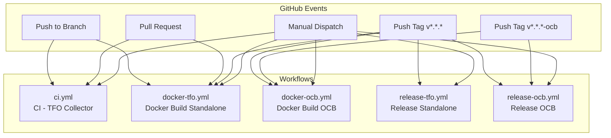

## Build Types

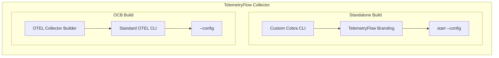

| Build Type | Description | CLI Command | Config File |
|------------|-------------|-------------|-------------|
| **Standalone** | Custom Cobra CLI with TelemetryFlow branding | `tfo-collector start --config config.yaml` | `tfo-collector.yaml` |
| **OCB** | Standard OpenTelemetry Collector Builder | `tfo-collector --config config.yaml` | `otel-collector.yaml` |

---

## Build Type Selection

The CI/CD workflows use tag-based build type selection to prevent duplicate builds and allow selective releases:

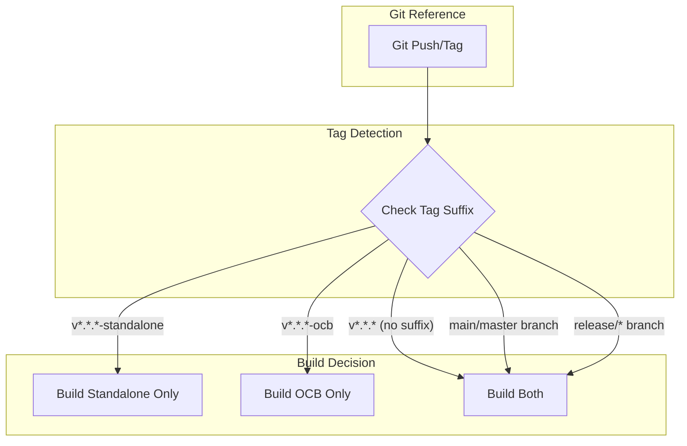

### Selection Matrix

| Git Reference | Standalone Builds | OCB Builds | Example |
|---------------|-------------------|------------|---------|
| `v*.*.*-standalone` | ✅ | ❌ | `v1.1.1-standalone` |
| `v*.*.*-ocb` | ❌ | ✅ | `v1.1.1-ocb` |
| `v*.*.*` (no suffix) | ✅ | ✅ | `v1.1.1` |
| `main` / `master` branch | ✅ | ✅ | Push to main |
| `release/*` branch | ✅ | ✅ | `release/v1.2.0` |
| `workflow_dispatch` | Based on input | Based on input | Manual trigger |

### Implementation Patterns

Each workflow type uses a specific pattern for build type selection:

#### CI Workflow (`ci.yml`)

Uses a `prepare` job with outputs:

```yaml
prepare:
  outputs:
    build_standalone: ${{ steps.determine.outputs.build_standalone }}
    build_ocb: ${{ steps.determine.outputs.build_ocb }}
  steps:
    - name: Determine build type
      run: |
        if [[ "$REF" == refs/tags/*-standalone ]]; then
          BUILD_STANDALONE="true"
          BUILD_OCB="false"
        elif [[ "$REF" == refs/tags/*-ocb ]]; then
          BUILD_STANDALONE="false"
          BUILD_OCB="true"
        else
          BUILD_STANDALONE="true"
          BUILD_OCB="true"
        fi

build-standalone:
  needs: prepare
  if: needs.prepare.outputs.build_standalone == 'true'

build-ocb:
  needs: prepare
  if: needs.prepare.outputs.build_ocb == 'true'
```

#### Docker Workflows (`docker-tfo.yml`, `docker-ocb.yml`)

Uses a `check-build-type` job with `should_run` output:

```yaml
# docker-tfo.yml - Skips if -ocb tag
check-build-type:
  outputs:
    should_run: ${{ steps.check.outputs.should_run }}
  steps:
    - run: |
        if [[ "$REF" == refs/tags/*-ocb ]]; then
          echo "should_run=false" >> $GITHUB_OUTPUT
        else
          echo "should_run=true" >> $GITHUB_OUTPUT
        fi

# docker-ocb.yml - Skips if -standalone tag
check-build-type:
  steps:
    - run: |
        if [[ "$REF" == refs/tags/*-standalone ]]; then
          echo "should_run=false" >> $GITHUB_OUTPUT
        else
          echo "should_run=true" >> $GITHUB_OUTPUT
        fi
```

#### Release Workflows (`release-tfo.yml`, `release-ocb.yml`)

Uses job-level conditions with `endsWith()`:

```yaml
# release-tfo.yml
jobs:
  prepare:
    if: ${{ !endsWith(github.ref, '-ocb') }}

# release-ocb.yml
jobs:
  prepare:
    if: ${{ !endsWith(github.ref, '-standalone') }}
```

---

## Workflow Files

| Workflow | File | Build Type | Purpose |
|----------|------|------------|---------|
| CI | `ci.yml` | Both | Code quality, tests, build verification |
| Release Standalone | `release-tfo.yml` | Standalone | Release binaries (RPM, DEB, DMG, ZIP) |
| Release OCB | `release-ocb.yml` | OCB | Release binaries (RPM, DEB, DMG, ZIP) |
| Docker Standalone | `docker-tfo.yml` | Standalone | Build & push Docker images |
| Docker OCB | `docker-ocb.yml` | OCB | Build & push Docker images |

---

## CI Workflow

**File:** `.github/workflows/ci.yml`

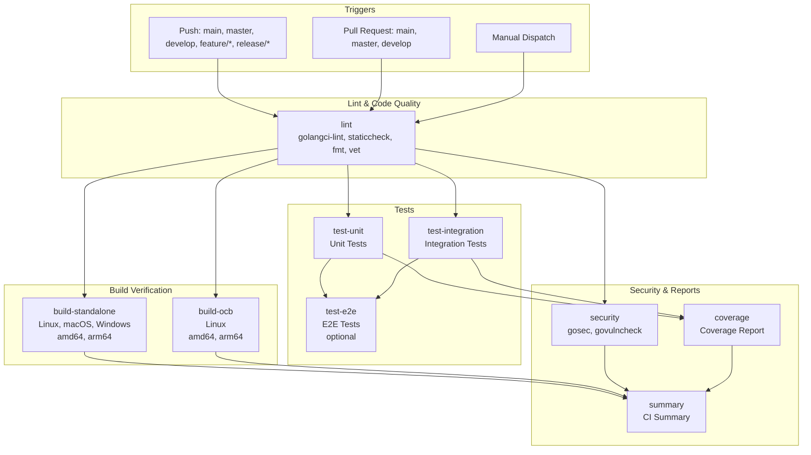

### CI Job Matrix

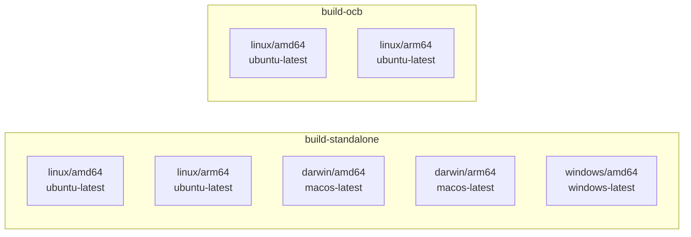

### CI Manual Dispatch Options

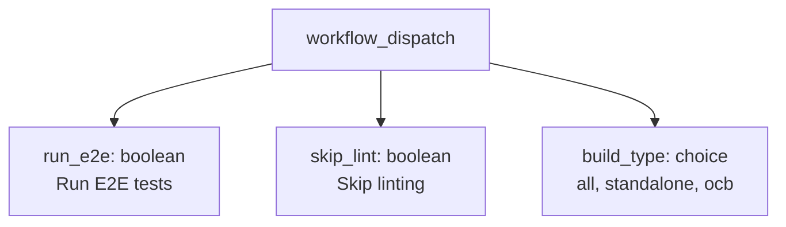

---

## Release Workflows

### Release Standalone

**File:** `.github/workflows/release-tfo.yml`

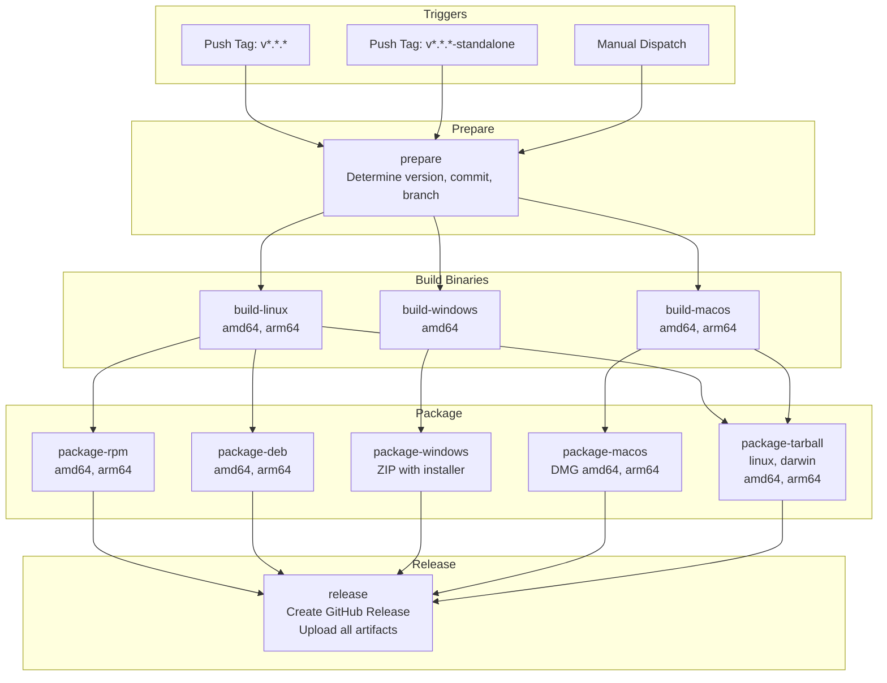

### Release OCB

**File:** `.github/workflows/release-ocb.yml`

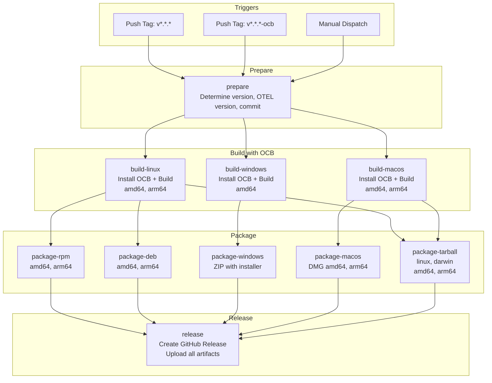

### Release Artifact Flow

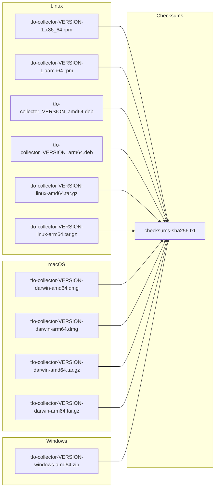

---

## Docker Workflows

### Docker Standalone

**File:** `.github/workflows/docker-tfo.yml`

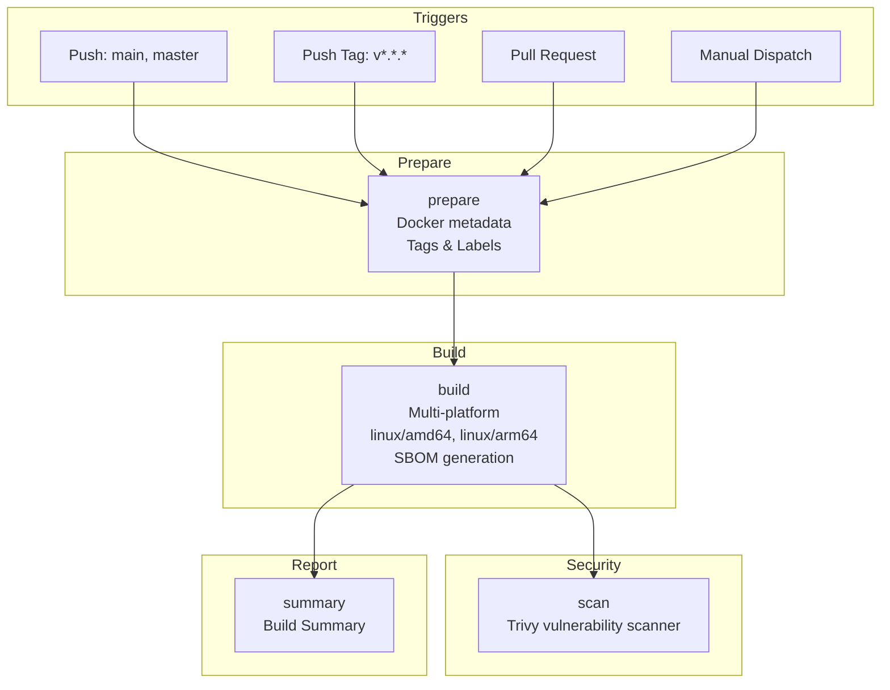

### Docker OCB

**File:** `.github/workflows/docker-ocb.yml`

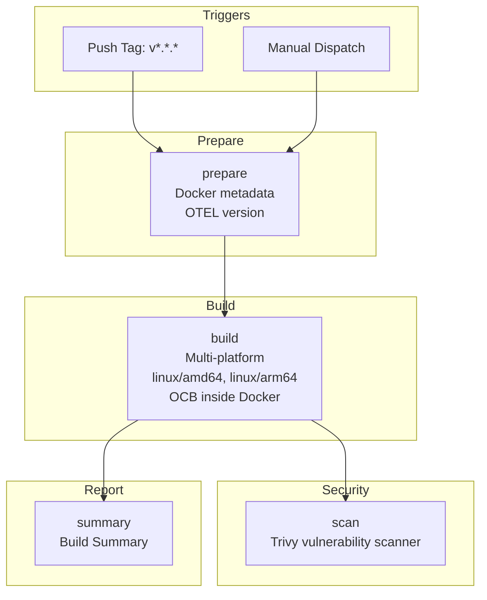

### Docker Image Tags

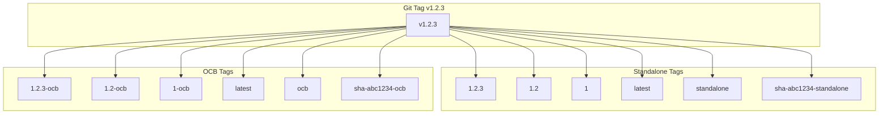

### Docker Registry Flow

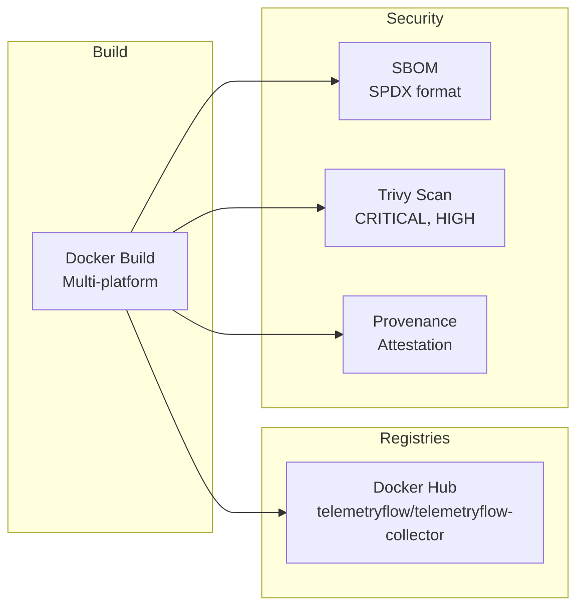

---

## Tag Routing

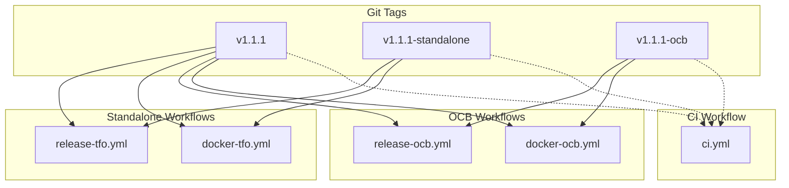

---

## Version Handling

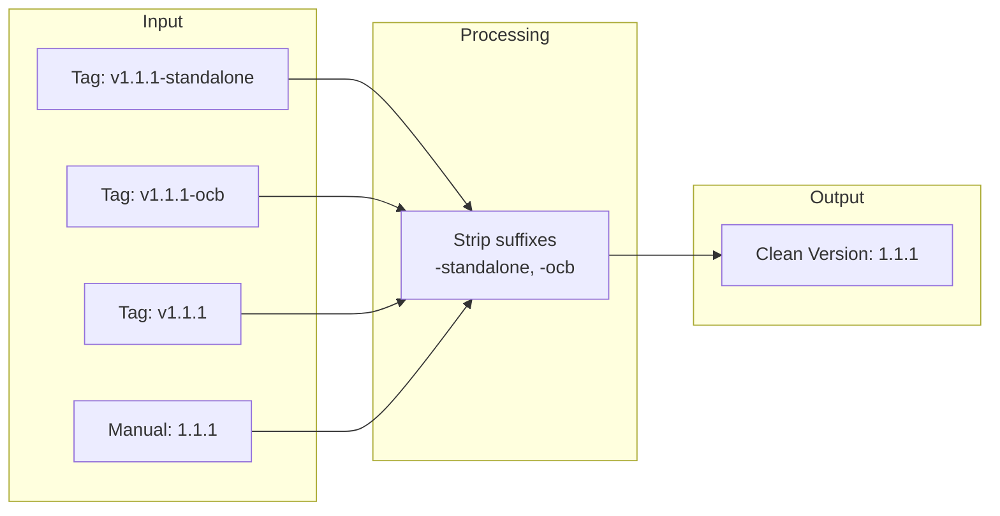

---

## Supported Platforms

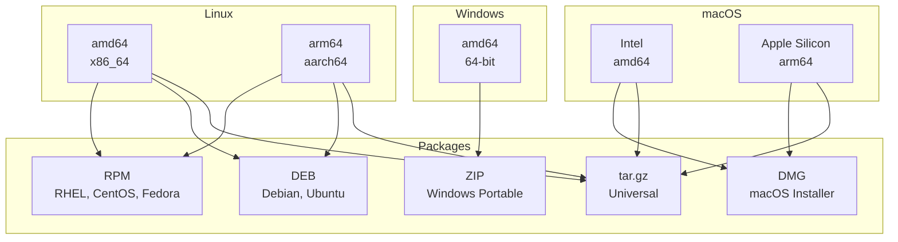

---

## Environment & Secrets

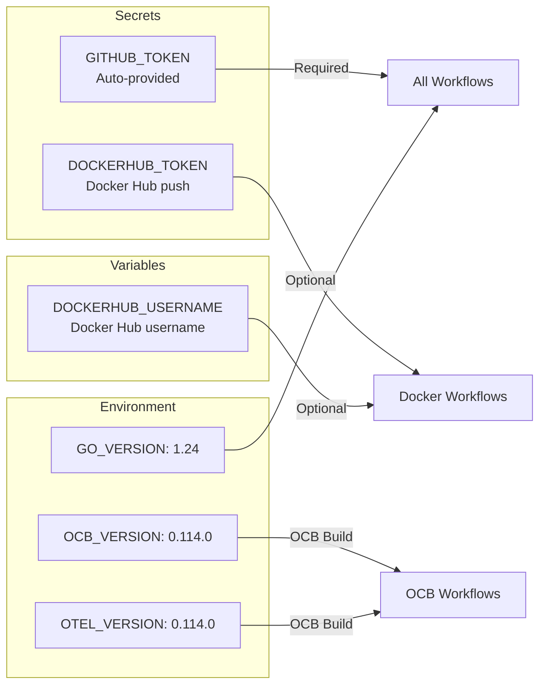

---

## Security Features

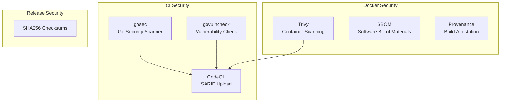

---

## Exposed Ports

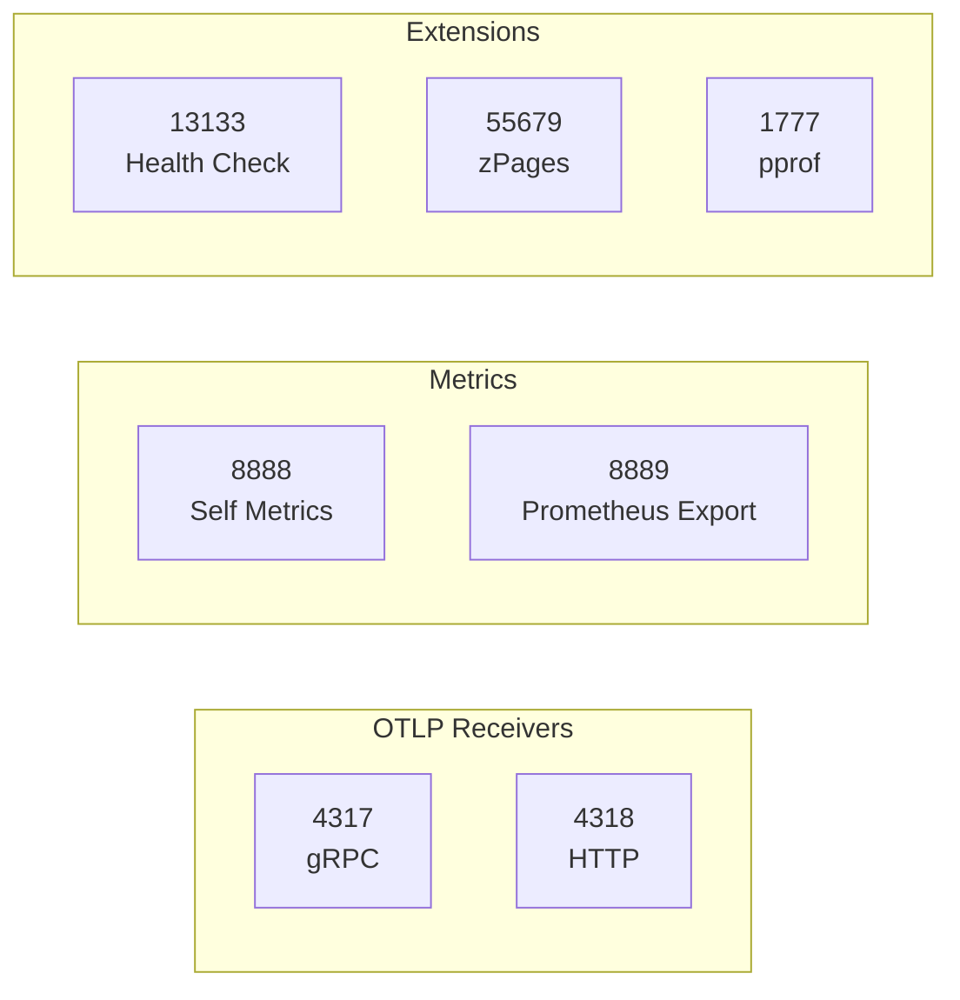

---

## Quick Reference

### Tag Conventions

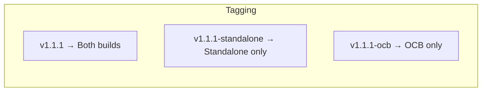

### Release Commands

```bash
# Standalone release
git tag v1.1.1
git push origin v1.1.1

# Or explicit standalone
git tag v1.1.1-standalone
git push origin v1.1.1-standalone

# OCB-only release
git tag v1.1.1-ocb
git push origin v1.1.1-ocb
```

### Docker Pull Commands

```bash
# Standalone
docker pull telemetryflow/telemetryflow-collector:latest
docker pull telemetryflow/telemetryflow-collector:1.1.1

# OCB
docker pull telemetryflow/telemetryflow-collector-ocb:latest
docker pull telemetryflow/telemetryflow-collector-ocb:1.1.1-ocb
```

### Run Commands

```bash
# Standalone (uses 'start --config')
docker run -d \
  --name tfo-collector \
  -p 4317:4317 -p 4318:4318 -p 8888:8888 -p 13133:13133 \
  telemetryflow/telemetryflow-collector:latest

# OCB (uses '--config' directly)
docker run -d \
  --name tfo-collector-ocb \
  -p 4317:4317 -p 4318:4318 -p 8888:8888 -p 13133:13133 \
  telemetryflow/telemetryflow-collector-ocb:latest
```

---

## Configuration Files

```mermaid
flowchart TD
    subgraph "Standalone Build"
        DF1[Dockerfile]
        CF1[configs/tfo-collector.yaml]
    end

    subgraph "OCB Build"
        DF2[Dockerfile.ocb]
        MF[manifest.yaml]
        CF2[configs/otel-collector.yaml]
    end
```

---

## CLI Differences

```mermaid
flowchart LR
    subgraph "Standalone CLI"
        SC1[tfo-collector start --config config.yaml]
        SC2[tfo-collector version]
        SC3[tfo-collector config validate]
    end

    subgraph "OCB CLI"
        OC1[tfo-collector --config config.yaml]
        OC2[tfo-collector --version]
        OC3[tfo-collector validate --config config.yaml]
    end
```

---

## Links

- [GitHub Actions Documentation](https://docs.github.com/en/actions)
- [Docker Build Push Action](https://github.com/docker/build-push-action)
- [OpenTelemetry Collector Builder](https://github.com/open-telemetry/opentelemetry-collector/tree/main/cmd/builder)
- [Trivy Action](https://github.com/aquasecurity/trivy-action)
