# TelemetryFlow Collector - GitHub Workflows

- **Version:** 1.1.2
- **Last Updated:** January 2026

This document describes the GitHub Actions workflows available for TelemetryFlow Collector with OCB-native architecture.

## Workflow Architecture

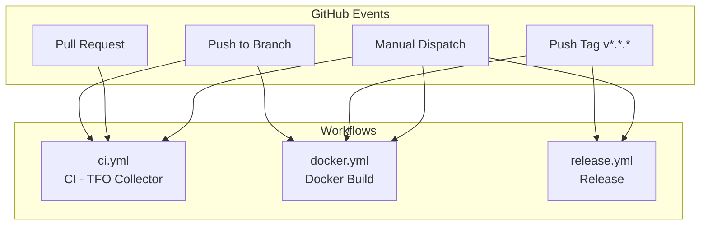

## OCB-Native Build

TelemetryFlow Collector now uses a **unified OCB-native build** - a single binary that includes all OTEL community components plus TFO custom components.

| Aspect | Description |
|--------|-------------|
| **Binary** | `tfo-collector` (single unified binary) |
| **Build** | OpenTelemetry Collector Builder (OCB) |
| **CLI** | Standard OTEL CLI with TFO branding |
| **Config** | Standard OTEL YAML format |
| **Docker Image** | `telemetryflow/telemetryflow-collector` |

---

## Workflow Files

| Workflow | File | Purpose |
|----------|------|---------|
| CI | `ci.yml` | Code quality, tests, build verification |
| Release | `release.yml` | Release binaries (RPM, DEB, DMG, ZIP) |
| Docker | `docker.yml` | Build & push Docker images |

---

## CI Workflow

**File:** `.github/workflows/ci.yml`

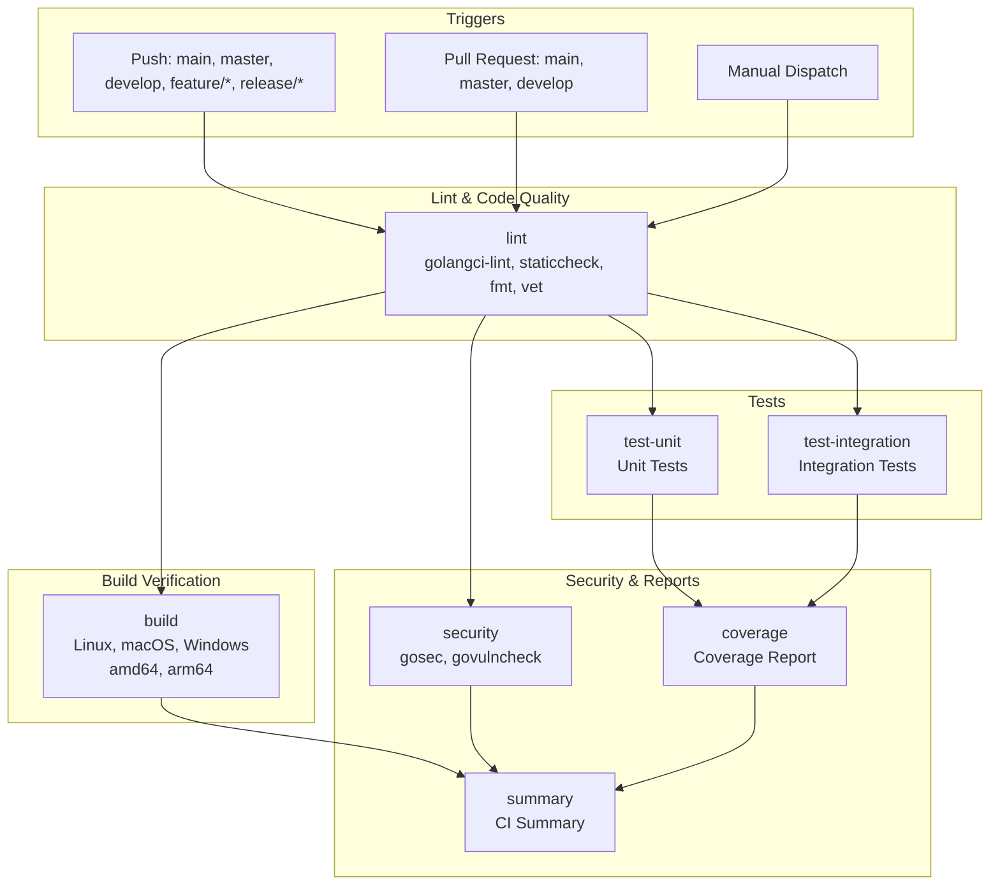

### CI Job Matrix

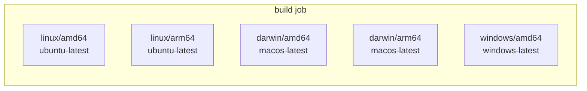

---

## Release Workflow

**File:** `.github/workflows/release.yml`

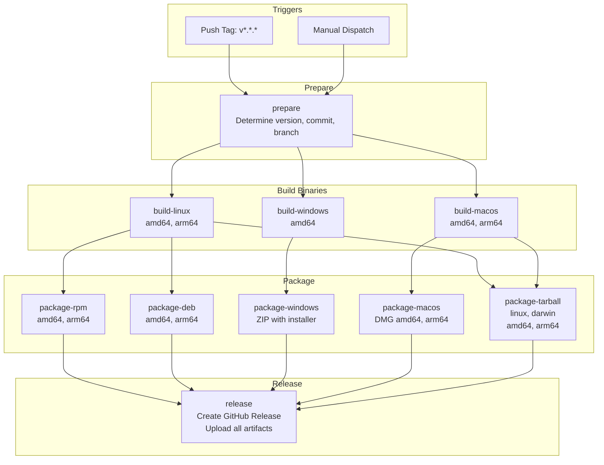

### Release Artifacts

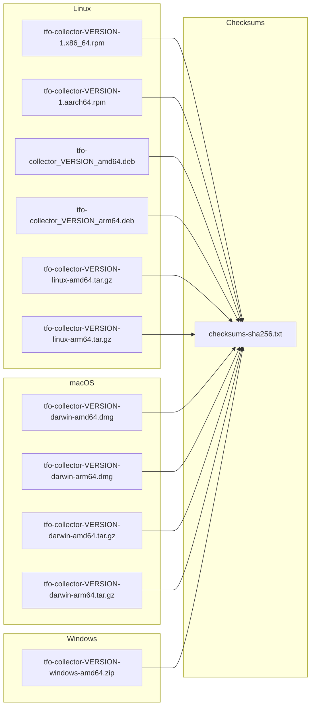

---

## Docker Workflow

**File:** `.github/workflows/docker.yml`

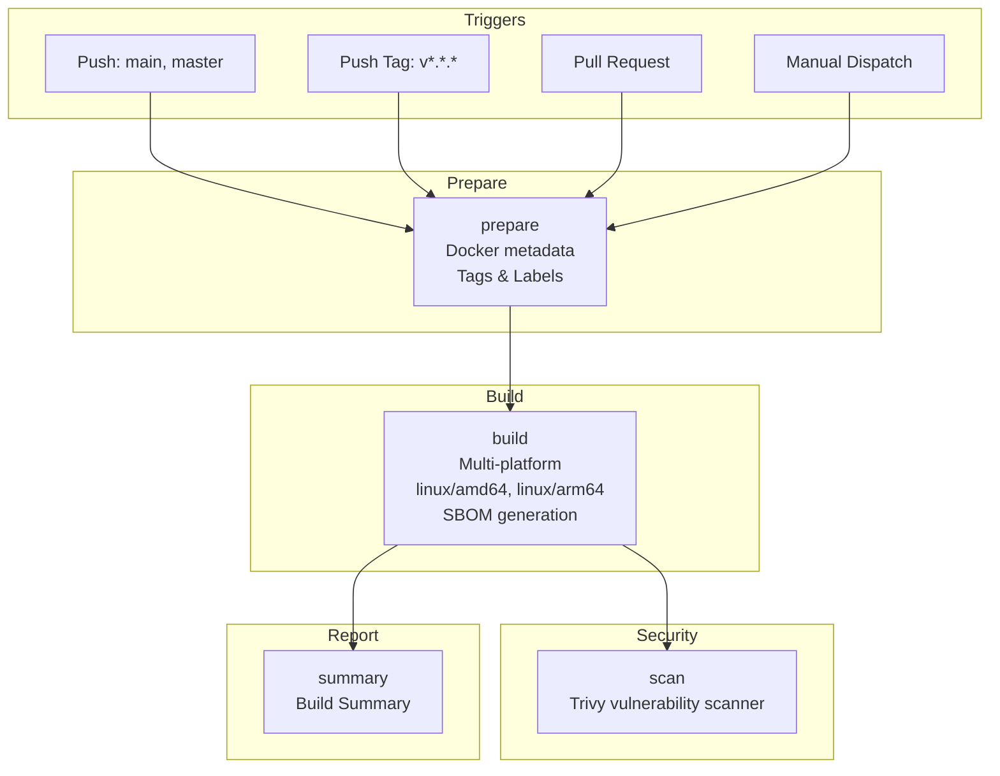

### Docker Image Tags

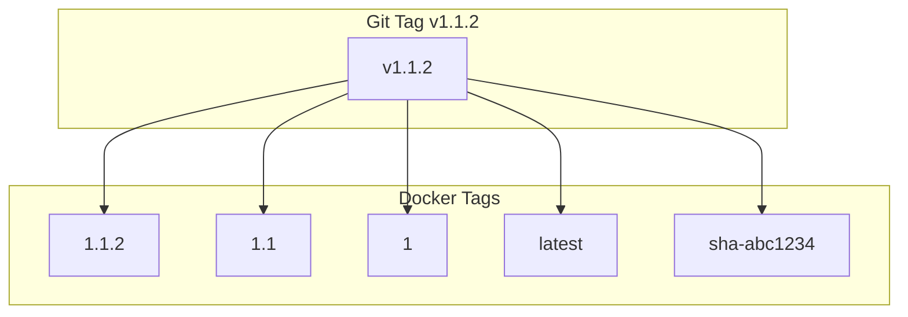

### Docker Registry Flow

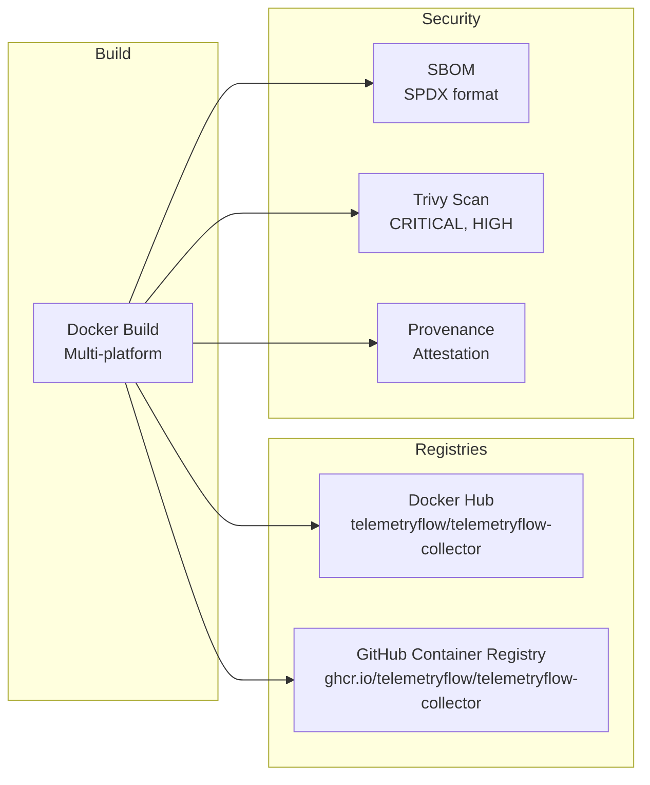

---

## Supported Platforms

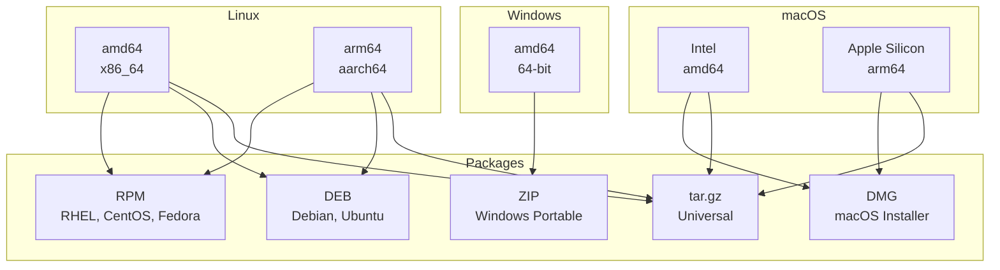

---

## Environment & Secrets

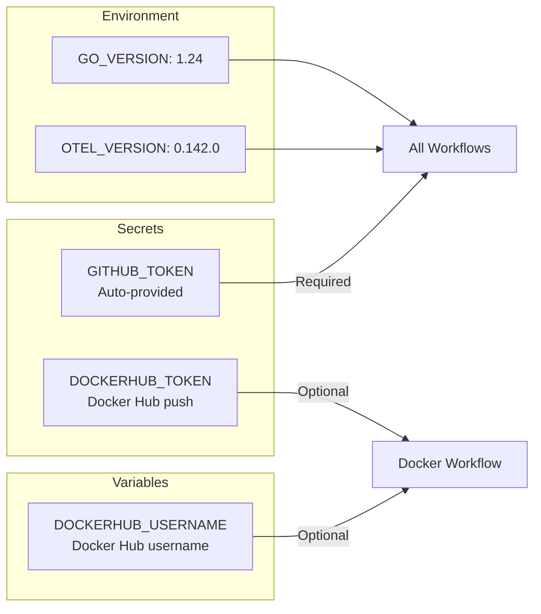

---

## Security Features

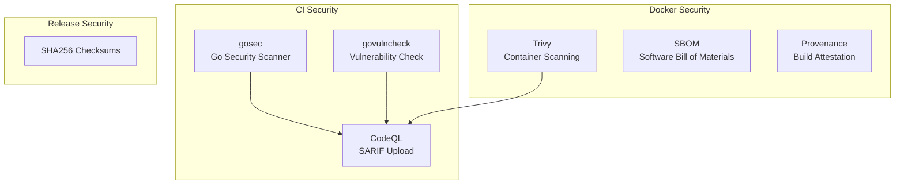

---

## Exposed Ports

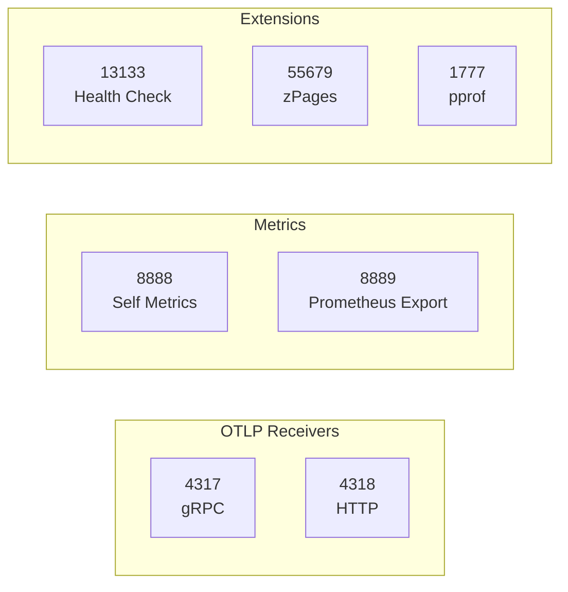

---

## Quick Reference

### Release Commands

```bash
# Create release
git tag v1.1.2
git push origin v1.1.2
```

### Docker Pull Commands

```bash
# Latest version
docker pull telemetryflow/telemetryflow-collector:latest

# Specific version
docker pull telemetryflow/telemetryflow-collector:1.1.2
```

### Run Command

```bash
# Run collector
docker run -d \
  --name tfo-collector \
  -p 4317:4317 -p 4318:4318 -p 8888:8888 -p 13133:13133 \
  telemetryflow/telemetryflow-collector:1.1.2
```

---

## Configuration Files

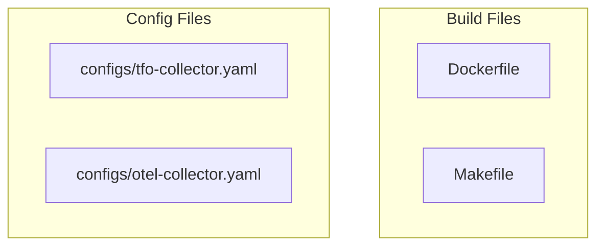

---

## CLI Commands

```bash
# Run with config
./tfo-collector --config config.yaml

# Validate config
./tfo-collector validate --config config.yaml

# Show version
./tfo-collector --version

# List components
./tfo-collector components
```

---

## Links

- [GitHub Actions Documentation](https://docs.github.com/en/actions)
- [Docker Build Push Action](https://github.com/docker/build-push-action)
- [OpenTelemetry Collector](https://opentelemetry.io/docs/collector/)
- [Trivy Action](https://github.com/aquasecurity/trivy-action)
