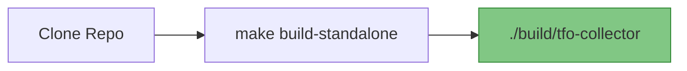
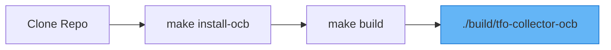
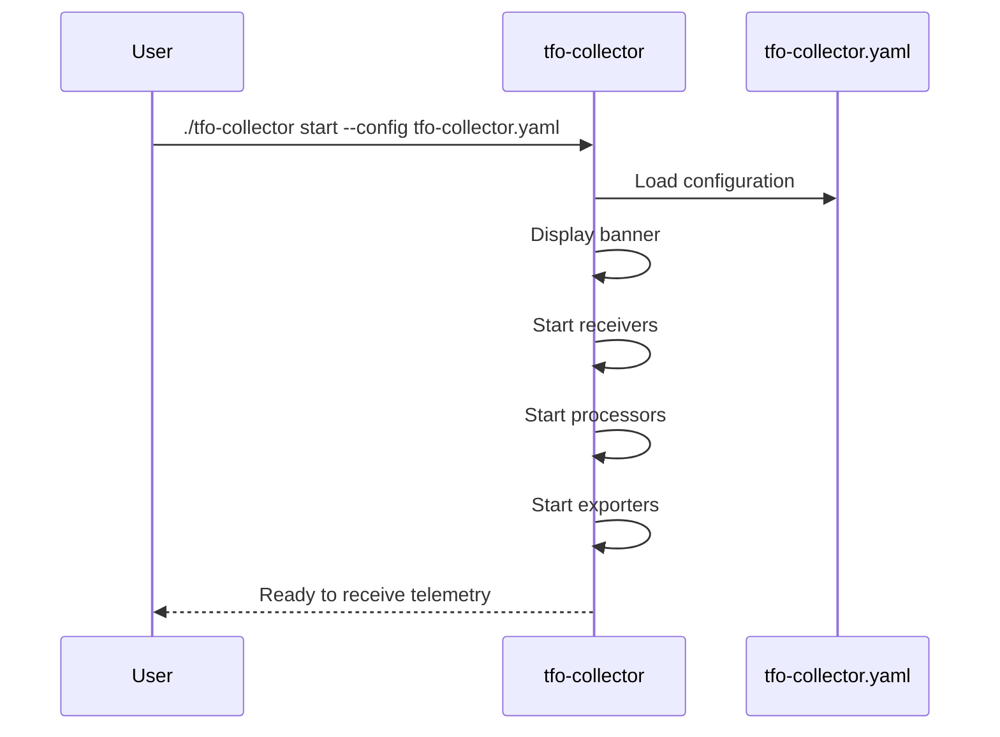
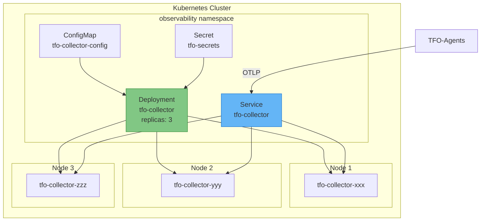

# TelemetryFlow Collector Installation Guide

- **Version:** 1.1.0
- **OTEL Version:** 0.142.0
- **Last Updated:** December 2025

---

## Prerequisites

- Go 1.24 or later (for building from source)
- Make (for build automation)
- Docker (optional, for containerized deployment)
- OCB (optional, for OCB build)

---

## Installation Methods

### Method 1: Build from Source



```bash
# Clone the repository
git clone https://github.com/telemetryflow/telemetryflow-collector.git
cd telemetryflow-collector

# Build standalone collector (default)
make build-standalone
# or just: make

# Verify the build
./build/tfo-collector version
```

### Method 2: Build with OCB



```bash
# Clone the repository
git clone https://github.com/telemetryflow/telemetryflow-collector.git
cd telemetryflow-collector

# Install OCB
make install-ocb

# Build with OCB
make build

# Verify the build
./build/tfo-collector-ocb --help
```

### Method 3: Docker Image

TelemetryFlow Collector provides separate Dockerfiles and Docker Compose files for each build type:

| File | Build Type | Description |
|------|------------|-------------|
| `Dockerfile` | Standalone | Custom Cobra CLI build |
| `Dockerfile.ocb` | OCB | Standard OTEL CLI build |
| `docker-compose.yml` | Standalone | Docker Compose for standalone |
| `docker-compose.ocb.yml` | OCB | Docker Compose for OCB |
| `.env.example` | Both | Environment variables template |

#### Using Docker Compose (Recommended)

```bash
# Copy environment template
cp .env.example .env

# Edit .env with your configuration
vim .env

# Standalone build
docker-compose up -d --build

# OR OCB build
docker-compose -f docker-compose.ocb.yml up -d --build

# View logs
docker-compose logs -f tfo-collector

# Check health
curl http://localhost:13133/

# Stop
docker-compose down
```

**Environment Variables (.env.example):**

| Variable | Description | Default |
|----------|-------------|---------|
| `VERSION` | Build version | `1.1.0` |
| `OTEL_VERSION` | OpenTelemetry version (OCB) | `0.142.0` |
| `IMAGE_NAME` | Docker image name | `telemetryflow/telemetryflow-collector` |
| `OTLP_GRPC_PORT` | OTLP gRPC port | `4317` |
| `OTLP_HTTP_PORT` | OTLP HTTP port | `4318` |
| `METRICS_PORT` | Prometheus metrics port | `8888` |
| `PROMETHEUS_EXPORTER_PORT` | Prometheus exporter port | `8889` |
| `HEALTH_PORT` | Health check port | `13133` |
| `ZPAGES_PORT` | zPages debug port | `55679` |
| `PPROF_PORT` | pprof profiling port | `1777` |
| `LOG_LEVEL` | Log level | `info` |
| `MEMORY_LIMIT` | Container memory limit | `2G` |

#### Using Docker Directly

```bash
# Build standalone image
docker build \
  --build-arg VERSION=1.1.0 \
  --build-arg GIT_COMMIT=$(git rev-parse --short HEAD) \
  --build-arg GIT_BRANCH=$(git rev-parse --abbrev-ref HEAD) \
  --build-arg BUILD_TIME=$(date -u '+%Y-%m-%dT%H:%M:%SZ') \
  -t telemetryflow/telemetryflow-collector:1.1.0 .

# Build OCB image
docker build \
  -f Dockerfile.ocb \
  --build-arg VERSION=1.1.0 \
  --build-arg OTEL_VERSION=0.142.0 \
  -t telemetryflow/telemetryflow-collector-ocb:1.1.0 .
```

---

## Quick Start

### Standalone Collector



```bash
# Build
make build-standalone

# Run
./build/tfo-collector start --config configs/tfo-collector.yaml

# Expected output:
#     ___________    .__                        __
#     \__    ___/___ |  |   ____   _____   _____/  |________ ___.__. ...
#
# {"level":"info","msg":"Starting TelemetryFlow Collector","version":"1.1.0"}
```

### OCB Collector

```bash
# Build
make build

# Run
./build/tfo-collector-ocb --config configs/otel-collector.yaml
```

---

## Docker Deployment

### Standalone Docker

```bash
# Create config directory
mkdir -p /etc/tfo-collector

# Copy configuration
cp configs/tfo-collector.yaml /etc/tfo-collector/config.yaml

# Run container
docker run -d \
  --name tfo-collector \
  --restart unless-stopped \
  -p 4317:4317 \
  -p 4318:4318 \
  -p 8888:8888 \
  -p 8889:8889 \
  -p 13133:13133 \
  -v /etc/tfo-collector/config.yaml:/etc/tfo-collector/config.yaml:ro \
  -v /var/lib/tfo-collector:/var/lib/tfo-collector \
  telemetryflow/telemetryflow-collector:latest \
  start --config /etc/tfo-collector/config.yaml

# Check logs
docker logs tfo-collector

# Check health
curl http://localhost:13133/
```

### OCB Docker

```bash
# Create config directory
mkdir -p /etc/tfo-collector

# Copy configuration
cp configs/otel-collector.yaml /etc/tfo-collector/config.yaml

# Run container
docker run -d \
  --name tfo-collector-ocb \
  --restart unless-stopped \
  -p 4317:4317 \
  -p 4318:4318 \
  -p 8888:8888 \
  -p 8889:8889 \
  -p 13133:13133 \
  -v /etc/tfo-collector/config.yaml:/etc/tfo-collector/config.yaml:ro \
  telemetryflow/telemetryflow-collector-ocb:latest \
  --config /etc/otelcol/config.yaml
```

### Docker Compose

```yaml
# docker-compose.yml
version: '3.8'

services:
  tfo-collector:
    image: telemetryflow/telemetryflow-collector:latest
    container_name: tfo-collector
    command: ["start", "--config", "/etc/tfo-collector/config.yaml"]
    ports:
      - "4317:4317"   # OTLP gRPC
      - "4318:4318"   # OTLP HTTP
      - "8888:8888"   # Prometheus metrics
      - "8889:8889"   # Prometheus exporter
      - "13133:13133" # Health check
    volumes:
      - ./configs/tfo-collector.yaml:/etc/tfo-collector/config.yaml:ro
      - collector-data:/var/lib/tfo-collector
    restart: unless-stopped
    healthcheck:
      test: ["CMD", "curl", "-f", "http://localhost:13133/"]
      interval: 30s
      timeout: 10s
      retries: 3

volumes:
  collector-data:
```

---

## Systemd Installation

### Create Directories

```bash
# Create directories
sudo mkdir -p /etc/tfo-collector
sudo mkdir -p /var/lib/tfo-collector/queue
sudo mkdir -p /var/log/tfo-collector
```

### Install Binary

```bash
# Copy binary
sudo cp ./build/tfo-collector /usr/local/bin/
sudo chmod +x /usr/local/bin/tfo-collector

# Copy configuration
sudo cp configs/tfo-collector.yaml /etc/tfo-collector/

# Verify
/usr/local/bin/tfo-collector version
```

### Create Service File

```bash
sudo tee /etc/systemd/system/tfo-collector.service > /dev/null <<'EOF'
[Unit]
Description=TelemetryFlow Collector - Community Enterprise Observability Platform
Documentation=https://docs.telemetryflow.id
After=network-online.target
Wants=network-online.target

[Service]
Type=simple
User=telemetryflow
Group=telemetryflow
ExecStart=/usr/local/bin/tfo-collector start --config /etc/tfo-collector/tfo-collector.yaml
Restart=always
RestartSec=10
StandardOutput=journal
StandardError=journal
SyslogIdentifier=tfo-collector

# Resource limits
LimitNOFILE=65536
MemoryMax=2G

# Security hardening
NoNewPrivileges=true
PrivateTmp=true
ProtectSystem=strict
ProtectHome=true
ReadWritePaths=/var/lib/tfo-collector /var/log/tfo-collector

[Install]
WantedBy=multi-user.target
EOF
```

### Create Service User

```bash
# Create user
sudo useradd -r -s /bin/false -d /var/lib/tfo-collector telemetryflow

# Set permissions
sudo chown -R telemetryflow:telemetryflow /etc/tfo-collector
sudo chown -R telemetryflow:telemetryflow /var/lib/tfo-collector
sudo chown -R telemetryflow:telemetryflow /var/log/tfo-collector
```

### Enable and Start

```bash
# Reload systemd
sudo systemctl daemon-reload

# Enable service
sudo systemctl enable tfo-collector

# Start service
sudo systemctl start tfo-collector

# Check status
sudo systemctl status tfo-collector

# View logs
sudo journalctl -u tfo-collector -f
```

---

## Kubernetes Deployment

### Deployment Architecture



### Create Namespace

```yaml
# namespace.yaml
apiVersion: v1
kind: Namespace
metadata:
  name: observability
  labels:
    app.kubernetes.io/name: observability
```

### Create ConfigMap

```yaml
# configmap.yaml
apiVersion: v1
kind: ConfigMap
metadata:
  name: tfo-collector-config
  namespace: observability
data:
  tfo-collector.yaml: |
    # TelemetryFlow-specific extensions (optional)
    telemetryflow:
      api_key_id: "${TELEMETRYFLOW_API_KEY_ID}"
      api_key_secret: "${TELEMETRYFLOW_API_KEY_SECRET}"

    collector:
      id: ""
      name: "TelemetryFlow Collector - Kubernetes"
      tags:
        environment: "kubernetes"

    # Standard OTEL configuration
    receivers:
      otlp:
        protocols:
          grpc:
            endpoint: "0.0.0.0:4317"
          http:
            endpoint: "0.0.0.0:4318"

    processors:
      batch:
        send_batch_size: 8192
        timeout: 200ms
      memory_limiter:
        check_interval: 1s
        limit_percentage: 80
        spike_limit_percentage: 25

    exporters:
      otlp:
        endpoint: "${BACKEND_ENDPOINT}"
        headers:
          X-Tenant-Id: "${TENANT_ID}"
      debug:
        verbosity: basic

    extensions:
      health_check:
        endpoint: "0.0.0.0:13133"

    service:
      extensions: [health_check]
      pipelines:
        metrics:
          receivers: [otlp]
          processors: [memory_limiter, batch]
          exporters: [otlp, debug]
        logs:
          receivers: [otlp]
          processors: [memory_limiter, batch]
          exporters: [otlp, debug]
        traces:
          receivers: [otlp]
          processors: [memory_limiter, batch]
          exporters: [otlp, debug]
```

### Create Secret

```yaml
# secret.yaml
apiVersion: v1
kind: Secret
metadata:
  name: tfo-secrets
  namespace: observability
type: Opaque
stringData:
  backend-endpoint: "http://telemetryflow-api:3100"
  tenant-id: "your-tenant-id"
```

### Create Deployment

```yaml
# deployment.yaml
apiVersion: apps/v1
kind: Deployment
metadata:
  name: tfo-collector
  namespace: observability
  labels:
    app: tfo-collector
    version: "1.1.0"
spec:
  replicas: 3
  selector:
    matchLabels:
      app: tfo-collector
  template:
    metadata:
      labels:
        app: tfo-collector
        version: "1.1.0"
    spec:
      serviceAccountName: tfo-collector

      containers:
      - name: tfo-collector
        image: telemetryflow/telemetryflow-collector:1.1.0
        args:
          - "start"
          - "--config"
          - "/etc/tfo-collector/tfo-collector.yaml"

        env:
        - name: BACKEND_ENDPOINT
          valueFrom:
            secretKeyRef:
              name: tfo-secrets
              key: backend-endpoint
        - name: TENANT_ID
          valueFrom:
            secretKeyRef:
              name: tfo-secrets
              key: tenant-id

        ports:
        - name: otlp-grpc
          containerPort: 4317
          protocol: TCP
        - name: otlp-http
          containerPort: 4318
          protocol: TCP
        - name: metrics
          containerPort: 8888
          protocol: TCP
        - name: prometheus
          containerPort: 8889
          protocol: TCP
        - name: health
          containerPort: 13133
          protocol: TCP

        livenessProbe:
          httpGet:
            path: /
            port: 13133
          initialDelaySeconds: 30
          periodSeconds: 30

        readinessProbe:
          httpGet:
            path: /
            port: 13133
          initialDelaySeconds: 10
          periodSeconds: 10

        resources:
          requests:
            memory: "512Mi"
            cpu: "500m"
          limits:
            memory: "2Gi"
            cpu: "2000m"

        volumeMounts:
        - name: config
          mountPath: /etc/tfo-collector
        - name: queue
          mountPath: /var/lib/tfo-collector

      volumes:
      - name: config
        configMap:
          name: tfo-collector-config
      - name: queue
        emptyDir: {}
```

### Create Service

```yaml
# service.yaml
apiVersion: v1
kind: Service
metadata:
  name: tfo-collector
  namespace: observability
  labels:
    app: tfo-collector
spec:
  type: ClusterIP
  ports:
  - name: otlp-grpc
    port: 4317
    targetPort: 4317
    protocol: TCP
  - name: otlp-http
    port: 4318
    targetPort: 4318
    protocol: TCP
  - name: metrics
    port: 8888
    targetPort: 8888
    protocol: TCP
  - name: prometheus
    port: 8889
    targetPort: 8889
    protocol: TCP
  - name: health
    port: 13133
    targetPort: 13133
    protocol: TCP
  selector:
    app: tfo-collector
```

### Apply Resources

```bash
kubectl apply -f namespace.yaml
kubectl apply -f configmap.yaml
kubectl apply -f secret.yaml
kubectl apply -f deployment.yaml
kubectl apply -f service.yaml

# Verify
kubectl get pods -n observability -l app=tfo-collector
kubectl logs -n observability -l app=tfo-collector --tail=50
```

---

## Verification

### Health Check

```bash
# HTTP health endpoint
curl http://localhost:13133/
# Expected: {"status":"healthy"}
```

### Self Metrics

```bash
# Prometheus metrics
curl http://localhost:8888/metrics | head -30
```

### Send Test Data

```bash
# Send test metrics via OTLP HTTP (TelemetryFlow Platform v2)
curl -X POST http://localhost:4318/v2/metrics \
  -H "Content-Type: application/json" \
  -d '{
    "resourceMetrics": [{
      "resource": {
        "attributes": [
          {"key": "service.name", "value": {"stringValue": "test-service"}}
        ]
      },
      "scopeMetrics": [{
        "metrics": [{
          "name": "test.metric",
          "sum": {
            "dataPoints": [{
              "asInt": "100",
              "timeUnixNano": "'$(date +%s)000000000'"
            }]
          }
        }]
      }]
    }]
  }'
```

---

## Upgrading

### Binary Upgrade

```bash
# Stop service
sudo systemctl stop tfo-collector

# Backup current binary
sudo cp /usr/local/bin/tfo-collector /usr/local/bin/tfo-collector.backup

# Install new binary
sudo cp ./build/tfo-collector /usr/local/bin/

# Start service
sudo systemctl start tfo-collector

# Verify
tfo-collector version
```

### Docker Upgrade

```bash
# Pull new image
docker pull telemetryflow/telemetryflow-collector:1.1.0

# Stop and remove
docker stop tfo-collector
docker rm tfo-collector

# Start with new image
docker run -d --name tfo-collector ... telemetryflow/telemetryflow-collector:1.1.0 ...
```

### Kubernetes Upgrade

```bash
# Update image
kubectl set image deployment/tfo-collector \
  tfo-collector=telemetryflow/telemetryflow-collector:1.1.0 \
  -n observability

# Watch rollout
kubectl rollout status deployment/tfo-collector -n observability
```

---

## Uninstallation

### Systemd

```bash
sudo systemctl stop tfo-collector
sudo systemctl disable tfo-collector
sudo rm /etc/systemd/system/tfo-collector.service
sudo systemctl daemon-reload
sudo rm /usr/local/bin/tfo-collector
sudo rm -rf /etc/tfo-collector
sudo rm -rf /var/lib/tfo-collector
sudo userdel telemetryflow
```

### Docker

```bash
docker stop tfo-collector
docker rm tfo-collector
docker rmi telemetryflow/telemetryflow-collector:latest
```

### Kubernetes

```bash
kubectl delete deployment tfo-collector -n observability
kubectl delete service tfo-collector -n observability
kubectl delete configmap tfo-collector-config -n observability
kubectl delete secret tfo-secrets -n observability
```

---

**Copyright (c) 2024-2026 DevOpsCorner Indonesia. All rights reserved.**
