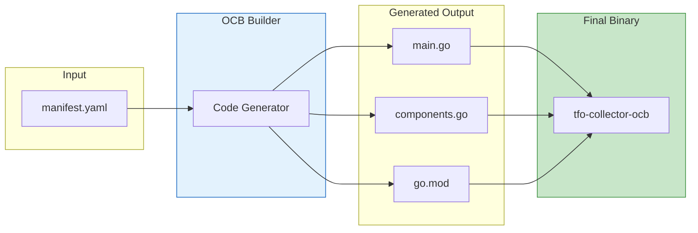
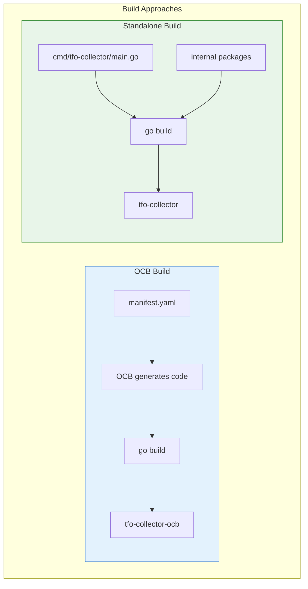
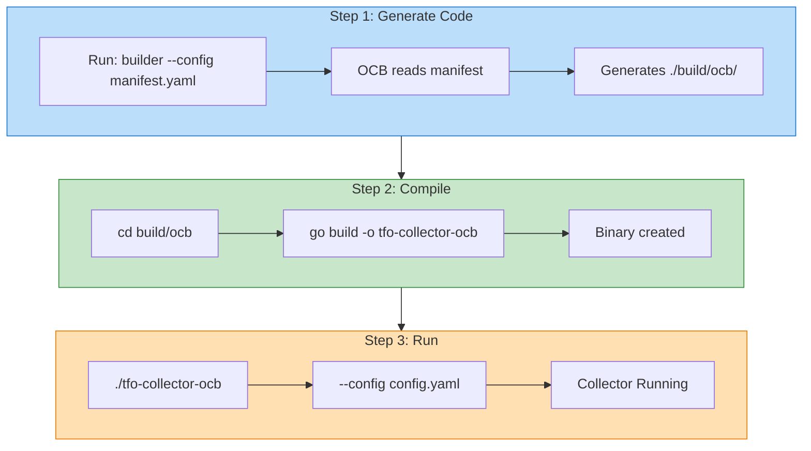
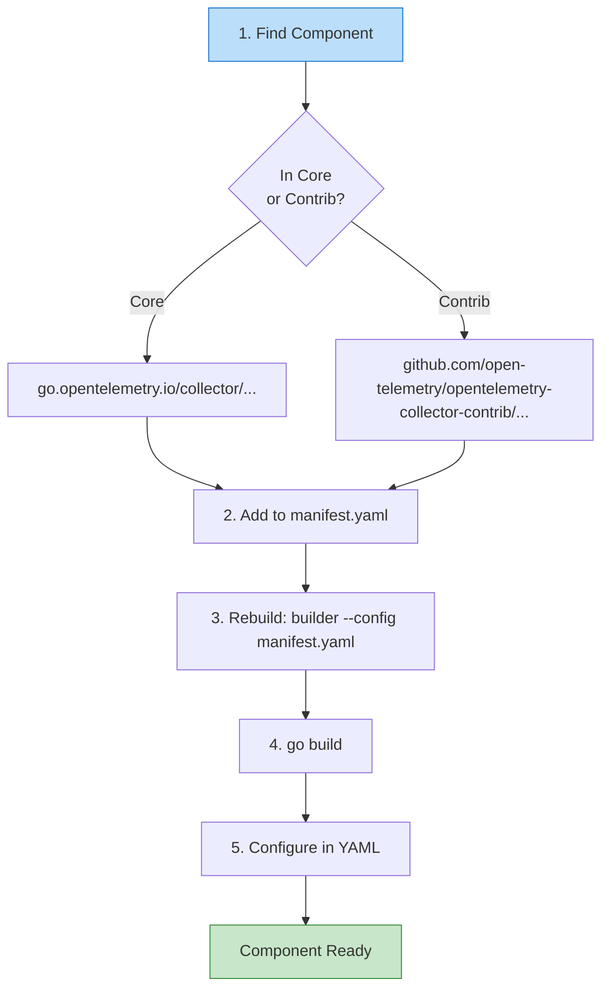

# TelemetryFlow Collector - OCB Build Guide

This guide explains how to build and use the TelemetryFlow Collector using the OpenTelemetry Collector Builder (OCB).

## Overview

The OCB (OpenTelemetry Collector Builder) is the official tool for building custom OpenTelemetry Collector distributions. It generates Go code from a manifest file (`manifest.yaml`) that defines which components to include.



### Two Build Approaches



| Approach | CLI Command | Config Format | Use Case |
|----------|-------------|---------------|----------|
| **OCB Build** | `tfo-collector --config config.yaml` | Standard OTEL | Full OTEL ecosystem |
| **Standalone Build** | `tfo-collector start --config config.yaml` | TelemetryFlow format | Lightweight, custom CLI |

## Prerequisites

- Go 1.24 or later
- OCB (OpenTelemetry Collector Builder) v0.142.0

## Installation

### Install OCB

```bash
# Install OCB matching your OTEL version
go install go.opentelemetry.io/collector/cmd/builder@v0.142.0

# Verify installation
builder version
```

### Alternative: Download Pre-built Binary

```bash
# Linux/macOS
curl -L -o ocb \
  "https://github.com/open-telemetry/opentelemetry-collector/releases/download/cmd%2Fbuilder%2Fv0.142.0/ocb_0.142.0_$(uname -s)_$(uname -m)"
chmod +x ocb
sudo mv ocb /usr/local/bin/
```

## Building the Collector



### Step 1: Generate Collector Code

```bash
# From project root
builder --config manifest.yaml

# Output will be in ./build/ocb/
```

### Step 2: Compile the Binary

```bash
cd build/ocb
go build -o tfo-collector-ocb .
```

### Step 3: Run the Collector

```bash
./tfo-collector-ocb --config configs/otel-collector.yaml
```

## Using Make Targets

The project includes convenient Make targets:

```bash
# Generate OCB code
make generate

# Build OCB collector
make build

# Build and run
make run

# Clean build artifacts
make clean
```

## Manifest Structure

The `manifest.yaml` defines which components to include:

```yaml
dist:
  name: tfo-collector-ocb
  description: TelemetryFlow Collector OCB
  output_path: ./build/ocb
  module: github.com/telemetryflow/telemetryflow-collector-ocb
  skip_compilation: true  # We compile manually

extensions:
  - gomod: go.opentelemetry.io/collector/extension/zpagesextension v0.142.0
  # ... more extensions

receivers:
  - gomod: go.opentelemetry.io/collector/receiver/otlpreceiver v0.142.0
  # ... more receivers

processors:
  - gomod: go.opentelemetry.io/collector/processor/batchprocessor v0.142.0
  # ... more processors

exporters:
  - gomod: go.opentelemetry.io/collector/exporter/otlpexporter v0.142.0
  # ... more exporters

connectors:
  - gomod: go.opentelemetry.io/collector/connector/forwardconnector v0.142.0
  # ... more connectors
```

## Adding New Components



### 1. Find the Component

Browse available components:

- **Core**: https://github.com/open-telemetry/opentelemetry-collector
- **Contrib**: https://github.com/open-telemetry/opentelemetry-collector-contrib

### 2. Add to Manifest

```yaml
receivers:
  # Add new receiver
  - gomod: github.com/open-telemetry/opentelemetry-collector-contrib/receiver/mongodbreceiver v0.142.0
```

### 3. Rebuild

```bash
builder --config manifest.yaml
cd build/ocb && go build -o tfo-collector-ocb .
```

### 4. Configure in YAML

```yaml
receivers:
  mongodb:
    hosts:
      - endpoint: localhost:27017
    username: admin
    password: ${env:MONGO_PASSWORD}
    collection_interval: 60s

service:
  pipelines:
    metrics:
      receivers: [mongodb]
      processors: [batch]
      exporters: [prometheus]
```

## Docker Build

### Build Image

```bash
docker build -f Dockerfile.ocb \
  --build-arg VERSION=1.1.1 \
  --build-arg OTEL_VERSION=0.142.0 \
  -t telemetryflow/telemetryflow-collector-ocb:1.1.1 .
```

### Run Container

```bash
docker run -d \
  --name tfo-collector-ocb \
  -p 4317:4317 \
  -p 4318:4318 \
  -p 8888:8888 \
  -p 8889:8889 \
  -p 13133:13133 \
  -v $(pwd)/configs/otel-collector.yaml:/etc/tfo-collector/otel-collector.yaml:ro \
  telemetryflow/telemetryflow-collector-ocb:1.1.1
```

### Docker Compose

```bash
docker-compose -f docker-compose.ocb.yml up -d
```

## Version Compatibility

| TelemetryFlow | OTEL Version | OCB Version |
|---------------|--------------|-------------|
| 1.1.x | 0.142.0 | v0.142.0 |
| 1.0.x | 0.114.0 | v0.114.0 |

**Important**: All components in `manifest.yaml` must use the same OTEL version to ensure compatibility.

## OTLP HTTP Endpoints

### OCB Build (OTEL Community - v1 Only)

The OCB build uses the **standard OpenTelemetry OTLP receiver** which supports **v1 endpoints only**:

| Signal | Endpoint | Content-Type |
|--------|----------|--------------|
| Traces | `/v1/traces` | `application/x-protobuf`, `application/json` |
| Metrics | `/v1/metrics` | `application/x-protobuf`, `application/json` |
| Logs | `/v1/logs` | `application/x-protobuf`, `application/json` |

This ensures full compatibility with the OpenTelemetry specification and all OTEL SDKs.

### TFO Standalone Build (Dual Endpoints)

The standalone TFO build uses a **custom OTLP receiver** that supports **both v1 and v2** endpoints:

| Version | Endpoint | Description |
|---------|----------|-------------|
| **v1** (OTEL Community) | `/v1/traces`, `/v1/metrics`, `/v1/logs` | Standard OpenTelemetry spec |
| **v2** (TFO Platform) | `/v2/traces`, `/v2/metrics`, `/v2/logs` | TelemetryFlow Platform-specific |

> **Recommendation:** Use **v2 endpoints** for TFO Standalone build for TelemetryFlow Platform features. Use **v1 endpoints** when compatibility with standard OTEL tooling is required.

## Troubleshooting

### Build Errors

**"module not found"**
```bash
# Update Go module cache
cd build/ocb
go mod tidy
```

**"incompatible versions"**
```bash
# Ensure all components use same version in manifest.yaml
# All gomod entries should end with v0.114.0
```

### Runtime Errors

**"unknown receiver type"**
- Component not included in manifest.yaml
- Rebuild with the component added

**"failed to create pipeline"**
- Check YAML syntax in config file
- Validate with: `./tfo-collector-ocb validate --config config.yaml`

## Configuration Validation

```bash
# Validate configuration
./tfo-collector-ocb validate --config configs/otel-collector.yaml

# Show configuration (debug)
./tfo-collector-ocb --config configs/otel-collector.yaml --dry-run
```

## CLI Reference

```bash
# Basic usage
./tfo-collector-ocb --config <config-file>

# Common flags
--config          Path to configuration file
--set             Override config values (e.g., --set=service.telemetry.logs.level=debug)
--feature-gates   Enable/disable feature gates

# Validate configuration
./tfo-collector-ocb validate --config <config-file>
```

## Related Documentation

- [Component Reference](./COMPONENTS.md) - All available components
- [Configuration Guide](./CONFIGURATION.md) - Configuration examples
- [Exemplars Guide](./EXEMPLARS.md) - Setting up metrics-to-traces correlation

## External Resources

- [OpenTelemetry Collector Builder](https://github.com/open-telemetry/opentelemetry-collector/tree/main/cmd/builder)
- [OTEL Collector Configuration](https://opentelemetry.io/docs/collector/configuration/)
- [OTEL Collector Contrib](https://github.com/open-telemetry/opentelemetry-collector-contrib)
