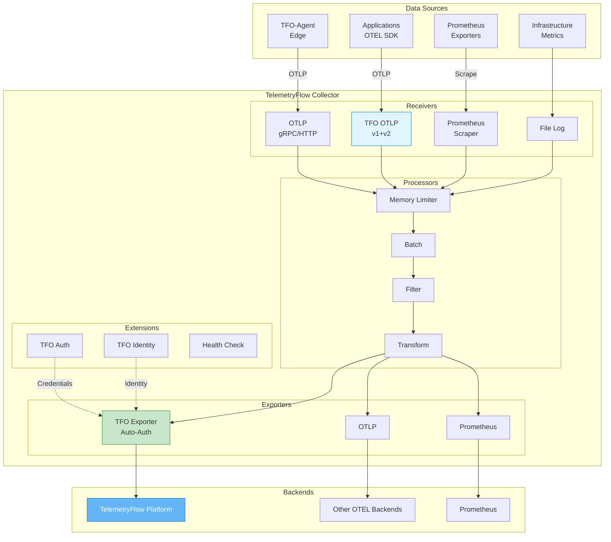

# TelemetryFlow Collector Documentation

- **Version:** 1.1.2
- **OTEL Version:** 0.142.0
- **Last Updated:** January 2026
- **Status:** Production Ready

---

## Overview

TelemetryFlow Collector (`tfo-collector`) is an enterprise-grade OpenTelemetry Collector distribution built with **OCB (OpenTelemetry Collector Builder)** that includes:

- **85+ OTEL Community Components** - Full ecosystem compatibility
- **TFO Custom Components** - Platform-specific features for TelemetryFlow

### OCB-Native Architecture

| Feature | Description |
|---------|-------------|
| Binary | `tfo-collector` |
| Build System | OpenTelemetry Collector Builder (OCB) |
| Config Format | Standard OTEL YAML |
| CLI | Standard OTEL with TFO branding |
| Components | 85+ OTEL community + TFO custom |
| Docker Image | `telemetryflow/telemetryflow-collector` |

### TFO Custom Components

| Component | Type | Description |
|-----------|------|-------------|
| `tfootlp` | Receiver | OTLP receiver with v1 + v2 endpoint support |
| `tfo` | Exporter | Auto-injects TFO authentication headers |
| `tfoauth` | Extension | Centralized API key management |
| `tfoidentity` | Extension | Collector identity and resource enrichment |

---

## Documentation Index

| Document | Description |
|----------|-------------|
| [README.md](README.md) | This file - Overview and quick reference |
| [INSTALLATION.md](INSTALLATION.md) | Installation and deployment guide |
| [CONFIGURATION.md](CONFIGURATION.md) | Configuration reference |
| [BUILD-SYSTEM.md](BUILD-SYSTEM.md) | OCB build system explained |
| [COMPONENTS.md](COMPONENTS.md) | Available receivers, processors, exporters |
| [ARCHITECTURE.md](ARCHITECTURE.md) | System architecture |
| [GITHUB-WORKFLOWS.md](GITHUB-WORKFLOWS.md) | CI/CD workflow documentation |

---

## Quick Start

### Build from Source

```bash
# Build
make build

# Run
./tfo-collector --config configs/tfo-collector.yaml

# Show version
./tfo-collector --version
```

### Docker

```bash
# Run with Docker
docker run -d \
  --name tfo-collector \
  -p 4317:4317 -p 4318:4318 -p 8888:8888 -p 13133:13133 \
  -v /path/to/config.yaml:/etc/tfo-collector/config.yaml:ro \
  telemetryflow/telemetryflow-collector:1.1.2
```

---

## Architecture Overview



---

## Features

### Multi-Signal Support

- **Metrics**: OTLP, Prometheus scraping
- **Logs**: OTLP, FluentForward, Syslog, File
- **Traces**: OTLP with sampling

### TFO Custom Components

**TFO OTLP Receiver (`tfootlp`)**:
- v1 endpoints: `/v1/traces`, `/v1/metrics`, `/v1/logs` (OTEL standard)
- v2 endpoints: `/v2/traces`, `/v2/metrics`, `/v2/logs` (TFO Platform)
- gRPC and HTTP support on same ports

**TFO Exporter (`tfo`)**:
- Auto-injects authentication headers
- Supports both cloud SaaS and self-hosted endpoints
- v2 API support for TelemetryFlow Platform

**TFO Auth Extension (`tfoauth`)**:
- Centralized API key management
- Environment variable substitution

**TFO Identity Extension (`tfoidentity`)**:
- Collector identity management
- Resource enrichment with collector metadata

### Enterprise Features

- Health check endpoint
- Prometheus metrics (self-monitoring)
- pprof profiling
- zPages debugging
- Persistent queue for resilience

---

## OTLP Capabilities

### OTLP Protocol Support

| Protocol | Port | Encoding | Signals |
|----------|------|----------|---------|
| gRPC | 4317 | Protocol Buffers | Traces, Metrics, Logs |
| HTTP | 4318 | Protocol Buffers, JSON | Traces, Metrics, Logs |

### OTLP HTTP Endpoints

| Endpoint | Version | Description |
|----------|---------|-------------|
| `/v1/traces` | v1 | Standard OTEL traces endpoint |
| `/v1/metrics` | v1 | Standard OTEL metrics endpoint |
| `/v1/logs` | v1 | Standard OTEL logs endpoint |
| `/v2/traces` | v2 | TelemetryFlow Platform traces |
| `/v2/metrics` | v2 | TelemetryFlow Platform metrics |
| `/v2/logs` | v2 | TelemetryFlow Platform logs |

### Exemplars Support

TelemetryFlow Collector supports **exemplars** for metrics-to-traces correlation:

```yaml
connectors:
  spanmetrics:
    exemplars:
      enabled: true
    histogram:
      explicit:
        buckets: [1ms, 5ms, 10ms, 25ms, 50ms, 100ms, 250ms, 500ms, 1s]

exporters:
  prometheus:
    enable_open_metrics: true  # Required for exemplars
```

See [EXEMPLARS.md](EXEMPLARS.md) for detailed configuration.

---

## Configuration Overview

TelemetryFlow Collector uses **standard OpenTelemetry Collector YAML format** with optional TFO-specific extensions.

### Basic Configuration

```yaml
# Standard OTEL configuration with TFO components
receivers:
  tfootlp:
    protocols:
      grpc:
        endpoint: "0.0.0.0:4317"
      http:
        endpoint: "0.0.0.0:4318"
    enable_v2_endpoints: true

processors:
  batch:
    send_batch_size: 8192
    timeout: 200ms

exporters:
  tfo:
    endpoint: "https://api.telemetryflow.id"
    use_v2_api: true
    auth:
      extension: tfoauth

extensions:
  tfoauth:
    api_key_id: "${env:TELEMETRYFLOW_API_KEY_ID}"
    api_key_secret: "${env:TELEMETRYFLOW_API_KEY_SECRET}"
  tfoidentity:
    id: "${env:TELEMETRYFLOW_COLLECTOR_ID}"
    name: "Production Collector"
  health_check:
    endpoint: "0.0.0.0:13133"

service:
  extensions: [health_check, tfoauth, tfoidentity]
  pipelines:
    traces:
      receivers: [tfootlp]
      processors: [batch]
      exporters: [tfo]
    metrics:
      receivers: [tfootlp]
      processors: [batch]
      exporters: [tfo]
    logs:
      receivers: [tfootlp]
      processors: [batch]
      exporters: [tfo]
```

---

## Exposed Ports

| Port | Protocol | Description |
|------|----------|-------------|
| 4317 | gRPC | OTLP gRPC receiver |
| 4318 | HTTP | OTLP HTTP receiver |
| 8888 | HTTP | Prometheus metrics (self) |
| 8889 | HTTP | Prometheus exporter |
| 13133 | HTTP | Health check |
| 55679 | HTTP | zPages |
| 1777 | HTTP | pprof |

---

## Project Structure

```text
tfo-collector/
├── cmd/tfo-collector/          # Main entry point
│   ├── main.go                 # OCB-native main with TFO branding
│   └── components.go           # Component factory registration
├── components/                 # TFO custom components
│   ├── tfootlpreceiver/        # TFO OTLP receiver (v1+v2)
│   ├── tfoexporter/            # TFO exporter (auto-auth)
│   └── extension/
│       ├── tfoauthextension/   # TFO auth extension
│       └── tfoidentityextension/ # TFO identity extension
├── internal/
│   └── version/                # Version and banner
├── configs/
│   ├── tfo-collector.yaml      # TFO config with custom components
│   └── otel-collector.yaml     # Standard OTEL config
├── build/                      # Build output directory
│   └── tfo-collector           # Built binary
├── manifest.yaml               # OCB manifest
├── Makefile
├── Dockerfile
└── README.md
```

---

## Build System

### Make Targets

```bash
# Show all commands
make help

# Build
make build              # Build collector
make build-all          # Build for all platforms

# Run
make run                # Run collector
make run-debug          # Run with debug logging

# Testing
make test               # Run tests
make lint               # Run linters
make validate-config    # Validate configuration

# Docker
make docker             # Build Docker image
make docker-push        # Push Docker image

# Cleanup
make clean              # Clean build artifacts
make tidy               # Tidy go modules
```

### Build Output

```text
./build/
└── tfo-collector       # OCB-native binary
```

---

## Deployment Options

### Docker

```bash
# Build image
docker build \
  --build-arg VERSION=1.1.2 \
  --build-arg GIT_COMMIT=$(git rev-parse --short HEAD) \
  -t telemetryflow/telemetryflow-collector:1.1.2 .

# Run container
docker run -d \
  --name tfo-collector \
  -p 4317:4317 -p 4318:4318 -p 8888:8888 -p 13133:13133 \
  -v /path/to/config.yaml:/etc/tfo-collector/config.yaml:ro \
  -e TELEMETRYFLOW_API_KEY_ID=tfk_xxx \
  -e TELEMETRYFLOW_API_KEY_SECRET=tfs_xxx \
  telemetryflow/telemetryflow-collector:1.1.2
```

### Kubernetes

```yaml
apiVersion: apps/v1
kind: Deployment
metadata:
  name: tfo-collector
spec:
  replicas: 3
  selector:
    matchLabels:
      app: tfo-collector
  template:
    spec:
      containers:
      - name: collector
        image: telemetryflow/telemetryflow-collector:1.1.2
        args: ["--config", "/etc/tfo-collector/config.yaml"]
        ports:
        - containerPort: 4317
        - containerPort: 4318
        - containerPort: 8888
        env:
        - name: TELEMETRYFLOW_API_KEY_ID
          valueFrom:
            secretKeyRef:
              name: tfo-credentials
              key: api-key-id
        - name: TELEMETRYFLOW_API_KEY_SECRET
          valueFrom:
            secretKeyRef:
              name: tfo-credentials
              key: api-key-secret
```

### Systemd

```ini
[Unit]
Description=TelemetryFlow Collector - CEOP
After=network.target

[Service]
Type=simple
ExecStart=/usr/local/bin/tfo-collector --config /etc/tfo-collector/config.yaml
Restart=always
LimitNOFILE=65536
Environment="TELEMETRYFLOW_API_KEY_ID=tfk_xxx"
Environment="TELEMETRYFLOW_API_KEY_SECRET=tfs_xxx"

[Install]
WantedBy=multi-user.target
```

---

## Health Checks

```bash
# Health endpoint
curl http://localhost:13133/

# Self metrics
curl http://localhost:8888/metrics

# zPages (if enabled)
curl http://localhost:55679/debug/servicez
```

---

## Links

- **Website**: [https://telemetryflow.id](https://telemetryflow.id)
- **Documentation**: [https://docs.telemetryflow.id](https://docs.telemetryflow.id)
- **OpenTelemetry**: [https://opentelemetry.io](https://opentelemetry.io)
- **Developer**: [DevOpsCorner Indonesia](https://devopscorner.id)

---

**Copyright (c) 2024-2026 DevOpsCorner Indonesia. All rights reserved.**
