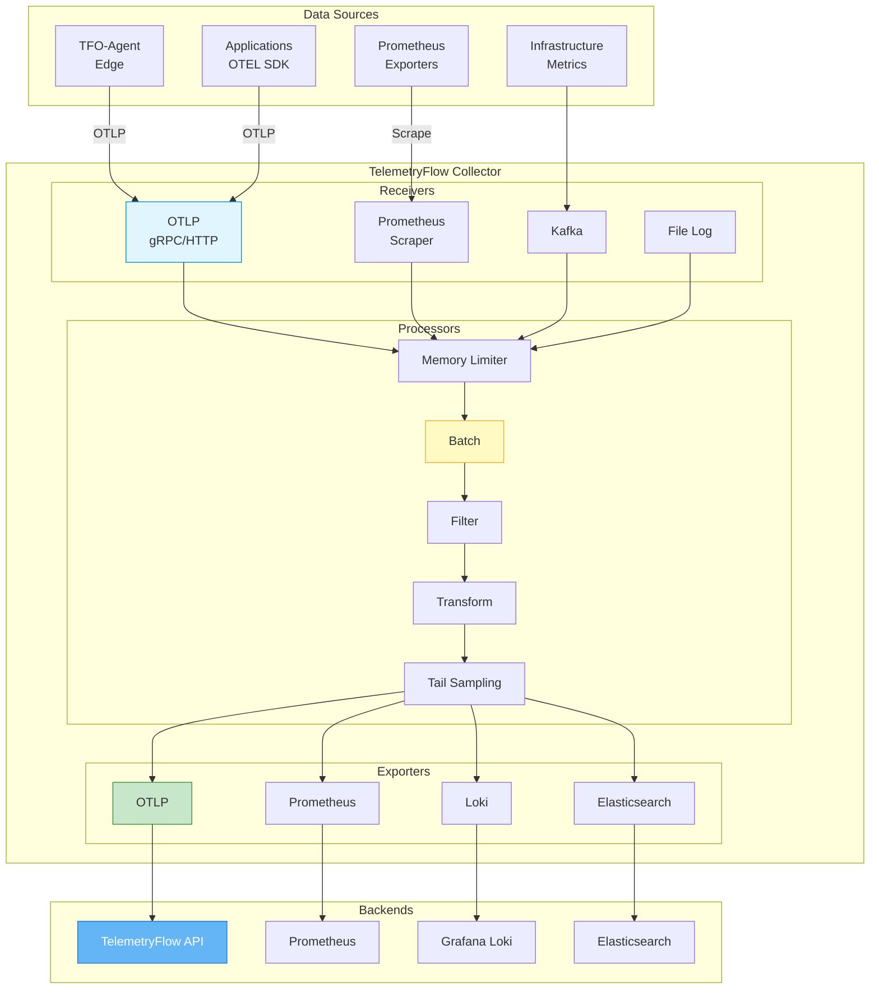
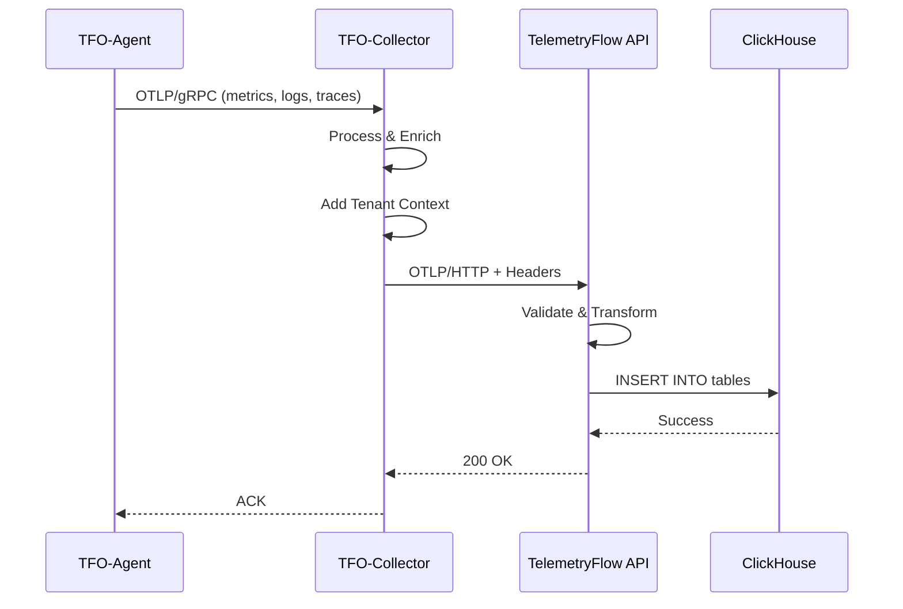

# TelemetryFlow Collector Documentation

- **Version:** 1.1.1
- **OTEL Version:** 0.142.0
- **Last Updated:** January 2026
- **Status:** Production Ready

---

## Overview

TelemetryFlow Collector (`tfo-collector`) is an enterprise-grade OpenTelemetry Collector distribution with a **dual build system**:

1. **Standalone Build** - Custom Cobra CLI with TelemetryFlow-specific features
2. **OCB Build** - Standard OpenTelemetry Collector built with OCB (OpenTelemetry Collector Builder)

### Build Comparison

| Feature | Standalone (`tfo-collector`) | OCB (`tfo-collector-ocb`) |
|---------|------------------------------|---------------------------|
| Binary | `./build/tfo-collector` | `./build/tfo-collector-ocb` |
| Dockerfile | `Dockerfile` | `Dockerfile.ocb` |
| Config Format | Custom with `enabled` flags | Standard OTEL YAML |
| CLI | Cobra commands (`start`, `version`) | Standard OTEL (`--config`) |
| Banner | Custom ASCII art | None |
| Components | Pre-selected essential | Full ecosystem |
| Use Case | Production deployments | Full compatibility |

---

## Documentation Index

| Document | Description |
|----------|-------------|
| [README.md](README.md) | This file - Overview and quick reference |
| [INSTALLATION.md](INSTALLATION.md) | Installation and deployment guide |
| [CONFIGURATION.md](CONFIGURATION.md) | Configuration reference for both builds |
| [BUILD-SYSTEM.md](BUILD-SYSTEM.md) | Dual build system explained |
| [COMPONENTS.md](COMPONENTS.md) | Available receivers, processors, exporters |
| [PIPELINES.md](PIPELINES.md) | Pipeline configuration guide |
| [TROUBLESHOOTING.md](TROUBLESHOOTING.md) | Troubleshooting guide |

---

## Quick Start

### Standalone Build (Recommended)

```bash
# Build
make build-standalone
# or just: make

# Run
./build/tfo-collector start --config configs/tfo-collector.yaml

# Show version
./build/tfo-collector version
```

### OCB Build (Full OTEL Compatibility)

```bash
# Install OCB
make install-ocb

# Build
make build

# Run
./build/tfo-collector-ocb --config configs/otel-collector.yaml
```

---

## Architecture Overview



### Data Flow



---

## Features

### Multi-Signal Support

- **Metrics**: OTLP, Prometheus scraping
- **Logs**: OTLP, FluentForward, Syslog, File
- **Traces**: OTLP with sampling

### Rich Component Ecosystem

**Receivers:**

- OTLP (gRPC/HTTP)
- Prometheus scraping
- Host Metrics
- File Log
- Kafka
- Kubernetes cluster/events

**Processors:**

- Batch
- Memory Limiter
- Attributes
- Resource Detection
- Filter
- Transform
- Tail Sampling

**Exporters:**

- OTLP (gRPC/HTTP)
- Prometheus
- Loki
- Elasticsearch/OpenSearch
- Kafka
- File

### Enterprise Features

- Health check endpoint
- Prometheus metrics (self-monitoring)
- pprof profiling
- zPages debugging
- Persistent queue for resilience
- Multi-tenant context handling

---

## OTLP Capabilities

TelemetryFlow Collector provides comprehensive OTLP (OpenTelemetry Protocol) support as the primary data ingestion and export mechanism.

### OTLP Protocol Support

| Protocol | Endpoint | Encoding | Signals |
|----------|----------|----------|---------|
| gRPC | `0.0.0.0:4317` | Protocol Buffers | Traces, Metrics, Logs |
| HTTP/1.1 | `0.0.0.0:4318` | Protocol Buffers, JSON | Traces, Metrics, Logs |

### OTLP Receiver Features

**gRPC Protocol (Port 4317):**
- Full bidirectional streaming support
- Max receive message size: 4 MiB (configurable)
- Max concurrent streams: 100 (configurable)
- Keepalive configuration with configurable ping intervals
- TLS/mTLS support with client certificate authentication

**HTTP Protocol (Port 4318):**

- API endpoints (both versions supported):
  - Standard OTLP: `/v1/traces`, `/v1/metrics`, `/v1/logs`
  - TelemetryFlow Platform: `/v2/traces`, `/v2/metrics`, `/v2/logs`
- Content-Type negotiation: `application/json`, `application/x-protobuf`
- CORS support with configurable origins and headers
- Max request body: 10 MiB
- Keepalive: 30s read/write timeout

### OTLP Exporter Features

**OTLP gRPC Exporter:**
- Endpoint: Configurable backend target
- TLS/mTLS support with custom certificates
- Custom headers for authentication
- Gzip compression support
- Retry on failure with exponential backoff
- Persistent sending queue (configurable)

**OTLP HTTP Exporter:**
- HTTP/1.1 with Protocol Buffers or JSON encoding
- TLS/mTLS support
- Custom headers support
- Gzip compression
- Configurable timeout (default: 30s)

### Signal Types

| Signal | Description | Use Case |
|--------|-------------|----------|
| **Traces** | Distributed tracing with spans, resources, and instrumentation metadata | Request flow tracking, latency analysis |
| **Metrics** | Counters, gauges, histograms, summaries with data points | Performance monitoring, alerting |
| **Logs** | Log records with severity, timestamps, and trace context | Application debugging, audit trails |

### Exemplars Support

TelemetryFlow Collector supports **exemplars** for metrics-to-traces correlation:

```yaml
connectors:
  spanmetrics:
    exemplars:
      enabled: true  # Enable exemplars
    histogram:
      explicit:
        buckets: [1ms, 5ms, 10ms, 25ms, 50ms, 100ms, 250ms, 500ms, 1s]

exporters:
  prometheus:
    enable_open_metrics: true  # Required for exemplars
```

See [EXEMPLARS.md](EXEMPLARS.md) for detailed configuration.

### Connectors for Derived Telemetry

| Connector | Purpose | Output |
|-----------|---------|--------|
| `spanmetrics` | Derive metrics from traces with exemplars | `traces_spanmetrics_duration_milliseconds`, `traces_spanmetrics_calls_total` |
| `servicegraph` | Build service dependency graphs | `traces_service_graph_request_total`, `traces_service_graph_request_duration_seconds` |

---

## Configuration Overview

Both builds now use **standard OpenTelemetry Collector YAML format**. The standalone config adds optional TelemetryFlow-specific sections for authentication and collector identification.

### Standalone Configuration

```yaml
# configs/tfo-collector.yaml (standard OTEL format + TelemetryFlow extensions)

# TelemetryFlow-specific extensions (optional, ignored by OCB)
telemetryflow:
  api_key_id: "${TELEMETRYFLOW_API_KEY_ID}"
  api_key_secret: "${TELEMETRYFLOW_API_KEY_SECRET}"
  endpoint: "${TELEMETRYFLOW_ENDPOINT:-localhost:4317}"

collector:
  id: "${TELEMETRYFLOW_COLLECTOR_ID}"
  name: "${TELEMETRYFLOW_COLLECTOR_NAME:-TelemetryFlow Collector}"
  tags:
    environment: "${TELEMETRYFLOW_ENVIRONMENT:-production}"

# Standard OTEL configuration (same format as OCB)
receivers:
  otlp:
    protocols:
      grpc:
        endpoint: "0.0.0.0:4317"
      http:
        endpoint: "0.0.0.0:4318"

processors:
  batch:
    send_batch_size: 8192
    timeout: 200ms

exporters:
  debug:
    verbosity: detailed

service:
  pipelines:
    metrics:
      receivers: [otlp]
      processors: [batch]
      exporters: [debug]
```

### OCB Configuration

```yaml
# configs/otel-collector.yaml (standard OTEL format)
receivers:
  otlp:
    protocols:
      grpc:
        endpoint: "0.0.0.0:4317"
      http:
        endpoint: "0.0.0.0:4318"

processors:
  batch:
    send_batch_size: 8192
    timeout: 200ms

exporters:
  debug:
    verbosity: detailed

service:
  pipelines:
    metrics:
      receivers: [otlp]
      processors: [batch]
      exporters: [debug]
```

---

## Exposed Ports

| Port | Protocol | Description |
|------|----------|-------------|
| 4317 | gRPC | OTLP gRPC receiver |
| 4318 | HTTP | OTLP HTTP receiver |
| 8888 | HTTP | Prometheus metrics (self) |
| 8889 | HTTP | Prometheus exporter |
| 13133 | HTTP | Health check |
| 55679 | HTTP | zPages |
| 1777 | HTTP | pprof |

---

## Project Structure

```text
tfo-collector/
├── cmd/tfo-collector/          # Standalone CLI entry point
│   └── main.go                 # Cobra CLI with commands
├── internal/
│   ├── collector/              # Core collector implementation
│   ├── config/                 # Configuration management
│   └── version/                # Version and banner
├── pkg/                        # Shared packages
│   ├── banner/                 # Startup banner
│   ├── config/                 # Config loader utilities
│   └── plugin/                 # Component registry
├── configs/
│   ├── tfo-collector.yaml      # Standalone config (custom)
│   ├── otel-collector.yaml      # OCB config (standard OTEL)
│   └── ocb-collector-minimal.yaml
├── build/                      # Build output directory
│   ├── tfo-collector           # Standalone binary
│   ├── tfo-collector-ocb       # OCB binary
│   └── ocb/                    # OCB generated code
├── tests/
│   ├── unit/
│   └── integration/
├── manifest.yaml               # OCB manifest
├── Makefile
├── Dockerfile                  # Standalone build
├── Dockerfile.ocb              # OCB build
└── README.md
```

---

## Build System

### Make Targets

```bash
# Show all commands
make help

# Standalone Build (Default)
make                    # Build standalone collector
make build-standalone   # Build standalone collector
make run-standalone     # Run standalone collector
make test-standalone    # Run tests

# OCB Build
make build              # Build with OCB
make build-all          # Build for all platforms with OCB
make install-ocb        # Install OpenTelemetry Collector Builder
make generate           # Generate collector code using OCB
make run                # Run OCB collector
make run-debug          # Run OCB with debug logging
make validate-config    # Validate OCB configuration

# Common
make test               # Run tests
make lint               # Run linters
make clean              # Clean build artifacts
make docker             # Build Docker image
make version            # Show version information
make tidy               # Tidy go modules
```

### Build Output

```text
./build/
├── tfo-collector       # Standalone binary (Cobra CLI)
├── tfo-collector-ocb   # OCB binary (standard OTEL)
└── ocb/                # OCB generated code
```

---

## Deployment Options

### Docker

TelemetryFlow Collector provides separate Dockerfiles for each build type:

| Dockerfile | Image | Description |
|------------|-------|-------------|
| `Dockerfile` | `telemetryflow/telemetryflow-collector` | Standalone build with Cobra CLI |
| `Dockerfile.ocb` | `telemetryflow/telemetryflow-collector-ocb` | OCB build with standard OTEL CLI |

#### Build Images

```bash
# Build standalone image
docker build \
  --build-arg VERSION=1.1.1 \
  --build-arg GIT_COMMIT=$(git rev-parse --short HEAD) \
  --build-arg GIT_BRANCH=$(git rev-parse --abbrev-ref HEAD) \
  --build-arg BUILD_TIME=$(date -u '+%Y-%m-%dT%H:%M:%SZ') \
  -t telemetryflow/telemetryflow-collector:1.1.1 .

# Build OCB image
docker build \
  -f Dockerfile.ocb \
  --build-arg VERSION=1.1.1 \
  --build-arg OTEL_VERSION=0.142.0 \
  -t telemetryflow/telemetryflow-collector-ocb:1.1.1 .
```

#### Run Containers

```bash
# Standalone
docker run -d \
  --name tfo-collector \
  -p 4317:4317 -p 4318:4318 -p 8888:8888 -p 13133:13133 \
  -v /path/to/config.yaml:/etc/tfo-collector/tfo-collector.yaml:ro \
  telemetryflow/telemetryflow-collector:1.1.1

# OCB
docker run -d \
  --name tfo-collector-ocb \
  -p 4317:4317 -p 4318:4318 -p 8888:8888 -p 13133:13133 \
  -v /path/to/config.yaml:/etc/tfo-collector/collector.yaml:ro \
  telemetryflow/telemetryflow-collector-ocb:1.1.1
```

### Kubernetes

```yaml
apiVersion: apps/v1
kind: Deployment
metadata:
  name: tfo-collector
spec:
  replicas: 3
  selector:
    matchLabels:
      app: tfo-collector
  template:
    spec:
      containers:
      - name: collector
        image: telemetryflow/telemetryflow-collector:latest
        args: ["start", "--config", "/etc/tfo-collector/config.yaml"]
        ports:
        - containerPort: 4317
        - containerPort: 4318
        - containerPort: 8888
```

### Systemd

```ini
[Unit]
Description=TelemetryFlow Collector - CEOP
After=network.target

[Service]
Type=simple
ExecStart=/usr/local/bin/tfo-collector start --config /etc/tfo-collector/tfo-collector.yaml
Restart=always
LimitNOFILE=65536

[Install]
WantedBy=multi-user.target
```

---

## Health Checks

```bash
# Health endpoint
curl http://localhost:13133/

# Self metrics
curl http://localhost:8888/metrics

# zPages (if enabled)
curl http://localhost:55679/debug/servicez
```

---

## Links

- **Website**: [https://telemetryflow.id](https://telemetryflow.id)
- **Documentation**: [https://docs.telemetryflow.id](https://docs.telemetryflow.id)
- **OpenTelemetry**: [https://opentelemetry.io](https://opentelemetry.io)
- **Developer**: [DevOpsCorner Indonesia](https://devopscorner.id)

---

**Copyright (c) 2024-2026 DevOpsCorner Indonesia. All rights reserved.**
